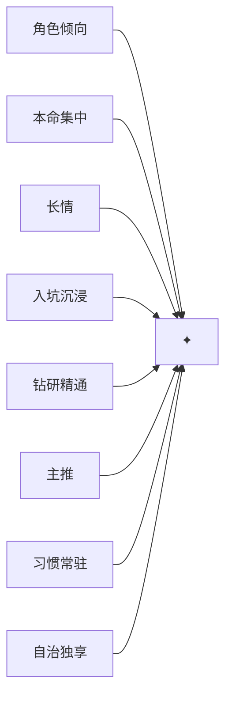
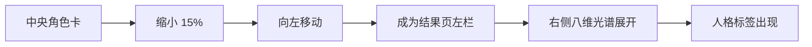
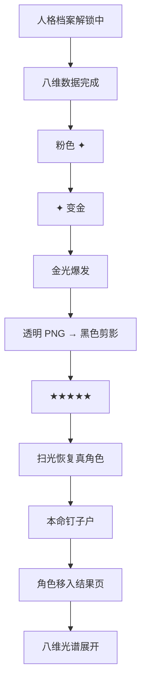

# 二游玩家人格测试：五星抽卡式结果揭晓设计与实现方案

> 适用场景：类似 MBTI 的二游玩家人格测试，在用户完成答题后，用“五星 / S 级角色出金”的方式揭晓人格结果，并无缝进入最终人格档案页。  
> 当前素材前提：**已经有一张矩形人格角色图**，例如「本命钉子户」企鹅角色图。  
> 推荐技术栈：**React / Next.js + GSAP + CSS/SVG + Canvas 粒子**。  
> 核心目标：不是简单模仿某个具体游戏，而是做成一套原创的“人格档案召唤 / Personality Archive Summon”视觉体系。

---

## 1. 设计结论

最推荐的整体体验是：

**档案计算 → 八维数据汇聚 → 星芒变金 → 金光爆发 → 角色剪影 → 五星揭晓 → 真角色出现 → 人格名称出现 → 角色卡移动并展开结果页**

```mermaid
flowchart LR
    A["提交最后一道题"] --> B["人格档案解锁中"]
    B --> C["八维数据汇聚"]
    C --> D["粉色核心星芒"]
    D --> E["核心变金"]
    E --> F["全屏金光爆发"]
    F --> G["角色剪影出现"]
    G --> H["★★★★★ / S CLASS"]
    H --> I["角色真容揭晓"]
    I --> J["人格名称 + 一句话"]
    J --> K["角色卡左移"]
    K --> L["展开完整人格档案"]
```



### 关键原则

1. **所有人格都建议设定为 S / 五星**
   - 人格测试不存在“低级人格”。
   - 用户抽到低稀有度人格会产生负反馈。
   - 五星代表“这是你的人格档案”，不是“这个人格比其他人格更强”。

2. **动画阶段用透明角色素材，结果页阶段可以继续用矩形完整图**
   - 动画：透明角色 / 透明 Splash Art。
   - 结果页：现有矩形图继续使用完全没问题。
   - 两种资产可以并存，不需要二选一。

3. **不要直接把整张矩形图片变黑做剪影**
   - 会变成一块黑色矩形。
   - 缺少“猜角色”的轮廓感。
   - 正确做法是：先抠出主体，再对主体做剪影。

---

# 2. 视觉定位

整体建议继续沿用你现有结果页的品牌语言：

- 深黑紫背景
- 粉色星芒
- 青蓝色系统文字
- 米白 / 黑 / 粉结果页
- 档案馆、扫描、解锁、资料库等概念
- 二游抽卡的爽感
- 不直接复制具体游戏 UI

建议统一命名：

- `ARCHIVE CONNECTED`
- `PERSONALITY ARCHIVE`
- `S CLASS ARCHIVE`
- `EXCEPTIONAL ARCHIVE DETECTED`
- `人格档案解锁中`
- `检测到特殊人格档案`

可以将整个系统包装为：

> **人格档案召唤 / Personality Archive Summon**

---

# 3. 现有矩形图片怎么处理

## 3.1 当前素材

当前你已经有：

- 一张完整矩形角色图
- 带完整背景
- 角色处于画面中央
- 适合结果页展示

这张图不需要废弃。

推荐拆成三种用途：

| 资产 | 用途 |
|---|---|
| 原矩形图 | 最终结果页 |
| 透明角色图 | 剪影 / 真容揭晓 |
| 透明 Splash Art | 高级版五星出场 |

---

## 3.2 第一优先级：抠出角色主体

从矩形图中保留：

- 人物 / 吉祥物主体
- 手持物
- 锁链
- 卡片
- 爱心
- 与角色直接关联的配件

去掉：

- 房间
- 墙面
- 地面
- 桌椅
- 完整场景背景

输出：

```text
character-cutout.png
```

要求：

- PNG
- 背景透明
- 角色完整
- 边缘干净
- 不裁切头顶、手、脚、道具
- 最好四周留 8%～15% 安全边距

---

## 3.3 第二优先级：生成“非矩形 Splash Art”

如果希望效果更接近高品质二游五星角色揭晓，不要只保留一个人形抠图。

建议生成：

- 角色主体
- 金色晶体
- 星芒
- 云雾
- 心形
- 卡片
- 装饰线
- 企鹅吉祥物
- 金色发光碎片

但**最外围背景保持透明**。

最终视觉类似：

```text
       ✦       ★
   ◇       ❤️

      [角色主体]
  [晶体][卡片][云雾]
       ★★★★★

（整个画面外轮廓不规则）
（没有矩形背景）
```

这种素材特别适合做：

- 出卡
- 剪影
- 五星揭晓
- 分享卡
- 首屏 Hero

---

# 4. 生图与图片处理提示词

## 4.1 矩形原图 → 透明角色主体

适用于 GPT 图像编辑。

### 中文提示词

```text
移除此图像的全部背景，只保留角色主体以及与角色直接关联的前景道具。

必须完整保留：
- 人物 / 吉祥物身体
- 头部
- 手臂
- 双腿和脚
- 手持物
- 身上的挂件、卡片、锁链、徽章、爱心等角色配件

不要改变角色外观、姿势、表情、服装、颜色和比例。
不要重绘角色。
不要添加新的元素。
不要裁切任何主体部分。

背景必须设为完全透明。
边缘需要干净、平滑、清晰，头发、挂件、链条等细节必须尽量保留。

输出为透明背景 PNG。
```

### 英文版

```text
Remove the entire background from this image.

Preserve the foreground character and all character-attached props exactly and completely, including:
- the full character body
- head
- arms
- legs and feet
- held objects
- chains
- badges
- cards
- hearts
- accessories
- small attached decorative items

Do not change the character's appearance, pose, expression, costume, proportions, colors, or design.
Do not redraw the character.
Do not add new objects.
Do not crop any part of the subject.

Set the entire background to full transparency.

Keep the cutout edges clean, smooth, crisp, and anti-aliased.
Preserve fine details such as hair, chains, dangling accessories, and card edges.

Output as a transparent PNG.
```

---

## 4.2 矩形角色图 → 五星 Splash Art

用于生成非矩形“高稀有度角色揭晓画面”。

```text
将这张角色图改造成原创二游风格的高稀有度角色揭晓 Splash Art。

必须保留原角色的核心身份和设计：
- 黑色企鹅造型
- 黄色企鹅嘴
- 深色短发
- 蓝色发卡
- 原有表情和可爱气质
- 身上大量与“本命角色收藏”相关的卡片、徽章、挂件和爱心元素

构图要求：
- 角色主体占画面中心
- 角色完整，不裁切
- 具有明显的前中后景层次
- 在角色背后增加放射状金色光芒
- 增加金色晶体、星星、星芒、粉色爱心、收藏卡片、柔和云雾
- 让部分晶体和卡片延伸到角色轮廓外侧
- 构图要有“五星角色出场”的冲击力
- 角色主体与背景明显分离

最重要要求：
- 最外围背景为透明
- 不要出现矩形底图
- 整幅插画应该像一个不规则形状的透明 PNG 游戏角色立绘 / Splash Art
- 所有发光特效、晶体、云雾、卡片都属于前景图层
- 画面四周自然收边，而不是一个矩形框

风格：
- 高品质二次元游戏角色揭晓插画
- 可爱、华丽、明亮、庆祝感
- 金色 + 粉色 + 黑色为主要视觉语言
- 不模仿任何具体游戏角色、Logo、字体和 UI
- 保持原创

不添加游戏 Logo。
不添加版权角色。
不添加复杂背景场景。

输出透明背景 PNG。
```

---

## 4.3 只生成“金色出金背景”

推荐把角色与背景拆开，这样前端可以动态控制。

```text
生成一张原创二游五星角色揭晓背景。

要求：
- 16:9
- 深黑紫色背景
- 中央强烈金色逆光
- 放射状金色光束
- 大量细小星点
- 少量粉色高光
- 金色晶体碎片
- 空气中的微粒
- 柔和云雾
- 高级游戏抽卡出金氛围
- 中央留出足够空间给角色
- 左右两侧可以有晶体和装饰
- 中间不要有人物
- 不要文字
- 不要 Logo
- 不要具体游戏元素

视觉关键词：
cinematic gacha reveal,
premium game summon background,
gold burst,
volumetric lighting,
gold crystal shards,
sparkles,
dark purple background,
dramatic backlight
```

---

## 4.4 生成剪影专用图（一般不推荐）

原则上不需要单独生图。

直接使用透明 PNG：

```css
filter: brightness(0);
```

就可以得到与真实角色 100% 对齐的剪影。

这比重新生成一张“黑色角色剪影”可靠得多。

---

# 5. 推荐动画时序

总时长推荐：

**4.5 ～ 6 秒**

第一次播放足够有仪式感，但不会过长。

---

## 5.1 阶段 1：人格档案计算

时间：

```text
0.0s ～ 1.1s
```

画面：

- 原有“人格档案解锁中”
- 中央粉色星芒
- 进度条
- `ARCHIVE CONNECTED`

可以增加八维数据依次连接。

```text
角色倾向      CONNECTED
本命集中      CONNECTED
长情          CONNECTED
入坑沉浸      CONNECTED
钻研精通      CONNECTED
主推          CONNECTED
习惯常驻      CONNECTED
自治独享      CONNECTED
```

最终：

```text
MATCH COMPLETE
99.97%
```

最后停顿：

```text
150 ～ 250ms
```

这次停顿非常重要。

---

# 6. 阶段 2：八维数据汇聚

时间：

```text
1.1s ～ 1.7s
```

八条数据线从屏幕不同方向向中央汇聚。



建议使用：

- SVG Path
- `stroke-dasharray`
- GSAP `strokeDashoffset`

视觉：

- 初始为粉色
- 接近核心时转为暖金
- 最后全部吸入中央星芒

---

# 7. 阶段 3：粉色星芒出金

时间：

```text
1.7s ～ 2.15s
```

中央星芒：

```text
粉色
↓
高亮粉色
↓
白色
↓
金色
↓
近乎纯白
```

同步：

- Scale 0.8 → 1.2
- Rotation
- Blur / Glow
- 屏幕轻震
- 粒子开始产生

核心文字：

```text
EXCEPTIONAL ARCHIVE DETECTED
```

或：

```text
检测到特殊人格档案
```

---

# 8. 阶段 4：全屏金光爆发

时间：

```text
2.15s ～ 2.45s
```

这是整个动画最强的一瞬间。

推荐：

- 径向光爆
- 金色晶体碎片
- 白场闪光
- Canvas 粒子
- 屏幕 Shake
- 一点 RGB / Chromatic Aberration
- 强烈 Bloom

注意：

**爆发必须短。**

真正有冲击力的效果一般：

```text
180 ～ 350ms
```

不要持续一两秒。

---

# 9. 阶段 5：角色剪影

时间：

```text
2.45s ～ 3.2s
```

背景：

- 深黑紫
- 中央金色逆光
- 少量星点

角色：

- 透明 PNG
- `brightness(0)`
- 金色 Drop Shadow
- 轻微上下浮动

示例：

```css
.character.silhouette {
  filter:
    brightness(0)
    saturate(0)
    drop-shadow(0 0 18px rgba(255, 223, 130, .75))
    drop-shadow(0 0 48px rgba(255, 180, 80, .38));
}
```

---

# 10. 阶段 6：★★★★★ / S CLASS

时间：

```text
3.0s ～ 3.45s
```

建议五星逐颗点亮：

```text
☆ ☆ ☆ ☆ ☆
★ ☆ ☆ ☆ ☆
★ ★ ☆ ☆ ☆
★ ★ ★ ☆ ☆
★ ★ ★ ★ ☆
★ ★ ★ ★ ★
```

每颗：

```text
80 ～ 120ms
```

第五颗：

- Scale 1.0 → 1.25 → 1.0
- 加一圈金色冲击波
- 同时轻震一次

文字：

```text
PERSONALITY ARCHIVE
★★★★★
S CLASS
```

---

# 11. 阶段 7：真容揭晓

时间：

```text
3.45s ～ 4.1s
```

推荐使用“扫光揭晓”，而不是简单 Fade。

逻辑：

```text
黑色剪影
↓
左侧一道白金色扫描线
↓
扫描经过的区域恢复真实颜色
↓
完整角色出现
```

可以使用：

- CSS Mask
- `clip-path`
- 双层角色图
- GSAP 控制遮罩

---

## 11.1 简化版

直接让 Filter 从黑色恢复：

```css
.character {
  filter: brightness(0) saturate(0);
}
```

动画：

```js
gsap.to(".character", {
  filter: "brightness(1) saturate(1)",
  duration: 0.3
});
```

---

## 11.2 高级版：双层揭晓

HTML：

```html
<div class="character-wrap">
  

  <div class="reveal-mask">
    
  </div>
</div>
```

CSS：

```css
.character-wrap {
  position: absolute;
  inset: 0;
}

.character {
  position: absolute;
  left: 50%;
  bottom: 3vh;
  height: 82vh;
  transform: translateX(-50%);
}

.silhouette-layer {
  filter:
    brightness(0)
    drop-shadow(0 0 22px rgba(255, 220, 120, .8));
}

.reveal-mask {
  position: absolute;
  inset: 0;
  clip-path: inset(0 100% 0 0);
}
```

GSAP：

```js
gsap.to(".reveal-mask", {
  clipPath: "inset(0 0% 0 0)",
  duration: 0.45,
  ease: "power3.inOut"
});
```

---

# 12. 阶段 8：人格名称揭晓

建议不是普通标题。

布局：

```text
角色关系型

本命钉子户

「版本会翻页，
  你的头像不会。」

★★★★★
S CLASS ARCHIVE
```

可以增加：

```text
ARCHIVE No. 07
```

或者：

```text
PERSONALITY TYPE · R01
```

---

# 13. 阶段 9：无缝进入结果页

这一段很重要。

不要：

```text
动画结束
↓
页面瞬间消失
↓
结果页重新加载
```

推荐：

```text
中央角色
↓
缩小
↓
向左移动
↓
落入结果页左侧区域
↓
右侧八维光谱展开
↓
标签卡依次出现
```



这样就像：

**角色揭晓 → 打开角色详情页**

---

# 14. 页面技术架构

推荐：

```text
React / Next.js
├─ GSAP
├─ CSS
├─ SVG
├─ Canvas
└─ Howler.js（可选）
```

各自职责：

| 技术 | 作用 |
|---|---|
| React | 页面状态 |
| GSAP | 动画时间轴 |
| SVG | 光束、扫描线、星芒 |
| CSS | 光效、滤镜、布局 |
| Canvas | 粒子爆炸 |
| Howler.js | 音效 |

不建议一开始上 Three.js。

这套效果基本不需要真正 3D。

---

# 15. 推荐项目目录

```text
src/
├─ components/
│  ├─ summon/
│  │  ├─ SummonScene.tsx
│  │  ├─ ArchiveLoading.tsx
│  │  ├─ DataConverge.tsx
│  │  ├─ BurstLayer.tsx
│  │  ├─ ParticleCanvas.tsx
│  │  ├─ CharacterReveal.tsx
│  │  ├─ RarityStars.tsx
│  │  └─ RevealTitle.tsx
│  │
│  └─ result/
│     ├─ ResultPage.tsx
│     ├─ SpectrumChart.tsx
│     └─ PersonalityTags.tsx
│
├─ assets/
│  ├─ characters/
│  │  ├─ benming-cutout.png
│  │  ├─ benming-splash.png
│  │  └─ benming-full.jpg
│  │
│  ├─ fx/
│  │  ├─ sparkle.svg
│  │  ├─ star.svg
│  │  ├─ crystal.svg
│  │  └─ noise.png
│  │
│  └─ audio/
│     ├─ connect.mp3
│     ├─ charge.mp3
│     ├─ burst.mp3
│     ├─ star.mp3
│     └─ reveal.mp3
```

---

# 16. React 页面骨架

```tsx
"use client";

import { useEffect, useRef } from "react";
import gsap from "gsap";

export default function SummonScene() {
  const root = useRef<HTMLDivElement>(null);

  useEffect(() => {
    const ctx = gsap.context(() => {
      const tl = gsap.timeline();

      tl
        // 1. loading
        .fromTo(
          ".archive-loading",
          { opacity: 0 },
          { opacity: 1, duration: 0.25 }
        )

        .to(".archive-progress", {
          width: "100%",
          duration: 0.9,
          ease: "power1.inOut"
        })

        // 2. pause
        .to({}, { duration: 0.18 })

        // 3. hide archive UI
        .to(".archive-loading", {
          opacity: 0,
          duration: 0.22
        })

        // 4. summon core
        .fromTo(
          ".summon-core",
          {
            opacity: 0,
            scale: 0.4,
            rotation: -20
          },
          {
            opacity: 1,
            scale: 1,
            rotation: 45,
            duration: 0.35,
            ease: "back.out(2)"
          }
        )

        // 5. pink -> gold
        .to(".summon-core", {
          color: "#ffd86a",
          scale: 1.45,
          duration: 0.18
        })

        // 6. burst
        .to(".burst", {
          opacity: 1,
          scale: 18,
          duration: 0.18,
          ease: "power4.out"
        })

        .to(".burst", {
          opacity: 0,
          duration: 0.25
        })

        // 7. silhouette
        .fromTo(
          ".character",
          {
            opacity: 0,
            scale: 0.86,
            y: 60
          },
          {
            opacity: 1,
            scale: 1,
            y: 0,
            duration: 0.55,
            ease: "power3.out"
          }
        )

        // 8. stars
        .fromTo(
          ".rarity",
          {
            opacity: 0,
            y: 20
          },
          {
            opacity: 1,
            y: 0,
            duration: 0.25
          }
        )

        // 9. reveal
        .to(".character", {
          filter:
            "brightness(1) saturate(1) drop-shadow(0 20px 50px rgba(0,0,0,.3))",
          duration: 0.28
        })

        // 10. title
        .fromTo(
          ".personality-title",
          {
            opacity: 0,
            x: -60
          },
          {
            opacity: 1,
            x: 0,
            duration: 0.45,
            ease: "power3.out"
          }
        );
    }, root);

    return () => ctx.revert();
  }, []);

  return (
    <div ref={root} className="summon">
      <section className="archive-loading">
        <div className="archive-logo">✦</div>

        <div className="archive-connected">
          ARCHIVE CONNECTED
        </div>

        <h1>人格档案解锁中</h1>

        <div className="progress-track">
          <div className="archive-progress" />
        </div>
      </section>

      <div className="summon-core">✦</div>

      <div className="burst" />

      

      <section className="rarity">
        <div>★★★★★</div>
        <span>S CLASS ARCHIVE</span>
      </section>

      <section className="personality-title">
        <span>角色关系型</span>
        <h2>本命钉子户</h2>
        <p>版本会翻页，你的头像不会。</p>
      </section>
    </div>
  );
}
```

---

# 17. 核心 CSS

```css
.summon {
  position: fixed;
  inset: 0;
  overflow: hidden;

  background:
    radial-gradient(
      circle at 50% 48%,
      #3b303c 0%,
      #2d2932 42%,
      #17151c 100%
    );

  color: white;
}

.archive-loading {
  position: absolute;
  inset: 0;

  display: flex;
  flex-direction: column;
  align-items: center;
  justify-content: center;

  z-index: 20;
}

.archive-logo {
  font-size: 100px;
  color: #dd7896;

  text-shadow:
    0 0 20px rgba(221,120,150,.5),
    0 0 70px rgba(221,120,150,.3);
}

.archive-connected {
  margin-top: 36px;

  font-size: 24px;
  letter-spacing: .28em;

  color: #82d7de;
}

.archive-loading h1 {
  margin-top: 22px;

  font-size: clamp(40px, 6vw, 72px);
}

.progress-track {
  width: min(520px, 60vw);
  height: 4px;

  margin-top: 36px;

  background: rgba(255,255,255,.15);
}

.archive-progress {
  width: 0%;
  height: 100%;

  background:
    linear-gradient(
      90deg,
      #e57b9c,
      #ffd765
    );
}

.summon-core {
  position: absolute;

  left: 50%;
  top: 50%;

  transform: translate(-50%, -50%);

  z-index: 30;

  font-size: 160px;
  color: #df7898;

  opacity: 0;

  text-shadow:
    0 0 24px currentColor,
    0 0 90px currentColor;
}

.burst {
  position: absolute;

  left: 50%;
  top: 50%;

  width: 18px;
  height: 18px;

  transform: translate(-50%, -50%);

  border-radius: 999px;

  z-index: 25;

  opacity: 0;

  background: white;

  box-shadow:
    0 0 60px 35px #fff,
    0 0 150px 90px #ffd868,
    0 0 300px 160px rgba(255,180,80,.65);
}

.character {
  position: absolute;

  left: 50%;
  bottom: 4vh;

  transform: translateX(-50%);

  height: min(84vh, 920px);

  object-fit: contain;

  z-index: 10;

  opacity: 0;

  filter:
    brightness(0)
    saturate(0)
    drop-shadow(0 0 20px rgba(255,220,130,.75))
    drop-shadow(0 0 55px rgba(255,180,80,.35));
}

.rarity {
  position: absolute;

  left: 50%;
  bottom: 5vh;

  transform: translateX(-50%);

  z-index: 20;

  text-align: center;

  color: #ffd86a;

  opacity: 0;
}

.rarity > div {
  font-size: 30px;
  letter-spacing: 10px;

  text-shadow:
    0 0 14px rgba(255,216,106,.75);
}

.rarity span {
  display: block;

  margin-top: 8px;

  font-size: 12px;
  letter-spacing: .3em;

  opacity: .8;
}

.personality-title {
  position: absolute;

  left: 7vw;
  bottom: 15vh;

  z-index: 30;

  opacity: 0;
}

.personality-title span {
  font-size: 15px;
  letter-spacing: .2em;
  color: #f0a0b8;
}

.personality-title h2 {
  margin: 8px 0 0;

  font-size: clamp(44px, 6vw, 78px);
}

.personality-title p {
  margin-top: 14px;

  font-size: 17px;
  color: rgba(255,255,255,.72);
}
```

---

# 18. 八维光束 SVG 方案

HTML / JSX：

```tsx
<svg
  className="data-rays"
  viewBox="0 0 1000 700"
  preserveAspectRatio="none"
>
  <line x1="0" y1="80" x2="500" y2="350" />
  <line x1="0" y1="200" x2="500" y2="350" />
  <line x1="0" y1="320" x2="500" y2="350" />
  <line x1="0" y1="520" x2="500" y2="350" />

  <line x1="1000" y1="80" x2="500" y2="350" />
  <line x1="1000" y1="200" x2="500" y2="350" />
  <line x1="1000" y1="320" x2="500" y2="350" />
  <line x1="1000" y1="520" x2="500" y2="350" />
</svg>
```

CSS：

```css
.data-rays {
  position: absolute;
  inset: 0;

  width: 100%;
  height: 100%;

  pointer-events: none;
}

.data-rays line {
  stroke: #e7809d;
  stroke-width: 2;

  opacity: .75;

  stroke-dasharray: 600;
  stroke-dashoffset: 600;
}
```

GSAP：

```js
gsap.to(".data-rays line", {
  strokeDashoffset: 0,
  duration: 0.45,
  stagger: 0.035,
  ease: "power2.in"
});
```

---

# 19. 粒子系统

粒子建议分三种：

### A. 金色晶体碎片

数量：

```text
20 ～ 30
```

特点：

- 大小 4～18 px
- 爆发瞬间高速向外
- 旋转
- 很快消失

### B. 小星点

数量：

```text
40 ～ 80
```

特点：

- 1～4 px
- 漂浮
- 生命周期较长

### C. 粉色人格碎片

数量：

```text
10 ～ 20
```

用途：

让品牌色继续存在，不变成纯“金色游戏 UI”。

---

# 20. 简单 Canvas 粒子代码

```tsx
import {
  useEffect,
  useRef
} from "react";

export function ParticleCanvas() {
  const ref = useRef<HTMLCanvasElement>(null);

  useEffect(() => {
    const canvas = ref.current;
    if (!canvas) return;

    const ctx = canvas.getContext("2d");
    if (!ctx) return;

    let width = window.innerWidth;
    let height = window.innerHeight;

    canvas.width = width;
    canvas.height = height;

    const particles = Array.from(
      { length: 80 },
      () => {
        const angle =
          Math.random() * Math.PI * 2;

        const speed =
          2 + Math.random() * 8;

        return {
          x: width / 2,
          y: height / 2,

          vx:
            Math.cos(angle) * speed,

          vy:
            Math.sin(angle) * speed,

          size:
            1 + Math.random() * 5,

          life:
            40 + Math.random() * 50,

          rotation:
            Math.random() * Math.PI
        };
      }
    );

    let frame = 0;

    function render() {
      frame++;

      ctx.clearRect(
        0,
        0,
        width,
        height
      );

      particles.forEach((p) => {
        p.x += p.vx;
        p.y += p.vy;

        p.vx *= .985;
        p.vy *= .985;

        p.life -= 1;

        if (p.life <= 0) return;

        ctx.save();

        ctx.translate(
          p.x,
          p.y
        );

        ctx.rotate(
          p.rotation + frame * .02
        );

        ctx.globalAlpha =
          Math.min(
            1,
            p.life / 25
          );

        ctx.fillStyle =
          "#FFD868";

        ctx.fillRect(
          -p.size / 2,
          -p.size / 2,
          p.size,
          p.size
        );

        ctx.restore();
      });

      requestAnimationFrame(render);
    }

    render();
  }, []);

  return (
    <canvas
      ref={ref}
      className="particle-canvas"
    />
  );
}
```

CSS：

```css
.particle-canvas {
  position: absolute;
  inset: 0;

  width: 100%;
  height: 100%;

  pointer-events: none;

  z-index: 40;
}
```

---

# 21. 屏幕震动

推荐只在爆发瞬间用。

```css
.summon-stage {
  will-change: transform;
}
```

```js
gsap.to(".summon-stage", {
  keyframes: [
    { x: -8, y: 3 },
    { x: 7, y: -4 },
    { x: -4, y: 2 },
    { x: 2, y: -1 },
    { x: 0, y: 0 }
  ],
  duration: 0.18
});
```

不要超过：

```text
200 ～ 250ms
```

否则会晕。

---

# 22. 扫光效果

CSS：

```css
.reveal-light {
  position: absolute;

  top: -20%;
  left: -20%;

  width: 18%;
  height: 140%;

  transform:
    rotate(16deg);

  opacity: 0;

  background:
    linear-gradient(
      90deg,
      transparent,
      rgba(255,255,255,.95),
      rgba(255,221,130,.75),
      transparent
    );

  filter: blur(8px);

  z-index: 50;
}
```

GSAP：

```js
gsap.fromTo(
  ".reveal-light",
  {
    x: "-20vw",
    opacity: 0
  },
  {
    x: "140vw",
    opacity: 1,
    duration: 0.55,
    ease: "power2.inOut"
  }
);
```

---

# 23. 五星逐颗点亮

React：

```tsx
<div className="stars">
  {[0,1,2,3,4].map(i => (
    <span
      key={i}
      className="star"
    >
      ★
    </span>
  ))}
</div>
```

GSAP：

```js
gsap.fromTo(
  ".star",
  {
    opacity: 0,
    scale: 2,
    filter: "blur(8px)"
  },
  {
    opacity: 1,
    scale: 1,
    filter: "blur(0px)",

    duration: .14,
    stagger: .09,

    ease: "back.out(2)"
  }
);
```

---

# 24. 角色落入结果页

如果结果页本身也是 React，可以通过 FLIP 实现得很自然。

推荐使用：

```text
GSAP Flip
```

逻辑：

```text
Reveal 页面角色 DOM
↓
记录位置
↓
切换 Result 布局
↓
角色 DOM 移动到结果页左栏
↓
Flip.from()
```

概念代码：

```js
import { Flip } from "gsap/Flip";

gsap.registerPlugin(Flip);

const state =
  Flip.getState(".character-card");

// 修改 DOM / 添加 result layout

Flip.from(
  state,
  {
    duration: .7,
    ease: "power3.inOut"
  }
);
```

---

# 25. 最终结果页与动画如何衔接

你现有结果页大致是：

```text
左侧：
角色图
人格名称
一句话
人格指标摘要

右侧：
八维光谱
游玩标签
```

动画结束后：

### 左侧

继续保留现有矩形图片。

### 动画中的透明角色

有两种方案：

#### 方案 A

透明角色缩小并淡出。

矩形结果图同步淡入。

#### 方案 B

透明角色落入左侧卡位。

然后卡位逐渐出现矩形背景。

推荐 B。

视觉效果：

```text
透明角色
↓
落入卡框
↓
卡框背景由无到有
↓
最终成为完整矩形结果图
```

这样非常自然。

---

# 26. 分享卡设计

建议结果页额外输出一个：

```text
9:16
```

或：

```text
3:4
```

分享图。

内容：

```text
★★★★★

[人格 Splash Art]

本命钉子户

角色关系型 · S CLASS

「版本会翻页，
  你的头像不会。」

长情          95
本命集中      90
角色倾向     100

GPTI
```

这样比截整个网页更适合：

- 小红书
- B站动态
- 微博
- QQ群
- 微信

---

# 27. 音效

建议做，但可以后加。

需要五类：

```text
connect.mp3
charge.mp3
burst.mp3
star.mp3
reveal.mp3
```

## 时序

### Connect

八维数据接入时：

```text
轻电子滴声
```

### Charge

星芒充能：

```text
持续上升音
```

### Burst

出金：

```text
低频冲击 + 金属 / 魔法爆发
```

### Star

五星逐个点亮：

```text
叮
叮
叮
叮
叮——
```

### Reveal

角色真容出现：

```text
短促和弦 / 华丽提示音
```

---

# 28. 性能建议

## PC

可以：

```text
80～120 粒子
```

## 手机

建议：

```text
30～60 粒子
```

避免：

- 全屏大量 Blur
- 同时 10 层 `backdrop-filter`
- 数百个 DOM 粒子
- 大量 4K PNG

---

## 图片尺寸建议

透明角色：

```text
长边 1600～2200px
```

Splash Art：

```text
2048px 级别
```

网页展示建议转：

```text
WebP / AVIF
```

透明图也可以：

```text
WebP Alpha
```

减少体积。

---

# 29. 移动端适配

桌面：

```text
角色高度：
75～85vh
```

手机：

```text
角色高度：
58～70vh
```

避免角色头顶顶住导航。

人格名称在手机上建议放在：

```text
屏幕底部
```

而不是左侧。

---

# 30. 跳过机制

右下角始终保留：

```text
点击跳过 ›
```

首次用户大概率会看完整动画。

重复测试时：

- 用户可以直接跳过
- 跳过后直接进入结果页

可以在 `localStorage` 记录：

```js
localStorage.setItem(
  "hasSeenPersonalityReveal",
  "true"
);
```

之后可以缩短动画。

---

# 31. `prefers-reduced-motion`

需要照顾减少动画设置。

```css
@media (
  prefers-reduced-motion:
  reduce
) {
  .summon * {
    animation: none !important;
    transition: none !important;
  }
}
```

对应逻辑：

```js
const reduced =
  window.matchMedia(
    "(prefers-reduced-motion: reduce)"
  ).matches;

if (reduced) {
  // 直接跳到角色揭晓状态
}
```

---

# 32. 推荐开发优先级

## P0：先做

1. 抠透明角色
2. 档案 Loading
3. 星芒出金
4. 金光爆发
5. 角色剪影
6. 真容揭晓
7. 人格名称
8. 进入结果页

这已经足够做出第一版。

---

## P1：增强

1. 五星逐颗出现
2. Canvas 粒子
3. 八维光束汇聚
4. 扫光
5. 屏幕震动
6. 音效

---

## P2：高级

1. Splash Art
2. 分享卡
3. GSAP Flip 进入结果页
4. 不同人格不同背景色
5. 不同人格不同动画元素
6. 人格角色图鉴

---

# 33. 不同人格可以拥有不同“出卡元素”

例如：

| 人格 | 动画元素 |
|---|---|
| 本命钉子户 | 卡片、锁链、爱心 |
| 多角博爱党 | 多张角色卡旋转 |
| 囤囤鼠 | 抽卡资源、票券 |
| 强度科研党 | 数据 HUD、公式 |
| 剧情考据党 | 文档、照片、红线 |
| 全图鉴党 | 收藏册、图鉴卡 |
| XP 自由人 | 多色棱镜、随机卡片 |
| 冲动抽卡党 | 爆炸式卡券、强闪光 |

这样所有人格共享同一个动画框架，但又不完全一样。

---

# 34. 推荐最终视觉效果

整体风格建议保持：

```text
70% 自有“人格档案系统”
+
30% 二游抽卡爽感
```

而不是：

```text
90% 某游戏抽卡 UI
+
10% 人格测试
```

这样产品更容易形成自己的辨识度。

---

# 35. 最终执行版本

推荐你先按下面这一版做：



### 建议总时长

```text
4.8 ～ 5.6 秒
```

### 动画核心素材

```text
角色透明 PNG
+
金色背景
+
SVG 星芒
+
Canvas 粒子
```

这四样已经可以完成绝大多数效果。

---

# 36. 一句话实施原则

> **矩形图继续用于最终结果页；从矩形图中抠出角色，或生成透明的非矩形 Splash Art，用于“剪影 → 五星 → 真容揭晓”的抽卡动画；所有视觉最终回归你的“人格档案系统”品牌语言。**

