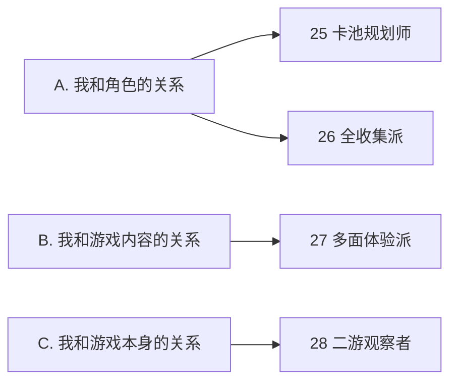

# 咕咕嘎嘎 × 二游玩家人格测试

# 新增人格设计补充稿 v0.2

> 用途：补充原有 24 个人格，扩展为 28 个人格视觉原型池。
> 本补充稿默认沿用原文档的固定角色识别锚点、统一画风、图片规格与 Base Prompt 逻辑。

---

# 9. 新增人格总览

| #  | 人格    | 建议分组                  | 人格核心                | 第一视觉符号          |
| -- | ----- | --------------------- | ------------------- | --------------- |
| 25 | 卡池规划师 | A. 我和角色的关系            | 抽卡不是冲动，而是跨版本资源调度    | 资源保险箱 + 长规划卷轴   |
| 26 | 全收集派  | A. 我和角色的关系            | 喜欢与否可以讨论，但图鉴不能有空格   | 巨大角色图鉴 + 最后一个空格 |
| 27 | 多面体验派 | B. 我和游戏内容的关系          | 不偏科，什么内容都想体验一下      | 巨型四色玩法魔方        |
| 28 | 二游观察者 | C. 我和游戏本身的关系（或新增观察维度） | 观察的不只是单个游戏，而是整个二游生态 | 巨型望远镜 + 多个游戏星球  |

---

# A. 我和角色的关系（新增）

## 25｜卡池规划师

### 人格核心

**抽卡不是冲动消费，而是一场跨版本资源调度。**

关键词：
`卡池规划` `资源管理` `屯抽` `预算纪律` `目标明确`

### 第一视觉符号

**守着一个塞满抽卡资源的透明保险箱，面前铺着一张长长的“未来卡池规划卷轴”。**

### 表情

* 极度克制
* 冷静
* 有一点肉疼
* 明明很想抽，但理智占了上风

### 动作

一只手拿铅笔在规划卷轴上画路线，另一只手死死按住一个发光的“抽卡按钮”。

### 核心道具

* 巨型透明资源保险箱
* 长条卡池规划卷轴
* 星石 / 抽卡券形状的资源
* 小算盘或资源计数器

### 服装 / 头饰

* 基础企鹅服
* 企鹅帽旁夹一支小铅笔
* 腰间挂小钥匙
* 胸前一个迷你资源袋

### 场景

迷你“卡池战略室”，后方只有少量虚化的未来角色卡池剪影。

### 特效

* 金色资源光点
* 蓝色规划路线
* 远处卡池微微发光
* 保险箱内部堆满闪亮资源

### 画面梗

> “这个版本不能抽。”
> “为什么？”
> “因为我三个版本以后有安排。”

或：

> “不是不抽，是还没到预算周期。”

### 完整 Prompt

```text
The same recurring original character "Gugu Gaga": a cute chibi anime girl in a black penguin kigurumi, oversized penguin hood with a yellow beak and round cartoon eyes, short black bob haircut with straight bangs, a small blue hair clip on the left side, large dark gray anime eyes, pale skin, rosy cheeks, rounded black-and-white penguin body with a white belly, yellow penguin feet, silver metallic collar clasp around the neck, tiny round body, oversized head, premium chibi 3D designer toy, soft vinyl collectible figure, polished high-quality 3D rendering.

Personality variant: "Gacha Banner Planner". She guards a large transparent resource vault filled with glowing generic gacha gems and ticket-shaped tokens, while a long planning scroll spreads across the floor showing abstract future banner blocks, resource paths and milestone symbols with no readable text. One hand carefully draws a route on the planning scroll with a tiny pencil, while the other hand firmly presses down her own hand before it can touch a tempting glowing summon button nearby. Calm but visibly tempted expression, eyes secretly glancing toward the glowing banner, tiny determined frown. A pencil clipped beside the penguin hood and a miniature vault key at her waist. Deep blue and golden strategic planning room, subtle glowing future character-card silhouettes in the distance, funny contrast between temptation and extreme self-control, clear silhouette, full-body, 4:5 vertical composition, premium toy photography, no readable text.
```

---

## 26｜全收集派

### 人格核心

**喜欢不喜欢可以讨论，但图鉴不能有空格。**

关键词：
`全图鉴` `完成主义` `角色收集` `补齐` `一个都不能少`

### 第一视觉符号

**一本巨大角色图鉴在她身后完全展开，像两扇翅膀；图鉴里几乎全部点亮，只剩最后一个空格。**

### 表情

* 满足
* 执着
* 轻微强迫症发作
* 对“最后一个空格”极度在意

### 动作

一手抱着巨大角色图鉴，另一只手高高举起“最后一张角色卡”，准备塞入最后一个槽位。

### 核心道具

* 巨大角色图鉴
* 最后一张缺失角色卡
* 收藏印章

### 服装 / 头饰

* 基础企鹅服
* 小白手套
* 胸口收藏家徽章
* 企鹅帽旁一根小书签

### 场景

角色收藏档案馆，后方是一排虚化收藏柜。

### 特效

* 已收集格子：金色、彩色、星光
* 唯一缺失格子：空白、灰色、轻微强调光

### 画面梗

> “我可以不用，但我不能没有。”

或：

> “不是厨不厨的问题，图鉴怎么能是 99%？”

### 完整 Prompt

```text
The same recurring original character "Gugu Gaga": a cute chibi anime girl wearing her signature black penguin kigurumi, oversized yellow-beak penguin hood, short black bob haircut with straight bangs, small blue hair clip on the left side, large dark gray anime eyes, rosy cheeks, white penguin belly, yellow penguin feet, silver metallic collar clasp, premium chibi 3D soft vinyl collectible toy.

Personality variant: "Completionist Collector". Behind her opens an enormous elegant character collection album like two giant wings, filled with neat rows of glowing generic character-card slots. Almost every slot is brightly completed except for one painfully obvious empty gray slot near the top corner. She holds the final missing generic character card high in one hand and prepares to place it into the last empty slot with ceremonial seriousness. Her expression mixes overwhelming satisfaction with obsessive focus on that single missing space, slightly narrowed eyes and a determined smile. Tiny white collector gloves, miniature bookmark decoration beside the penguin hood, subtle collector badge on her chest. Clean archive-like collection room with blurred display cabinets, golden completion sparkles around filled slots, the empty slot softly highlighted, humorous completionist obsession, highly readable silhouette, full-body 4:5 vertical composition, premium toy photography, no readable text.
```

---

# B. 我和游戏内容的关系（新增）

## 27｜多面体验派

### 人格核心

**剧情、战斗、探索、收集、养成……什么都想体验一下。**

关键词：
`广谱体验` `不偏科` `什么都玩` `尝鲜` `内容探索`

### 第一视觉符号

**正在转动一颗巨大的四色“游戏玩法魔方”。**

四个主要面分别用抽象图标暗示：

* 剧情
* 战斗
* 探索
* 收藏 / 角色

### 表情

* 好奇
* 兴致勃勃
* 眼睛很亮
* “这个也挺有意思”的兴趣感

### 动作

双手抱着 / 转动巨型玩法魔方，身体跟着魔方微微转动。

### 核心道具

* 巨型四色玩法魔方
* 一张小体验券 / 游戏手册

### 服装 / 头饰

* 基础企鹅服
* 一条四色短围巾
* 小型多功能腰包

### 场景

简洁的“游戏体验大厅”，背景被柔和分成几个区域，隐约可见遗迹、战斗场、剧情舞台、收藏展柜等内容元素。

### 特效

* 不同玩法面对应不同微光：蓝、紫、橙、金
* 魔方旋转时带有彩色轨迹

### 画面梗

> “主线挺好，深渊也打，地图也逛，图鉴顺便开一下。”

或：

> “为什么一定要选一种玩法？”

### 完整 Prompt

```text
The same recurring original character "Gugu Gaga": cute chibi anime girl in her signature black penguin kigurumi, oversized penguin hood with yellow beak and cartoon eyes, short black bob haircut with straight bangs, small blue hair clip on the left side, large dark gray anime eyes, rosy cheeks, white penguin belly, yellow penguin feet, silver metallic collar clasp, premium chibi 3D soft vinyl collectible figure.

Personality variant: "Multi-Faceted Experience Player". She enthusiastically holds and rotates an oversized colorful multi-faced puzzle cube representing different parts of a game. The visible faces contain simple abstract iconography for story, combat, exploration and character collection with no readable text: an open-book symbol, crossed weapon shapes, a landscape-map symbol and sparkling collection-card shapes. Her eyes are bright with curiosity, cheerful interested smile, posture actively turning the cube as if deciding what to experience next. A short multicolored scarf and tiny utility pouch decorate the penguin suit. Minimal game-experience hall in the background, softly divided into distant blurred areas suggesting ruins, a battle arena, a cinematic stage and a collection gallery. Colorful rotating light trails around the cube, lively but clean composition, broad curiosity rather than hardcore specialization, full-body 4:5, premium toy photography, no readable text.
```

---

# C. 我和游戏本身的关系（新增）

## 28｜二游观察者

### 人格核心

**玩的不只是某一个游戏，观察的是整个二游生态。**

关键词：
`品类观察` `跨游比较` `系统研究` `行业敏感` `版本趋势`

### 第一视觉符号

**一座迷你天文台 + 巨大的观测望远镜。**
望远镜看的不是普通星空，而是多个漂浮着的“小型游戏世界星球”。

### 表情

* 若有所思
* 好奇
* 有一点“果然如此”的微妙表情
* 研究者式兴奋

### 动作

一只眼睛贴着大型天文望远镜，一手拿记录板，像在观察整个二游宇宙。

### 核心道具

* 巨型天文望远镜
* 多颗二游星球
* 小记录板

### 服装 / 头饰

* 基础企鹅服
* 小型研究员披肩
* 企鹅帽顶部加一个迷你星形观测天线
* 腰间挂小记录册

### 场景

高处的小型二游观测站，远处是深蓝色天空，多个游戏世界像行星一样围绕运行。

### 特效

* 星轨
* 轨道线
* 数据节点
* 多个不同颜色的世界光晕

### 画面梗

> “别人玩版本，她在观察版本为什么这么做。”

或：

> “这个机制我好像去年在隔壁见过。”

### 完整 Prompt

```text
The same recurring original character "Gugu Gaga": a cute chibi anime girl in a black penguin kigurumi, oversized penguin hood with a yellow beak and round cartoon eyes, short black bob haircut with straight bangs, small blue hair clip on the left side, large dark gray anime eyes, rosy cheeks, white penguin belly, yellow penguin feet, silver metallic collar clasp, tiny rounded body, oversized head, premium chibi 3D designer toy, soft vinyl collectible figure, polished high-quality 3D rendering.

Personality variant: "Gacha Game Observer". She stands at a miniature futuristic observatory and peers through an oversized astronomical telescope, not toward normal stars but toward several small glowing fantasy game-world planets orbiting in the distance. Each miniature world has different abstract visual motifs such as character-card rings, battle symbols, exploration landmarks, event lights and gacha-like halos, with no logos and no readable text. She holds a small research clipboard beside the telescope, wearing a tiny researcher cape over the penguin suit and a small star-shaped observation antenna decoration on the hood. Thoughtful curious expression, one eyebrow slightly raised, subtle smile as if she has just discovered a pattern connecting several games. Deep blue observatory sky, cyan and purple orbit trails, floating analytical nodes and soft golden highlights, intellectual meta-level observation of the entire gacha-game ecosystem, clearly different from internet drama watching, strong readable silhouette, full-body 4:5 vertical composition, premium toy photography, no readable text.
```

---

# 10. 新增 4 人格视觉差异总表

| #  | 人格    | 第一视觉符号        | 主表情      | 主动作    |
| -- | ----- | ------------- | -------- | ------ |
| 25 | 卡池规划师 | 资源保险箱 + 长规划卷轴 | 克制、冷静、肉疼 | 压住抽卡按钮 |
| 26 | 全收集派  | 巨大图鉴 + 最后一空格  | 满足又执着    | 填最后一张卡 |
| 27 | 多面体验派 | 四色玩法魔方        | 好奇、兴奋    | 转动魔方   |
| 28 | 二游观察者 | 巨型望远镜 + 游戏星球  | 若有所思     | 观测多个世界 |

---

# 11. 与现有人格的区分建议

## 11.1 卡池规划师 vs 性能经理人

* **性能经理人**：关注“这个角色值不值得抽”
* **卡池规划师**：关注“我现在该不该抽、资源怎么分配”

视觉区分：

* 性能经理人：平板 + 数据图 + 经理气质
* 卡池规划师：资源保险箱 + 长规划卷轴 + 强克制感

## 11.2 全收集派 vs 都是我的翅膀

* **都是我的翅膀**：喜欢很多角色，感情容量大
* **全收集派**：即使不一定是本命，也不能让图鉴缺一块

视觉区分：

* 都是我的翅膀：周边抱满怀
* 全收集派：整齐图鉴 + 最后一个空格

## 11.3 多面体验派 vs 快乐体验家

* **快乐体验家**：怎么玩舒服就怎么玩，不凹不卷
* **多面体验派**：主动想把各种玩法都体验一下

视觉区分：

* 快乐体验家：懒人沙发 + 零食 + 佛系放松
* 多面体验派：玩法魔方 + 主动转动 + 内容广度

## 11.4 二游观察者 vs 社区观察员

* **社区观察员**：观察玩家、社区、节奏、争论
* **二游观察者**：观察游戏设计、版本趋势、不同二游之间的演化

视觉区分：

* 社区观察员：望远镜 + 小桌 + 瓜子 + 评论气泡
* 二游观察者：天文台 + 游戏星球 + 研究记录板

---

# 12. 建议的分组归属

如果继续沿用原有四大分组，建议这样放置：



---

# 13. 批量生成建议（补充）

新增 4 张图建议不要一次性和原有 24 张混在同一轮首发生成。
建议先单独校准这 4 张，重点确认：

* 脸型是否继续保持同一角色
* 蓝色发夹是否稳定存在
* 企鹅帽嘴型和圆眼是否统一
* 白肚皮面积是否一致
* 黄色脚造型是否统一
* 银色颈扣是否始终保留
* 3D 软胶潮玩材质是否一致
* 大道具是否足够“一眼区分”

新增 4 张图的重点剪影分别应当是：

* **卡池规划师**：守保险箱 / 长卷轴
* **全收集派**：展开的大图鉴
* **多面体验派**：巨型玩法魔方
* **二游观察者**：超大望远镜
