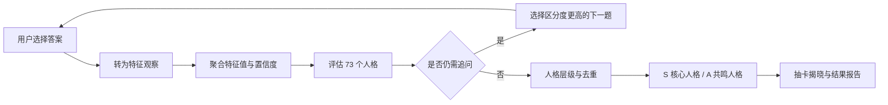

# 咕咕嘎嘎·二游玩家人格测试：设计思路、实现原理与优缺点总结

> 文档基于当前线上版本与代码实现整理，更新时间：2026-09-19。  
> 在线体验：<https://ai-ideology.github.io/gugugaga-test/>

## 1. 项目概述

“咕咕嘎嘎·二游玩家人格测试”是一款面向二次元游戏玩家的静态网页应用。它不试图判断用户的心理人格，而是通过角色偏好、内容体验、资源投入、游玩节律与社区互动等常见游戏情境，整理用户当前的二游偏好，并生成一组“核心人格”和“共鸣人格”。

当前版本包含：

- 65 道候选题组成的自适应题库；
- 约 24–35 道的动态答题路径；
- 角色、内容、投入、社交四个领域；
- 36 个底层特征；
- 11 个人格 Family；
- 73 个人格定义，其中 72 个公开人格、1 个隐藏人格；
- S 级核心人格与 A 级共鸣人格结果；
- 抽卡式揭晓、完整结果报告、人格图鉴与 PNG 分享图。

这里的 S 与 A 表示本次测试中的匹配层级，不是稀有度，也不代表人格优劣：S 是本次和用户匹配度最高的一组核心人格，A 是匹配度次高的共鸣人格。

## 2. 产品设计思路

### 2.1 为什么不直接复刻 MBTI

二游玩家的差异往往不是简单的性格二分，而是由多种游戏场景共同构成：

- 有人把角色视为战斗单位，有人更关注角色故事、审美和陪伴感；
- 有人围绕强度、配队和高难内容规划资源，有人更看重剧情、探索与演出；
- 有人长期稳定上线，有人只在大版本、新角色或新剧情出现时回归；
- 有人热衷同人、攻略与社区互动，也有人更喜欢独享体验；
- 同一个玩家可能同时拥有数个明显侧面，而非只能属于一个类型。

因此，本项目采用“多特征观察 + 多人格匹配”，不要求所有用户被压缩成唯一四字母类型。最终结果允许同时出现多个核心人格和共鸣人格，更接近二游玩家真实、复合且会随版本变化的游玩方式。

### 2.2 设计目标

项目在三个目标之间做平衡：

1. **有共鸣**：题目来自玩家熟悉的新角色、抽卡、复刻、养成、高难、剧情、长草期和社区互动等情境。
2. **有依据**：人格结果不只由单题触发，还综合匹配度、证据强度、证据数量、领域有效性和人格层级关系。
3. **有传播力**：通过轻二次元形象、卡牌揭晓、S/A 分层和分享海报，为结果增加记忆点和社交表达价值。

### 2.3 结果不是诊断

产品把结果定义为“当前游玩偏好快照”，而不是心理诊断。它不评价消费多少、练度高低、是否肝、是否追强度，也不把 S/A 做成玩家等级。这样可以降低价值判断，避免用娱乐测试给用户贴永久标签。

## 3. 内容与判定模型

### 3.1 四个观察领域

系统使用四个领域组织底层特征：

| 领域 | 代码 | 关注内容 |
| --- | --- | --- |
| 角色 | R | 审美、故事、陪伴、演出、本命与角色关系 |
| 内容 | C | 剧情、世界观、探索、收集、挑战与创作内容 |
| 投入 | I | 时间、资源、抽卡、养成、效率与预算边界 |
| 社区 | S | 攻略、同人、讨论、信息获取与同好互动 |

每个领域包含若干底层特征，当前共 36 个。特征既可以是数值，也可以是分类状态；未经历过的玩法可以记录为 `NA`，未知信息则保持 `UNKNOWN`，避免把“没玩过”误判成“不喜欢”。

### 3.2 自适应题路

题库共 65 题，按用途分成四个阶段：

| 阶段 | 题库数量 | 作用 |
| --- | ---: | --- |
| 入口校准 `gate` | 6 | 确认用户接触过哪些领域，建立适用边界 |
| 共享核心 `core` | 18 | 形成角色、内容、投入和社交的基础轮廓 |
| 动态追问 `route` | 30 | 围绕当前候选人格与低置信特征继续提问，最多选 8 题 |
| 档案确认 `confirm` | 11 | 对接近成立的侧面进行补充确认，最多选 3 题 |

答题不是从 65 题中随机抽取。系统每次提交答案后都会重新计算特征和候选人格，再为后续题目评分：

- 优先选择能区分当前高匹配候选人格的题目；
- 对尚未获得充分证据、置信度较低的特征给予额外优先级；
- 根据题目的 `routeIf` 和 `skipIf` 判断是否适合当前用户；
- 相同答案会得到相同题路，不使用随机数。

整体流程如下：

### 3.3 从答案到特征

每个选项包含三类后台信息：

- 对哪些特征进行更新；
- 该答案属于 E1、E2 或 E3 哪一档证据强度；
- 用于结果解释的题目与选项文案。

系统先把答案转换成 `Observation`，再按特征路径聚合：

- 数值特征按照证据权重计算加权平均；
- 分类特征使用有效观察值；
- 同一特征被多道题支持时，置信度随独立证据增加；
- 单题证据会受到置信度折减，避免“一题定人格”；
- 部分复合特征由若干子特征派生。

当前证据权重为：E1 = 0.6、E2 = 1、E3 = 1.5。

### 3.4 人格匹配与 S/A 判定

每个人格包含一组特征条件，例如某个特征高于阈值、低于阈值，或多个特征共同成立。系统会依次计算：

1. **领域门槛**：用户未接触的领域不参与相应人格的强判断；
2. **条件适配度**：根据特征值距离人格阈值的位置映射为 0–100 分；
3. **人格匹配度**：对多个条件按权重汇总；复合人格更强调短板约束；
4. **证据置信度**：综合独立题目数量和 E1/E2/E3 证据权重；
5. **直接证据**：部分人格必须出现指定的高强度直接证据；
6. **层级处理**：分支人格需要上层人格基础，特定子人格可替代父人格；
7. **同族去重**：高度重叠、证据来源相似的人格只保留更具代表性的一个。

当前主要判定门槛为：

- **S / 核心人格**：匹配度至少 80、证据置信度至少 0.8、至少有 2 个独立证据，并通过必要的直接证据检查；
- **A / 共鸣人格**：匹配度至少 65、证据置信度至少 0.6，并通过必要的直接证据检查；
- 匹配度达到 55 但证据不足的，只作为候选，不直接展示为 S 或 A；
- A 级结果按综合排序最多展示 7 个；
- 若没有人格达到 S 门槛，系统会展示当前最强信号，但不会为了视觉效果强行升级为 S。

排序分不仅考虑匹配度，也考虑证据置信度与人格具体程度。因此，“条件很像但证据很少”的人格不会轻易压过“多个情境持续支持”的人格。

## 4. 用户体验设计

### 4.1 页面结构

应用使用 Hash Router 组织主要流程：

- 首页：说明产品定位并进入测试；
- 测试页：动态显示题目、选项、答题规则和进度；
- 分析页：短暂整理动画；
- 揭晓页：依次翻开 A 卡与 S 卡，最后展示卡片集合；
- 结果页：展示主结果、核心人格、共鸣人格、答案依据和分享功能；
- 人格图鉴：按 Family 浏览公开人格；
- 人格详情：阅读人格描述、典型行为和相关人格；
- 判定原理：用玩家可理解的方式解释系统如何工作。

### 4.2 视觉语言

当前视觉采用 Neo-Brutalist Playful 风格，并加入轻二次元表达：

- 米白纸张背景、淡网格与黑色结构线；
- 黄色、粉色、青色、紫色作为高辨识度强调色；
- 卡片、标签、错位阴影和杂志式版面建立品牌感；
- 原创人格形象使用 WebP 正图与缩略图，兼顾画质和加载体积；
- 正文优先使用微软雅黑、苹方、思源黑体等系统字体，粗体主要留给标题和关键动作；
- 移动端压缩题目与选项空间，并将操作按钮放在全部选项之后，避免遮挡答案。

### 4.3 抽卡揭晓

揭晓不是单纯跳转，而是按“等待—翻卡—收下—归位—下一张—总览”的节奏展开：

- A 卡先揭晓，S 卡后揭晓，形成逐步升高的仪式感；
- 卡背、轨道、扫描、翻面和卡片归位共同构成反馈；
- 卡片最终排列成集合，让用户理解结果是“一组人格侧面”；
- S/A 只表达匹配层级，相关说明在集合页明确展示；
- 遵循 `prefers-reduced-motion`，用户启用减少动态效果后会显著缩短动画。

## 5. 技术实现

### 5.1 技术栈

- React 19 + TypeScript 5.8；
- Vite 7；
- React Router 7，使用 `HashRouter` 适配静态托管；
- Vitest + Testing Library；
- Playwright 端到端测试；
- `html-to-image` 生成 PNG 分享图；
- GitHub Actions + GitHub Pages 自动部署。

项目是纯静态前端，不需要后端、数据库、登录系统或环境变量。

### 5.2 内容与代码解耦

题库、底层特征、人格体系和结果文案主要维护在 `方案/` 目录下的结构化 Markdown 文件中。构建时由以下模块解析：

- `src/data/questionBank.ts`：解析题库；
- `src/data/features.ts`：解析底层特征；
- `src/data/identitySystem.ts`：组装人格规则、层级、文案和图片；
- `src/data/identityCopy.ts`：解析人格结果文案。

评分逻辑位于 `src/engine/`，页面流程位于 `src/App.tsx`，类型契约位于 `src/types.ts`。这种分层让内容维护者可以调整题目与文案，而不必直接修改评分引擎。

需要注意：人格条件与部分映射规则目前仍在 TypeScript 中维护，并未做到所有规则完全配置化。

### 5.3 状态保存与结果复现

答题状态以版本化 `QuizState` 保存在浏览器 `localStorage` 中，包括：

- 当前题号；
- 已形成的动态题路；
- 答案映射；
- 开始时间与完成状态；
- 揭晓状态；
- 结果快照。

刷新页面后可以恢复进度。结果快照带有题库、特征、人格和引擎版本；版本不兼容时会重新计算，减少规则升级后旧结果错配的风险。

### 5.4 分享图片

结果页在页面外构建固定尺寸的分享卡 DOM，再由 `html-to-image` 转换成 PNG。分享卡包含主人格形象、人格名、共鸣短句、长描述、典型行为和相关人格标签。浏览器支持 Web Share API 时可调用系统分享，否则下载 PNG 或复制结果文案。

### 5.5 构建与部署

本地开发和普通生产构建使用根路径；GitHub Pages 模式将 Vite `base` 设置为 `/gugugaga-test/`。每次推送到 `main` 后，GitHub Actions 会：

1. 安装锁定依赖；
2. 运行单元测试；
3. 执行 TypeScript 与 Pages 构建；
4. 上传 `dist/`；
5. 发布到 GitHub Pages。

## 6. 测试与质量保障

当前自动化测试覆盖：

- 65 道题是否完整加载及阶段数量是否正确；
- 36 个特征和 73 个人格是否完整；
- 人格编号是否唯一；
- 每个人格是否有完整结果文案与三条典型行为；
- 每个人格是否有正图与缩略图；
- 特征聚合、图片配色和评分引擎的关键行为；
- 主要用户流程的 Playwright 端到端测试基础。

GitHub Pages 的部署工作流会强制先运行单元测试，再允许发布。

## 7. 项目优点

### 7.1 产品层面

1. **二游语境明确**：题目、人格名称和结果文案来自真实玩家行为，比通用人格测试更容易产生共鸣。
2. **结果允许多面性**：S 核心人格与 A 共鸣人格共同呈现，避免唯一类型过度概括用户。
3. **无高低价值判断**：明确不将消费、强度、活跃度和 S/A 当作玩家优劣。
4. **结果有解释链**：从答案、特征、证据到人格匹配均可追溯，不是随机抽签。
5. **娱乐性与仪式感较强**：原创形象、抽卡揭晓和分享图提高完成率与传播意愿。
6. **无需登录**：用户可以直接体验，答题进度只保存在本机，进入成本低。

### 7.2 算法与内容层面

1. **自适应题路降低冗余**：基础题之后只追问当前候选方向和低置信特征。
2. **区分“未经历”和“不喜欢”**：领域门槛、`NA` 与 `UNKNOWN` 减少错误归因。
3. **防止一题定型**：S/A 都有最低匹配度和证据置信度要求。
4. **处理人格重叠**：父子替代和同族去重减少重复结果。
5. **计算确定可复现**：无随机判定，相同版本与答案会得到一致结果。

### 7.3 工程层面

1. **纯静态、部署简单**：无服务器成本，GitHub Pages 即可运行。
2. **内容与引擎基本分离**：结构化 Markdown 便于持续扩充题目和文案。
3. **类型契约清晰**：问题、特征、人格、结果和快照均有 TypeScript 类型约束。
4. **资源体系完整**：每个人格都具备正图与 WebP 缩略图。
5. **具备自动化发布门槛**：测试失败不会继续部署。

## 8. 项目缺点与风险

### 8.1 产品与研究风险

1. **尚未完成真实用户效度验证**：现有模拟认知走查不能替代 20–30 人以上的真实认知测试，更不能证明心理测量意义上的信度与效度。
2. **结果仍受自我报告偏差影响**：用户可能选择理想中的自己，而非真实行为；近期版本体验也可能放大某些答案。
3. **人格数量较多**：73 个人格增强了精细度，但也提高了用户理解成本、内容维护成本和相邻人格区分难度。
4. **S/A 容易被误读为稀有度**：虽然已有说明，抽卡视觉天然会让部分用户联想到等级，需要持续优化文案与呈现。
5. **偏好会随游戏和版本改变**：结果适合表达“当前状态”，不适合承诺长期稳定人格。
6. **题目覆盖仍可能不均衡**：不同游戏类型、玩家资历和社区参与程度可能导致部分人格更容易获得充分证据。

### 8.2 算法风险

1. **阈值主要来自规则设计**：80/65、0.8/0.6 等门槛具有可解释性，但尚缺少真实样本校准。
2. **线性加权模型表达能力有限**：它易于解释，但难以描述更复杂的条件交互和非线性行为。
3. **同族去重依赖人工规则**：重叠路径、证据交集和父子替代规则需要随内容扩充持续维护。
4. **自适应路径可能形成反馈偏差**：早期回答会影响后续追问方向，若入口题误选，可能减少其他方向的证据机会。
5. **结果数量不固定**：这是避免强凑人格的优点，但也可能让不同用户感觉“抽到的卡数不公平”，需要持续解释。

### 8.3 工程与体验问题

1. **首包仍偏大**：当前 JavaScript 构建产物超过 500 kB 警戒线，可通过路由级懒加载和模块拆分优化。
2. **核心页面集中在单个文件**：`src/App.tsx` 承担较多页面与流程，后续维护适合拆成页面组件、领域组件和 hooks。
3. **全量图片资源较多**：虽然已使用 WebP 和缩略图，图鉴仍需关注懒加载、缓存和低端手机内存占用。
4. **规则在前端公开**：纯静态实现意味着题库和评分逻辑可被查看；若未来需要防刷、统计或保密算法，则需要后端服务。
5. **数据只存本地**：更换设备、清除浏览器数据或无痕模式会丢失进度，无法跨设备恢复。
6. **没有运营数据闭环**：当前无法统计完成率、题目退出点、人格分布和分享转化，难以用真实行为持续校准。
7. **浏览器导图存在兼容性风险**：复杂字体、超长文案和部分移动浏览器可能影响 PNG 导出效果，需要持续做真机回归。
8. **部分旧样式和历史实现仍存在**：项目经过多轮视觉重构，样式表中有覆盖式规则和已不再使用的选择器，适合进行一次 CSS 清理。

## 9. 后续优化建议

### P0：先验证结果是否“说得像”

- 组织 20–30 名不同类型的二游玩家完成测试与访谈；
- 记录每题理解偏差、难选项、退出点和最终结果贴合度；
- 检查相邻人格是否能被用户清楚区分；
- 根据样本重新校准 S/A 阈值、置信度和题目路由优先级。

### P1：提升答题与结果解释

- 在结果页用一行固定图例持续解释 S/A；
- 展示少量用户可理解的“为什么匹配”，避免暴露专业公式；
- 对长题、七选项题和移动端小屏继续做真机测试；
- 优化结果数量差异的说明，降低“别人卡多、我卡少”的误解。

### P2：改善工程结构与性能

- 拆分 `App.tsx` 为页面、测试流程、揭晓流程、结果模块和图鉴模块；
- 合并并清理多轮覆盖产生的 CSS；
- 对图鉴、结果页和分享模块做动态加载；
- 为评分边界、回退结果、人格去重和版本恢复补充更多单元测试；
- 将更多人格条件迁移到结构化配置，减少规则与代码耦合。

### P3：建立可选的数据闭环

在明确隐私政策并征得用户同意的前提下，可以增加匿名统计：

- 每题选项分布；
- 题目停留和退出位置；
- 自适应路径长度；
- S/A 人格分布；
- 结果贴合度反馈；
- 分享与重新测试比例。

这些数据应只用于题库和阈值校准，不应采集不必要的个人信息。

## 10. 总结

本项目的核心价值不只是“把人格测试换成二游皮肤”，而是把二游玩家独有的角色关系、抽卡取舍、内容偏好、投入节律和社区互动转化为一套可追溯的多结果匹配系统。它已经形成了完整的产品闭环：结构化题库、自适应追问、证据聚合、人格判定、抽卡揭晓、结果解释、人格图鉴和分享传播。

目前最大的优势是主题鲜明、内容丰富、结果有解释依据且体验完整；最大的不足则是尚缺少真实用户样本校准，规则阈值与人格区分仍主要依赖设计推演。下一阶段最重要的工作不是继续增加人格数量，而是通过真实玩家测试验证题目理解、结果贴合度与相邻人格区分度，再据此优化题库和判定阈值。

