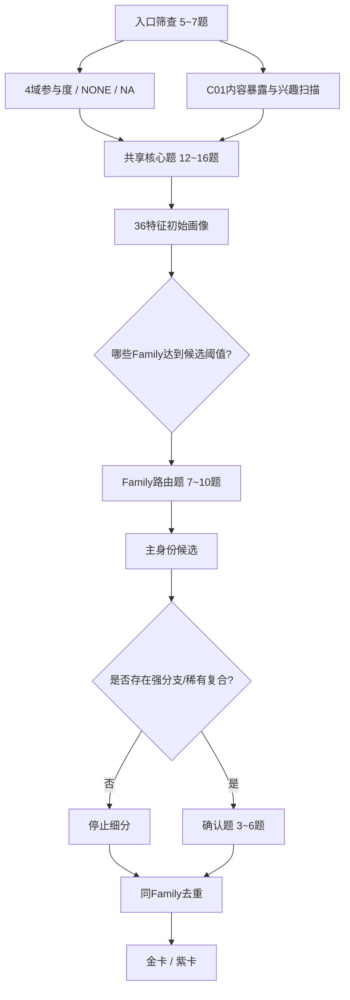

# 二游玩家身份测试｜36底层特征与题目覆盖矩阵 v0.1

> 基线：`二游玩家身份系统_身份体系冻结版_v0.6.1`。本文件不修改73个身份的核心定义，只负责把冻结身份转译成可执行的测量蓝图。
> 目标：先确定“测什么、何时问、什么算证据、何时跳过”，再进入正式题目文案。

---

## 0. 本版结论

- **73个身份不对应73套题**；正式题库围绕 **36个共享底层特征**组织。
- 36个特征分为四档：**A核心必测 / B共享或Family路由 / C高概率Family路由 / D分支或稀有复合确认**。
- 固定题只负责建立4域参与度与高复用特征；低复用、小众、专项玩法尽量路由后再问。
- `ANY` 是身份规则“不读取该域”；`NONE` 是玩家明确“不关注/不参与”；`NA/UNEXPOSED` 是“没接触/游戏没有，无法判断”。三者不能互换。
- **一题可以更新多个特征，但一题不能单独确认一个普通主身份。** 普通主身份原则上需要≥2条独立证据。
- 强分支采用“**父身份先成立，再继续细分**”；稀有复合必须让每个必需域都有独立证据，避免一题触发多金。
- 题量目标继续保持：**典型27～35题，复杂玩家35～42题，工程硬上限约44题**。

### 0.1 推荐的测量流程



---

## 1. 测量状态与证据规则

### 1.1 四种值不要混

| 状态 | 属于谁 | 含义 | 评分处理 |
|---|---|---|---|
| `ACTIVE` | 玩家 | 该域/玩法有实际参与，可继续测内部倾向 | 正常更新特征 |
| `NONE` | 玩家 | 明确不关注/不参与 | 对需要该域的身份形成Gate；**不是中间分** |
| `NA / UNEXPOSED` | 玩家-题目 | 游戏没有、没解锁、没接触，无法判断 | 缺失值，不形成负向证据 |
| `ANY` | 身份规则 | 这个身份根本不读取该域 | 该域不进入该身份公式 |

### 1.2 证据独立性

- 同一题即使同时更新 `C06 + I05`，在“独立证据计数”中仍只算 **1个 item_id**。
- 普通主身份：原则上需要 **≥2个独立 item_id**；至少1条应是行为/情境证据，而不是纯自我标签。
- 强分支：父身份成立后，允许 **1条非常直接的分支证据**确认；否则需要2条独立分支证据。
- 稀有复合：每个必需域都必须有至少1条独立证据，并且至少再有1条“跨域组合行为”证据。
- 隐藏身份 `二游观察者`：必须证明是真实低参与，而不是题目没问够造成的 `LOW_EVIDENCE`。

### 1.3 推荐的证据等级

| 等级 | 含义 | 例子 |
|---|---|---|
| `E0` | 无证据 / NA | 从未接触塔防 |
| `E1` | 弱支持 | “有时会看攻略” |
| `E2` | 有效支持 | 多次主动自己配队并根据环境调整 |
| `E3` | 强直接证据 | 明确长期只用赠送角色、不抽卡进行挑战 |

> 第一版题库先记录 `feature_score + evidence_level + item_ids`，不要只保存一个最终分数。这样后续校准、解释“为什么是你”和处理矛盾都会简单很多。

---

## 2. 36底层特征总覆盖矩阵

### 2.1 R｜角色关系（6项）

| Code | 特征 | 类型 | 测量档位 | 最低证据 | 主要服务身份 |
|---|---|---|---|---|---|
| `R01` | **角色吸引动机向量** | 向量 | A｜核心必测 | 至少2条独立证据；其中1条可为高信息量多选/排序题 | 本命真爱党、都是我的翅膀、版本心动派、XP鉴赏家、角色故事鉴赏家、角色陪伴派、演出控、强度党、手感党、缺啥补啥党、本命应援官 |
| `R02` | **本命集中 ↔ 博爱** | 双极 | A｜核心必测 | 至少2条独立证据，最好包含“关注/资源冲突时怎么选” | 本命真爱党、都是我的翅膀、白月光守护者、本命毕业党、逆天改命党、本命研究所长 |
| `R03` | **长情 ↔ 追新** | 双极 | B｜共享核心 | 1条跨版本情境 + 1条历史行为证据 | 版本心动派、白月光守护者 |
| `R04` | **角色关系/羁绊关注** | 标量 | B｜路由测量 | 1条直接偏好 + 1条行为/内容消费证据 | 关系雷达、羁绊组队党、嗑学家 |
| `R05` | **抽卡计划性 ↔ 即时性** | 双极 | A｜核心必测 | 至少2条独立抽卡决策情境 | 卡池规划师、抽卡行动派 |
| `R06` | **目标持久性/复刻耐心** | 标量 | D｜分支确认 | 1条强直接证据即可，但必须建立在明确目标存在上 | 复刻守望者 |

### 2.2 C｜内容玩法（15项）

| Code | 特征 | 类型 | 测量档位 | 最低证据 | 主要服务身份 |
|---|---|---|---|---|---|
| `C01` | **内容兴趣向量** | 向量 | A｜入口+核心 | 入口1题做广度扫描；高概率分量再用1条行为题确认 | 剧情沉浸党、世界观考古学家、剧情速通侠、OST收藏家、自由探索家、摄影师、家园建筑师、解谜破译员、全收集派、肉鸽常驻户、卡牌大师、塔防指挥官、闭关开荒党 |
| `C02` | **剧情沉浸深度** | 标量 | A｜共享核心 | 至少2条：阅读/观看行为 + 情绪/注意投入 | 角色故事鉴赏家、嗑学家、剧情沉浸党、入戏太深、剧情速通侠、OST收藏家 |
| `C03` | **世界观研究深度** | 标量 | C｜Family路由 | 1条直接研究行为 + 1条具体例子式证据 | 世界观考古学家 |
| `C04` | **自由探索驱动** | 标量 | B｜Family路由 | 1条无奖励情境 + 1条实际探索行为 | 自由探索家 |
| `C05` | **完成/收集驱动** | 标量 | B｜Family路由 | 至少2种不同系统的完成行为，避免单一系统误判 | 全收集派 |
| `C06` | **战斗挑战欲** | 标量 | A｜共享核心 | 1条真实参与 + 1条失败后的行为反应 | 逆天改命党、高难攻坚党、扫地僧、原生阵容挑战者、极限竞速手 |
| `C07` | **配队构筑兴趣** | 标量 | B｜Family路由 | 1条自主构筑行为 + 1条新角色/新环境重组情境 | 缺啥补啥党、羁绊组队党、本命研究所长、配队专家、原生阵容挑战者、攻略课代表 |
| `C08` | **机制研究倾向** | 标量 | C｜Family路由 | 至少1条“先研究再用”的直接行为；最好再有反向题 | 本命研究所长、机制党、攻略课代表 |
| `C09` | **操作精进倾向** | 标量 | D｜分支确认 | 1条专项训练行为 + 1条持续练习证据 | 手法磨练师 |
| `C10` | **数值/面板量化** | 标量 | D｜分支确认 | 1条直接工具使用证据即可；偶尔看别人表格只算弱证据 | 精算师 |
| `C11` | **养成精修倾向** | 标量 | B｜Family路由 | 1条标准定义 + 1条超过够用线后的继续投入 | 毕业党、词条精修师 |
| `C12` | **省时策略接受度** | 标量 | A｜共享核心 | 至少2个不同情境，区分“省时”与“不会所以抄” | 剧情速通侠、作业速通党、自动托管党 |
| `C13` | **内容广度** | 派生+确认 | B｜派生为主 | 主要由C01多个分量派生；全面体验派候选时用1条取舍题确认 | 全面体验派 |
| `C14` | **玩法手感敏感度** | 标量 | C｜角色/战斗路由 | 1条角色选择冲突题 + 1条实际试玩行为 | 手感党 |
| `C15` | **资源保留倾向** | 双极/标量 | B｜共享核心 | 2条资源冲突情境，至少一条非抽卡资源 | 屯屯鼠 |

### 2.3 I｜投入方式（5项）

| Code | 特征 | 类型 | 测量档位 | 最低证据 | 主要服务身份 |
|---|---|---|---|---|---|
| `I01` | **日常规律度** | 标量 | A｜核心必测 | 1条频率行为 + 1条漏做时反应/补做行为 | 日课打卡派 |
| `I02` | **总体投入强度：肝 ↔ 佛** | 双极 | A｜核心必测 | 至少2条跨场景证据，避免只问每日时长 | 自动托管党、秒速收菜员、随心体验派、二游观察者 |
| `I03` | **版本投入节律** | 类别向量 | A｜核心必测 | 1条版本周期行为题 + 1条活动截止/首日情境 | 版本活动特种兵、版本候鸟、首日冲锋队、活动末日战神、闭关开荒党 |
| `I04` | **多游投入分配** | 事实+标量 | B｜入口事实 | 1条事实题 + 1条分配策略题；只有长期并行才高 | 二游管理大师 |
| `I05` | **深度打磨耐力** | 标量 | B｜跨Family共享 | 至少2条来自不同目标或1条长期强行为证据 | 本命毕业党、逆天改命党、本命研究所长、高难攻坚党、扫地僧、手法磨练师、极限竞速手、词条精修师 |

### 2.4 S｜玩家关系（10项）

| Code | 特征 | 类型 | 测量档位 | 最低证据 | 主要服务身份 |
|---|---|---|---|---|---|
| `S01` | **社区接触度** | 标量 | A｜核心必测 | 1条频率/渠道行为 + 1条“没有社区会怎样”的闭环题 | 扫地僧、桃花源玩家、节奏绝缘体 |
| `S02` | **社区内容消费向量** | 向量 | B｜Family路由 | 1条内容类型多选 + 高分量1条强度题 | 长评潜水员、二创巡礼者、二创住民 |
| `S03` | **信息追踪向量** | 向量 | B｜Family路由 | 1条来源偏好 + 1条事件情境 | 极限竞速手、吃瓜群众、前瞻雷达 |
| `S04` | **主动互动/找同好** | 标量 | A｜共享核心 | 1条主动行为频率 + 1条新内容后的自然反应 | 嗑学家、极限竞速手、同好召集人 |
| `S05` | **联机共玩** | 标量 | B｜Family路由 | 1条联机偏好 + 1条实际共玩/约人行为 | 联机气氛组、萌新引路人 |
| `S06` | **互助答疑/知识分享** | 双子信号 | C｜Family路由 | 至少1条实际行为；若要区分攻略课代表/萌新引路人，再补1条取舍题 | 萌新引路人、攻略课代表 |
| `S07` | **创作输出向量** | 向量 | C｜Family路由 | 1条创作事实题；高概率类别再问频率/持续性 | 嗑学家、本命研究所长、攻略课代表、同人创作者、梗图工厂 |
| `S08` | **应援/晒卡表达** | 双子信号 | C｜角色/社区路由 | 至少1条直接外显行为；区分应援与晒卡 | 本命应援官、晒卡党 |
| `S09` | **独立判断/抗节奏** | 标量 | C｜主身份确认 | 至少2条冲突情境；必须先有社区接触 | 节奏绝缘体 |
| `S10` | **版本防剧透回避** | 专项事实 | D｜稀有复合确认 | 1条明确直接行为即可 | 闭关开荒党 |

---

## 3. 36个特征的可执行定义

### R｜角色关系

#### `R01`｜角色吸引动机向量　`A｜核心必测`

- **测什么**：XP/外观人设、功能强度、角色塑造、陪伴、演出等动机可并存；测“为什么角色会吸引你”，不强迫二选一。
- **最低证据**：至少2条独立证据；其中1条可为高信息量多选/排序题。
- **何时问**：R域参与度>NONE即测；若明确不关注角色则跳过大部分R题。
- **NONE / NA**：R域=NONE时记缺失，不把所有分量记0；个别未接触的陪伴/演出系统可NA。
- **最易混淆**：不要把“喜欢战斗玩法”误算成“因强度抽角色”；角色强度必须落到角色选择/抽取决策。
- **当前直接服务身份**：本命真爱党、都是我的翅膀、版本心动派、XP鉴赏家、角色故事鉴赏家、角色陪伴派、演出控、强度党、手感党、缺啥补啥党、本命应援官。

#### `R02`｜本命集中 ↔ 博爱　`A｜核心必测`

- **测什么**：是否存在少数稳定核心角色，还是长期容易对多个角色同时产生真实喜欢。
- **最低证据**：至少2条独立证据，最好包含“关注/资源冲突时怎么选”。
- **何时问**：R域ACTIVE且角色吸引动机非NONE。
- **NONE / NA**：不关注角色=缺失；不能用“角色少”推断本命集中。
- **最易混淆**：本命集中≠长情；博爱≠追新。
- **当前直接服务身份**：本命真爱党、都是我的翅膀、白月光守护者、本命毕业党、逆天改命党、本命研究所长。

#### `R03`｜长情 ↔ 追新　`B｜共享核心`

- **测什么**：旧角色情感权重是否稳定，新角色是否容易快速进入关注中心。
- **最低证据**：1条跨版本情境 + 1条历史行为证据。
- **何时问**：R02有有效角色关系后。
- **NONE / NA**：新玩家/游戏时长过短可NA，不强判。
- **最易混淆**：追新不等于抽卡冲动；长情不等于只喜欢一个角色。
- **当前直接服务身份**：版本心动派、白月光守护者。

#### `R04`｜角色关系/羁绊关注　`B｜路由测量`

- **测什么**：是否主动注意友情、阵营、CP/家族、立场变化、对话互动等关系线索。
- **最低证据**：1条直接偏好 + 1条行为/内容消费证据。
- **何时问**：C剧情/角色塑造或S二创/讨论有参与时优先路由。
- **NONE / NA**：几乎不看剧情且不接触关系向内容可NONE/低适用。
- **最易混淆**：关注角色本身≠关注角色之间的关系。
- **当前直接服务身份**：关系雷达、羁绊组队党、嗑学家。

#### `R05`｜抽卡计划性 ↔ 即时性　`A｜核心必测`

- **测什么**：跨版本规划、目标纪律、资源预留，与看到想抽就立即行动之间的倾向。
- **最低证据**：至少2条独立抽卡决策情境。
- **何时问**：R域抽卡参与>NONE；原生阵容挑战者候选需先确认是否主动不抽。
- **NONE / NA**：不抽卡/极少抽卡先区分“主动自限”与“未参与”，不能硬记计划性极高。
- **最易混淆**：屯资源≠卡池规划；计划性测的是目标和决策，不是单纯舍不得花。
- **当前直接服务身份**：卡池规划师、抽卡行动派。

#### `R06`｜目标持久性/复刻耐心　`D｜分支确认`

- **测什么**：错过明确角色目标后，是否会跨版本持续等待而不是迅速转向。
- **最低证据**：1条强直接证据即可，但必须建立在明确目标存在上。
- **何时问**：卡池规划师/白月光候选达到阈值后才问。
- **NONE / NA**：从未错过明确目标=NA。
- **最易混淆**：复刻等待≠长情本身；它是抽卡目标行为。
- **当前直接服务身份**：复刻守望者。

### C｜内容玩法

#### `C01`｜内容兴趣向量　`A｜入口+核心`

- **测什么**：剧情、世界观、音乐、探索、解谜、摄影、建造、战斗、配队、收集、肉鸽、卡牌、塔防等多分量兴趣与实际参与。
- **最低证据**：入口1题做广度扫描；高概率分量再用1条行为题确认。
- **何时问**：所有玩家必测；专项玩法仅对有暴露者继续。
- **NONE / NA**：游戏没有/从未接触某玩法=NA/UNEXPOSED；明确接触但不喜欢才记低。
- **最易混淆**：“玩过”不是“喜欢”；奖励驱动参与不能直接等于兴趣高。
- **当前直接服务身份**：剧情沉浸党、世界观考古学家、剧情速通侠、OST收藏家、自由探索家、摄影师、家园建筑师、解谜破译员、全收集派、肉鸽常驻户、卡牌大师、塔防指挥官、闭关开荒党。

#### `C02`｜剧情沉浸深度　`A｜共享核心`

- **测什么**：愿意完整体验文本、人物情绪、演出与叙事，而不是只拿关键结论。
- **最低证据**：至少2条：阅读/观看行为 + 情绪/注意投入。
- **何时问**：C01剧情或角色故事兴趣达到中等以上。
- **NONE / NA**：几乎没有剧情暴露可NA。
- **最易混淆**：剧情沉浸≠世界观考据；也≠角色故事导致抽卡。
- **当前直接服务身份**：角色故事鉴赏家、嗑学家、剧情沉浸党、入戏太深、剧情速通侠、OST收藏家。

#### `C03`｜世界观研究深度　`C｜Family路由`

- **测什么**：主动查设定、文本、时间线、伏笔，并建立自己的解释或因果链。
- **最低证据**：1条直接研究行为 + 1条具体例子式证据。
- **何时问**：C01世界观高或长评/PV逐帧消费明显时。
- **NONE / NA**：没接触足够世界观内容可NA。
- **最易混淆**：认真看剧情≠主动考据；必须有超出主线被动接收的研究行为。
- **当前直接服务身份**：世界观考古学家。

#### `C04`｜自由探索驱动　`B｜Family路由`

- **测什么**：即使奖励很少，也会因为空间发现、路线、环境细节而主动漫游。
- **最低证据**：1条无奖励情境 + 1条实际探索行为。
- **何时问**：C01探索高时。
- **NONE / NA**：无探索型地图/游戏结构可NA。
- **最易混淆**：为了宝箱100%跑图属于C05，不等于自由探索。
- **当前直接服务身份**：自由探索家。

#### `C05`｜完成/收集驱动　`B｜Family路由`

- **测什么**：对图鉴、宝箱、成就、限定物、缺口等未完成状态的敏感度。
- **最低证据**：至少2种不同系统的完成行为，避免单一系统误判。
- **何时问**：C01收集或多系统完成倾向中高。
- **NONE / NA**：相关系统不存在可NA。
- **最易混淆**：单一本命精养不是全收集；奖励价值高导致去拿也不等于完成欲。
- **当前直接服务身份**：全收集派。

#### `C06`｜战斗挑战欲　`A｜共享核心`

- **测什么**：是否主动碰高难、提高难度、追求更极限目标，而不是只完成最低要求。
- **最低证据**：1条真实参与 + 1条失败后的行为反应。
- **何时问**：C01战斗参与中等以上。
- **NONE / NA**：游戏无高难/玩家未解锁可NA。
- **最易混淆**：角色强度关注≠自己喜欢打高难。
- **当前直接服务身份**：逆天改命党、高难攻坚党、扫地僧、原生阵容挑战者、极限竞速手。

#### `C07`｜配队构筑兴趣　`B｜Family路由`

- **测什么**：是否主动理解角色职能、队伍结构、循环、反应/协同与组合。
- **最低证据**：1条自主构筑行为 + 1条新角色/新环境重组情境。
- **何时问**：战斗/配队兴趣中高。
- **NONE / NA**：游戏无配队系统可NA。
- **最易混淆**：照抄固定最强队不算构筑高；强度党也不必然会配队。
- **当前直接服务身份**：缺啥补啥党、羁绊组队党、本命研究所长、配队专家、原生阵容挑战者、攻略课代表。

#### `C08`｜机制研究倾向　`C｜Family路由`

- **测什么**：喜欢自己理解技能机制、交互规则、边界条件和用法。
- **最低证据**：至少1条“先研究再用”的直接行为；最好再有反向题。
- **何时问**：C01战斗/机制或C07中高。
- **NONE / NA**：玩法过于简单/无机制空间可NA。
- **最易混淆**：配队结构研究和单角色/系统机制研究要分开。
- **当前直接服务身份**：本命研究所长、机制党、攻略课代表。

#### `C09`｜操作精进倾向　`D｜分支确认`

- **测什么**：是否专门练轴、连招、取消后摇、闪避/格挡、输入节奏等。
- **最低证据**：1条专项训练行为 + 1条持续练习证据。
- **何时问**：高难攻坚党候选且I05高时。
- **NONE / NA**：回合制/无操作空间可NA。
- **最易混淆**：打高难不一定练手法；重复打本也不是专项训练。
- **当前直接服务身份**：手法磨练师。

#### `C10`｜数值/面板量化　`D｜分支确认`

- **测什么**：是否主动用表格、计算器、伤害工具或定量比较方案。
- **最低证据**：1条直接工具使用证据即可；偶尔看别人表格只算弱证据。
- **何时问**：配队/机制/养成候选高时。
- **NONE / NA**：游戏数值透明度极低可NA。
- **最易混淆**：看攻略结论≠自己量化；不要把强度关注直接算成精算。
- **当前直接服务身份**：精算师。

#### `C11`｜养成精修倾向　`B｜Family路由`

- **测什么**：从“能用”继续向高完成度、毕业标准推进的倾向。
- **最低证据**：1条标准定义 + 1条超过够用线后的继续投入。
- **何时问**：角色养成参与中高。
- **NONE / NA**：游戏无随机装备/养成深度低时部分子项NA。
- **最易混淆**：本命毕业党还需要R02本命集中；毕业党不要求只养本命。
- **当前直接服务身份**：毕业党、词条精修师。

#### `C12`｜省时策略接受度　`A｜共享核心`

- **测什么**：对成熟作业、自动、扫荡、托管等减少重复劳动方式的接受度。
- **最低证据**：至少2个不同情境，区分“省时”与“不会所以抄”。
- **何时问**：所有玩家可测；具体自动系统不存在时相应子项NA。
- **NONE / NA**：没有自动/扫荡功能=该子项NA。
- **最易混淆**：佛系不等于一定抄作业；效率高也不代表低投入。
- **当前直接服务身份**：剧情速通侠、作业速通党、自动托管党。

#### `C13`｜内容广度　`B｜派生为主`

- **测什么**：多个内容类型同时保持真实、主动、高参与，而不是“都碰过一点”。
- **最低证据**：主要由C01多个分量派生；全面体验派候选时用1条取舍题确认。
- **何时问**：C01至少4个分量达到中高后。
- **NONE / NA**：内容类型暴露不足时降低置信度。
- **最易混淆**：广度≠总游戏时长；低强度平均参与不能算全面体验。
- **当前直接服务身份**：全面体验派。

#### `C14`｜玩法手感敏感度　`C｜角色/战斗路由`

- **测什么**：操作反馈、技能循环、打击感/节奏对选择角色与玩法的重要度。
- **最低证据**：1条角色选择冲突题 + 1条实际试玩行为。
- **何时问**：R域角色选择参与且C战斗参与中高。
- **NONE / NA**：纯回合制可将“手感”解释为操作循环/机制顺手度；仍不适用则NA。
- **最易混淆**：演出好看≠手感好；机制有趣≠操作反馈合口味。
- **当前直接服务身份**：手感党。

#### `C15`｜资源保留倾向　`B｜共享核心`

- **测什么**：稀有养成资源倾向先囤还是有明确提升就转化；不涉及充值。
- **最低证据**：2条资源冲突情境，至少一条非抽卡资源。
- **何时问**：所有有养成资源系统的玩家。
- **NONE / NA**：几乎无稀缺资源系统可NA。
- **最易混淆**：卡池规划是目标导向；屯屯鼠是资源本身倾向保留。
- **当前直接服务身份**：屯屯鼠。

### I｜投入方式

#### `I01`｜日常规律度　`A｜核心必测`

- **测什么**：日课、周期维护、连续性等固定节律的稳定程度。
- **最低证据**：1条频率行为 + 1条漏做时反应/补做行为。
- **何时问**：所有实际游玩玩家。
- **NONE / NA**：没有日课/周期系统时相关子项NA。
- **最易混淆**：日课规律高≠总体肝度高；几分钟也可以天天打卡。
- **当前直接服务身份**：日课打卡派。

#### `I02`｜总体投入强度：肝 ↔ 佛　`A｜核心必测`

- **测什么**：时间/精力投入强度，以及是否愿意被奖励、完成度、最优解牵引。
- **最低证据**：至少2条跨场景证据，避免只问每日时长。
- **何时问**：所有玩家。
- **NONE / NA**：极低参与玩家仍可测，并与二游观察者边界联动。
- **最易混淆**：佛系≠不喜欢游戏；肝≠高手。
- **当前直接服务身份**：自动托管党、秒速收菜员、随心体验派、二游观察者。

#### `I03`｜版本投入节律　`A｜核心必测`

- **测什么**：stable / version_burst / first_day / deadline / long_grass 等投入时间结构。
- **最低证据**：1条版本周期行为题 + 1条活动截止/首日情境。
- **何时问**：玩过至少一个完整版本周期者。
- **NONE / NA**：刚入坑未经历版本周期=NA。
- **最易混淆**：版本候鸟是long_grass+version_burst，不是简单版本期多玩。
- **当前直接服务身份**：版本活动特种兵、版本候鸟、首日冲锋队、活动末日战神、闭关开荒党。

#### `I04`｜多游投入分配　`B｜入口事实`

- **测什么**：是否长期同时维护多款二游，以及是否主动安排不同游戏的日课/活动/版本节点。
- **最低证据**：1条事实题 + 1条分配策略题；只有长期并行才高。
- **何时问**：入口先问当前长期维护二游数量≥2才继续。
- **NONE / NA**：只玩一款=低，不是NA。
- **最易混淆**：偶尔试玩多款≠二游管理大师。
- **当前直接服务身份**：二游管理大师。

#### `I05`｜深度打磨耐力　`B｜跨Family共享`

- **测什么**：为了高难、养成、竞速、本命等目标持续重试、刷取和优化的耐力。
- **最低证据**：至少2条来自不同目标或1条长期强行为证据。
- **何时问**：高难/养成/本命深耕任一候选出现时。
- **NONE / NA**：没有出现需要打磨的目标时可低置信，不强判低。
- **最易混淆**：日常规律不是打磨耐力；长时间挂机也不算。
- **当前直接服务身份**：本命毕业党、逆天改命党、本命研究所长、高难攻坚党、扫地僧、手法磨练师、极限竞速手、词条精修师。

### S｜玩家关系

#### `S01`｜社区接触度　`A｜核心必测`

- **测什么**：从完全独享到高频浏览/参与社区的连续程度。
- **最低证据**：1条频率/渠道行为 + 1条“没有社区会怎样”的闭环题。
- **何时问**：所有玩家。
- **NONE / NA**：明确完全不接触社区=NONE/极低，但不是缺失。
- **最易混淆**：只看不说仍是社区接触高，不要误判为独享。
- **当前直接服务身份**：扫地僧、桃花源玩家、节奏绝缘体。

#### `S02`｜社区内容消费向量　`B｜Family路由`

- **测什么**：长评、同人图文、二创视频、手书/MMD/混剪等潜水消费偏好，并记录时间占比。
- **最低证据**：1条内容类型多选 + 高分量1条强度题。
- **何时问**：S01>低；完全不接触社区则跳过。
- **NONE / NA**：某类内容从未刷到/不了解可NA。
- **最易混淆**：消费二创≠创作二创；长评消费和剧情沉浸也不是同一件事。
- **当前直接服务身份**：长评潜水员、二创巡礼者、二创住民。

#### `S03`｜信息追踪向量　`B｜Family路由`

- **测什么**：节奏事件、官方前瞻、爆料/测试服等信息源的关注方式。
- **最低证据**：1条来源偏好 + 1条事件情境。
- **何时问**：S01>低或版本活动参与高。
- **NONE / NA**：不接触对应信息源=低/不参与；平台不可达可NA。
- **最易混淆**：看官方前瞻≠吃瓜；追爆料≠卡池规划。
- **当前直接服务身份**：极限竞速手、吃瓜群众、前瞻雷达。

#### `S04`｜主动互动/找同好　`A｜共享核心`

- **测什么**：主动发言、找同好、交流观点、分享体验的程度。
- **最低证据**：1条主动行为频率 + 1条新内容后的自然反应。
- **何时问**：S01不为NONE。
- **NONE / NA**：完全不接触社区则直接低，不再追问。
- **最易混淆**：高社区接触可以只是潜水，不等于主动互动。
- **当前直接服务身份**：嗑学家、极限竞速手、同好召集人。

#### `S05`｜联机共玩　`B｜Family路由`

- **测什么**：与别人一起玩对快乐、持续参与和解决问题的重要度。
- **最低证据**：1条联机偏好 + 1条实际共玩/约人行为。
- **何时问**：玩过有联机/协助功能的游戏。
- **NONE / NA**：游戏不支持联机=NA。
- **最易混淆**：社区聊天多≠喜欢联机。
- **当前直接服务身份**：联机气氛组、萌新引路人。

#### `S06`｜互助答疑/知识分享　`C｜Family路由`

- **测什么**：分别记录“讲清方法/知识”和“实际带人/救场/帮过本”。
- **最低证据**：至少1条实际行为；若要区分攻略课代表/萌新引路人，再补1条取舍题。
- **何时问**：S04/S05中高或用户有帮助他人行为。
- **NONE / NA**：从未遇到求助场景可NA。
- **最易混淆**：攻略课代表偏知识解释；萌新引路人偏实际陪玩解决问题。
- **当前直接服务身份**：萌新引路人、攻略课代表。

#### `S07`｜创作输出向量　`C｜Family路由`

- **测什么**：攻略、同人、梗图等稳定创作行为；区分偶尔转发与原创产出。
- **最低证据**：1条创作事实题；高概率类别再问频率/持续性。
- **何时问**：S01中高或自报有创作行为。
- **NONE / NA**：没有创作=低，不需要固定追问。
- **最易混淆**：转发/收藏不算创作；写攻略并入攻略课代表而非独立身份。
- **当前直接服务身份**：嗑学家、本命研究所长、攻略课代表、同人创作者、梗图工厂。

#### `S08`｜应援/晒卡表达　`C｜角色/社区路由`

- **测什么**：围绕本命的公开应援表达，与围绕抽卡结果的晒卡表达分开记录。
- **最低证据**：至少1条直接外显行为；区分应援与晒卡。
- **何时问**：R情感/抽卡参与且S01>NONE。
- **NONE / NA**：不接触社区但线下应援仍可有应援信号；晒卡无抽卡则NA。
- **最易混淆**：喜欢角色不等于应援；抽卡多不等于晒卡。
- **当前直接服务身份**：本命应援官、晒卡党。

#### `S09`｜独立判断/抗节奏　`C｜主身份确认`

- **测什么**：接触社区后，仍维持自身体验与判断，不轻易被共识替代。
- **最低证据**：至少2条冲突情境；必须先有社区接触。
- **何时问**：S01中高且有节奏/评价暴露。
- **NONE / NA**：完全不看社区=NA，不能因此判“节奏绝缘体”。
- **最易混淆**：独享不是抗节奏；抗节奏需要“看了但不被带走”。
- **当前直接服务身份**：节奏绝缘体。

#### `S10`｜版本防剧透回避　`D｜稀有复合确认`

- **测什么**：新剧情/版本上线时主动隔离社区、视频、评论，先完成个人体验。
- **最低证据**：1条明确直接行为即可。
- **何时问**：C新内容/剧情高 + I03首发投入候选时。
- **NONE / NA**：不在意剧透或不接触剧情则低/不适用。
- **最易混淆**：平时不逛社区不是闭关开荒；必须是版本期主动防剧透。
- **当前直接服务身份**：闭关开荒党。

---

## 4. 73身份 → 测量路径覆盖表

> 这张表不是重新定义身份，而是规定题库如何为冻结身份收集证据。

| Family | 身份 | 层级 | Mask | 冻结公式 | 测量阶段 | 最低独立证据要求 |
|---|---|---|---|---|---|---|
| F01 | **本命真爱党** | 主身份 | `1000` | R01情感向 + R02本命集中 | 主身份判定 | 原则上≥2条独立证据；至少1条为行为/情境证据 |
| F01 | **都是我的翅膀** | 主身份 | `1000` | R01情感向 + R02博爱 | 主身份判定 | 原则上≥2条独立证据；至少1条为行为/情境证据 |
| F01 | **版本心动派** | 主身份 | `1000` | R01情感向 + R03追新 | 主身份判定 | 原则上≥2条独立证据；至少1条为行为/情境证据 |
| F01 | **白月光守护者** | 主身份 | `1000` | R03长情 + R02稳定核心 | 主身份判定 | 原则上≥2条独立证据；至少1条为行为/情境证据 |
| F01 | **XP鉴赏家** | 主身份 | `1000` | R01.XP/外观/人设高 | 主身份判定 | 原则上≥2条独立证据；至少1条为行为/情境证据 |
| F01 | **角色故事鉴赏家** | 主身份 | `1100` | R01.塑造高 + C02剧情沉浸 | 主身份判定 | 原则上≥2条独立证据；至少1条为行为/情境证据 |
| F01 | **角色陪伴派** | 主身份 | `1000` | R01.陪伴高 | 主身份判定 | 原则上≥2条独立证据；至少1条为行为/情境证据 |
| F01 | **关系雷达** | 主身份 | `1000` | R04羁绊关注高 | 主身份判定 | 原则上≥2条独立证据；至少1条为行为/情境证据 |
| F01 | **演出控** | 主身份 | `1000` | R01.演出高 | 主身份判定 | 原则上≥2条独立证据；至少1条为行为/情境证据 |
| F02 | **强度党** | 主身份 | `1000` | R01.强度高 | 主身份判定 | 原则上≥2条独立证据；至少1条为行为/情境证据 |
| F02 | **手感党** | 主身份 | `1100` | R01角色选择 + C14手感敏感高 | 主身份判定 | 原则上≥2条独立证据；至少1条为行为/情境证据 |
| F02 | **缺啥补啥党** | 主身份 | `1100` | R01功能向 + C07配队构筑 | 主身份判定 | 原则上≥2条独立证据；至少1条为行为/情境证据 |
| F02 | **卡池规划师** | 主身份 | `1000` | R05计划性高 + 目标明确 | 主身份判定 | 原则上≥2条独立证据；至少1条为行为/情境证据 |
| F02 | **抽卡行动派** | 主身份 | `1000` | R05即时性高 | 主身份判定 | 原则上≥2条独立证据；至少1条为行为/情境证据 |
| F02 | **复刻守望者** | 强分支 | `1000` | R06目标持久性高 | 分支确认 | 父身份成立 + 1条强直接证据（或2条独立分支证据） |
| F02 | **玄学抽卡师** | 强分支 | `1000` | R域参与 + 专项行为证据 | 分支确认 | 父身份成立 + 1条强直接证据（或2条独立分支证据） |
| F03 | **本命毕业党** | 主身份 | `1010` | R02本命集中 + I05深度打磨耐力 | 主身份判定 | 原则上≥2条独立证据；至少1条为行为/情境证据 |
| F03 | **本命应援官** | 主身份 | `1001` | R01情感向 + S08应援表达 | 主身份判定 | 原则上≥2条独立证据；至少1条为行为/情境证据 |
| F03 | **羁绊组队党** | 强分支 | `1100` | R04羁绊关注 + C07配队构筑 | 分支确认 | 父身份成立 + 1条强直接证据（或2条独立分支证据） |
| F03 | **逆天改命党** | 稀有复合 | `1110` | R02本命集中 + C06高难挑战 + I05深度打磨 | 跨域复合确认 | 所有必需域均有独立证据 + 至少1条跨域组合证据 |
| F03 | **嗑学家** | 稀有复合 | `1101` | R04羁绊关注 + C02剧情细读 + S04/S07社区表达 | 跨域复合确认 | 所有必需域均有独立证据 + 至少1条跨域组合证据 |
| F03 | **本命研究所长** | 稀有复合 | `1111` | R02本命集中 + C07/C08研究 + I05长期打磨 + S07输出 | 跨域复合确认 | 所有必需域均有独立证据 + 至少1条跨域组合证据 |
| F04 | **剧情沉浸党** | 主身份 | `0100` | C01.剧情高 + C02沉浸深 | 主身份判定 | 原则上≥2条独立证据；至少1条为行为/情境证据 |
| F04 | **入戏太深** | 强分支 | `0100` | C02情绪共鸣极高 + 剧情余韵强 | 分支确认 | 父身份成立 + 1条强直接证据（或2条独立分支证据） |
| F04 | **世界观考古学家** | 主身份 | `0100` | C01.世界观高 + C03研究深 | 主身份判定 | 原则上≥2条独立证据；至少1条为行为/情境证据 |
| F04 | **剧情速通侠** | 主身份 | `0100` | C01.剧情有参与 + C12省时倾向高 + C02较低 | 主身份判定 | 原则上≥2条独立证据；至少1条为行为/情境证据 |
| F04 | **OST收藏家** | 主身份 | `0100` | C01.音乐/OST高 + C02氛围沉浸 | 主身份判定 | 原则上≥2条独立证据；至少1条为行为/情境证据 |
| F05 | **自由探索家** | 主身份 | `0100` | C01.探索高 + C04自由探索驱动 | 主身份判定 | 原则上≥2条独立证据；至少1条为行为/情境证据 |
| F05 | **摄影师** | 主身份 | `0100` | C01.摄影高 | 主身份判定 | 原则上≥2条独立证据；至少1条为行为/情境证据 |
| F05 | **家园建筑师** | 主身份 | `0100` | C01.建造高 | 主身份判定 | 原则上≥2条独立证据；至少1条为行为/情境证据 |
| F05 | **解谜破译员** | 主身份 | `0100` | C01.解谜高 | 主身份判定 | 原则上≥2条独立证据；至少1条为行为/情境证据 |
| F05 | **全收集派** | 主身份 | `0100` | C01.收集高 + C05完成驱动高 | 主身份判定 | 原则上≥2条独立证据；至少1条为行为/情境证据 |
| F05 | **全面体验派** | 主身份 | `0100` | C13内容广度高 | 主身份判定 | 原则上≥2条独立证据；至少1条为行为/情境证据 |
| F06 | **高难攻坚党** | 主身份 | `0110` | C06挑战欲高 + I05打磨耐力 | 主身份判定 | 原则上≥2条独立证据；至少1条为行为/情境证据 |
| F06 | **扫地僧** | 稀有复合 | `0111` | C06高难能力/参与高 + I05长期打磨 + S01低外显/独享 | 跨域复合确认 | 所有必需域均有独立证据 + 至少1条跨域组合证据 |
| F06 | **配队专家** | 主身份 | `0100` | C07配队构筑高 | 主身份判定 | 原则上≥2条独立证据；至少1条为行为/情境证据 |
| F06 | **原生阵容挑战者** | 主身份 | `1100` | R域抽卡主动自限/NONE + C06/C07玩法挑战 | 主身份判定 | 原则上≥2条独立证据；至少1条为行为/情境证据 |
| F06 | **机制党** | 主身份 | `0100` | C08机制研究高 | 主身份判定 | 原则上≥2条独立证据；至少1条为行为/情境证据 |
| F06 | **手法磨练师** | 强分支 | `0110` | C09操作精进高 + I05练习耐力 | 分支确认 | 父身份成立 + 1条强直接证据（或2条独立分支证据） |
| F06 | **精算师** | 强分支 | `0100` | C10数值量化高 | 分支确认 | 父身份成立 + 1条强直接证据（或2条独立分支证据） |
| F06 | **极限竞速手** | 稀有复合 | `0111` | C06极限指标 + I05反复打磨 + S03/S04社区基准 | 跨域复合确认 | 所有必需域均有独立证据 + 至少1条跨域组合证据 |
| F06 | **作业速通党** | 主身份 | `0100` | C12省时策略高（攻略复用） | 主身份判定 | 原则上≥2条独立证据；至少1条为行为/情境证据 |
| F06 | **自动托管党** | 主身份 | `0110` | C12自动/扫荡接受高 + I02偏佛 | 主身份判定 | 原则上≥2条独立证据；至少1条为行为/情境证据 |
| F07 | **毕业党** | 主身份 | `0100` | C11养成精修高 | 主身份判定 | 原则上≥2条独立证据；至少1条为行为/情境证据 |
| F07 | **词条精修师** | 强分支 | `0110` | C11词条精修高 + I05持续刷取 | 分支确认 | 父身份成立 + 1条强直接证据（或2条独立分支证据） |
| F07 | **屯屯鼠** | 主身份 | `0100` | C15资源保留倾向高 | 主身份判定 | 原则上≥2条独立证据；至少1条为行为/情境证据 |
| F08 | **肉鸽常驻户** | 主身份/路由 | `0100` | C01.肉鸽高 | 专项路由 | 原则上≥2条独立证据；至少1条为行为/情境证据 |
| F08 | **卡牌大师** | 主身份/路由 | `0100` | C01.卡牌高 | 专项路由 | 原则上≥2条独立证据；至少1条为行为/情境证据 |
| F08 | **塔防指挥官** | 主身份/路由 | `0100` | C01.塔防高 | 专项路由 | 原则上≥2条独立证据；至少1条为行为/情境证据 |
| F09 | **日课打卡派** | 主身份 | `0010` | I01日常规律高 | 主身份判定 | 原则上≥2条独立证据；至少1条为行为/情境证据 |
| F09 | **秒速收菜员** | 主身份 | `0010` | I02偏佛 + 短会话证据 | 主身份判定 | 原则上≥2条独立证据；至少1条为行为/情境证据 |
| F09 | **随心体验派** | 主身份 | `0010` | I02佛系/够用高 | 主身份判定 | 原则上≥2条独立证据；至少1条为行为/情境证据 |
| F09 | **版本活动特种兵** | 主身份 | `0010` | I03版本爆发型 | 主身份判定 | 原则上≥2条独立证据；至少1条为行为/情境证据 |
| F09 | **版本候鸟** | 强分支 | `0010` | I03=长草低参与+新版本回升 | 分支确认 | 父身份成立 + 1条强直接证据（或2条独立分支证据） |
| F09 | **首日冲锋队** | 强分支 | `0010` | I03=首日爆发 | 分支确认 | 父身份成立 + 1条强直接证据（或2条独立分支证据） |
| F09 | **活动末日战神** | 强分支 | `0010` | I03=截止爆发 | 分支确认 | 父身份成立 + 1条强直接证据（或2条独立分支证据） |
| F09 | **二游管理大师** | 主身份 | `0010` | I04多游分配高 | 主身份判定 | 原则上≥2条独立证据；至少1条为行为/情境证据 |
| F09 | **二游观察者** | 隐藏身份 | `0000` | 四域参与度整体低 + I02低投入 | 边界兜底 | 4域真实低参与证据充分，且排除LOW_EVIDENCE |
| F10 | **桃花源玩家** | 主身份 | `0001` | S01社区需求低/独享闭环 | 主身份判定 | 原则上≥2条独立证据；至少1条为行为/情境证据 |
| F10 | **同好召集人** | 主身份 | `0001` | S04主动互动高 | 主身份判定 | 原则上≥2条独立证据；至少1条为行为/情境证据 |
| F10 | **节奏绝缘体** | 主身份 | `0001` | S01有接触 + S09独立判断高 | 主身份判定 | 原则上≥2条独立证据；至少1条为行为/情境证据 |
| F10 | **吃瓜群众** | 主身份 | `0001` | S03.节奏事件追踪高 | 主身份判定 | 原则上≥2条独立证据；至少1条为行为/情境证据 |
| F10 | **长评潜水员** | 主身份 | `0001` | S02.长评消费高 | 主身份判定 | 原则上≥2条独立证据；至少1条为行为/情境证据 |
| F10 | **联机气氛组** | 主身份 | `0001` | S05联机共玩高 | 主身份判定 | 原则上≥2条独立证据；至少1条为行为/情境证据 |
| F10 | **萌新引路人** | 主身份 | `0101` | S06互助意愿高 + S05实际带人/救场 + C域基础能力 | 主身份判定 | 原则上≥2条独立证据；至少1条为行为/情境证据 |
| F10 | **前瞻雷达** | 主身份 | `0001` | S03.官方/爆料情报追踪高 | 主身份判定 | 原则上≥2条独立证据；至少1条为行为/情境证据 |
| F10 | **闭关开荒党** | 稀有复合 | `0111` | C01新内容高 + I03首发投入 + S10防剧透回避 | 跨域复合确认 | 所有必需域均有独立证据 + 至少1条跨域组合证据 |
| F11 | **攻略课代表** | 主身份 | `0101` | C07/C08有知识 + S06知识分享；S07.攻略输出可加分 | 主身份判定 | 原则上≥2条独立证据；至少1条为行为/情境证据 |
| F11 | **二创巡礼者** | 主身份 | `0001` | S02.同人消费高 | 主身份判定 | 原则上≥2条独立证据；至少1条为行为/情境证据 |
| F11 | **二创住民** | 强分支 | `0001` | S02.二创消费极高 + “二创时间≥游戏时间”直接证据 | 分支确认 | 父身份成立 + 1条强直接证据（或2条独立分支证据） |
| F11 | **同人创作者** | 主身份 | `0001` | S07.同人创作高 | 主身份判定 | 原则上≥2条独立证据；至少1条为行为/情境证据 |
| F11 | **梗图工厂** | 强分支 | `0001` | S07.梗创作高 | 分支确认 | 父身份成立 + 1条强直接证据（或2条独立分支证据） |
| F11 | **晒卡党** | 主身份 | `1001` | R域抽卡参与 + S08.晒卡表达高 | 主身份判定 | 原则上≥2条独立证据；至少1条为行为/情境证据 |

---

## 5. 题目覆盖策略：哪些必须固定问，哪些绝不能固定问

### 5.1 A档：典型用户必须拿到稳定证据

`R01`、`R02`、`R05`、`C01`、`C02`、`C06`、`C12`、`I01`、`I02`、`I03`、`S01`、`S04`

这些特征承担4域底座和高复用判定。建议典型用户对每个A档特征形成1～2条证据，但通过“一题多特征”压缩题量。

### 5.2 B档：有条件共享，达到路由条件就补

`R03`、`R04`、`C04`、`C05`、`C07`、`C11`、`C13`、`C15`、`I04`、`I05`、`S02`、`S03`、`S05`

B档不等于小众；它们通常对某一Family非常重要，但不值得所有玩家固定回答两次。

### 5.3 C档：Family已经有苗头再问

`C03`、`C08`、`C14`、`S06`、`S07`、`S08`、`S09`

例如 `C10精算`、`S07创作输出`，如果入口和共享题完全没有相关行为，就不要为了“覆盖完整”硬问。

### 5.4 D档：只为分支/稀有复合确认

`R06`、`C09`、`C10`、`S10`

这些题最适合做抽卡前的“最后鉴别”：用户已经很像某一族，再用1题确认是否值得出更具体的卡。

---

## 6. 第一版题槽规划（不是最终文案）

### 6.1 入口筛查：建议6题

| 槽位 | 目标 | 主要更新 | 说明 |
|---|---|---|---|
| `G01` | 角色参与与抽卡参与 | R域Gate、R01粗扫 | 明确提供“我基本不关注角色/不抽角色”；主动自限不抽要单独留信号 |
| `G02` | 内容类型与暴露扫描 | C01、专项NA | 剧情/探索/战斗/配队/收集/摄影/建造/解谜/肉鸽/卡牌/塔防等多选；区分喜欢、玩过、没接触 |
| `G03` | 总体肝佛与日常节律 | I01、I02 | 避免只问每日小时数，加入奖励/完成度冲突 |
| `G04` | 版本周期 | I03 | 识别稳定、版本爆发、首日、截止、长草 |
| `G05` | 社区接触与主动性 | S01、S04 | 把“完全不看”“只看不说”“主动发言”拆开 |
| `G06` | 多游事实与联机暴露 | I04、S05暴露 | 只做事实Gate；不把多游本身做成额外生态层 |

### 6.2 共享核心：建议12～14个槽位

| 槽位 | 高信息量情境主题 | 同时覆盖 |
|---|---|---|
| `K01` | 喜欢的新角色很吸引你，但强度/剧情/演出各有取舍 | R01、C14（条件） |
| `K02` | 两个都喜欢的角色只能优先一个：本命、博爱与新角冲突 | R02、R03 |
| `K03` | 资源够抽当前想要角色，但未来已有明确目标 | R05、R06弱筛 |
| `K04` | 一段重要剧情很长，奖励又在后面 | C02、C12 |
| `K05` | 低奖励区域有景色/谜题/宝箱缺口 | C04、C05、C01探索/解谜/收集 |
| `K06` | 高难连续失败后你会怎么处理 | C06、I05、C12 |
| `K07` | 新角色/新环境改变队伍结构 | C07、C08、R01功能向 |
| `K08` | 角色已经能用，但装备还有明显提升空间 | C11、C15、I05 |
| `K09` | 日课快过期但今天很累 | I01、I02、C12 |
| `K10` | 版本上线与活动截止两个时间点的真实节律 | I03、I02 |
| `K11` | 社区普遍评价与你自己的体验相反 | S01、S04、S09 |
| `K12` | 新版本后你最自然会做什么：玩、看前瞻、看长评、看二创、找人聊 | S02、S03、S04、C01 |
| `K13` | 朋友/萌新卡关来求助 | S05、S06 |
| `K14` | 喜欢的角色出了新内容，你会不会公开表达/分享 | S08、S04、R01情感向 |

> 实际工程不一定让所有玩家都回答K01～K14；例如R域NONE可跳过K01～K03、K14，S域NONE可跳过K11～K14中的社区部分。

### 6.3 Family路由题

- `F01/F03` 角色高参与：补 `R04`、本命深耕与角色塑造冲突题。
- `F04` 剧情高参与：补 `C03`；剧情沉浸极高时才调度“入戏太深”确认。
- `F05` 探索/收集高：补 `C04/C05` 的无奖励与跨系统证据；摄影/家园/解谜可直接用行为题确认。
- `F06` 战斗构筑高：补 `C08`；高难+打磨再补 `C09/C10`；原生阵容挑战者用直接自限题确认。
- `F08` 专项玩法：肉鸽/卡牌/塔防只对 `C01` 暴露者各问0～1题。
- `F10/F11` 社区高：根据消费/创作/互助苗头补 `S02/S03/S06/S07/S08/S09`。

### 6.4 分支/复合确认题预算

- 每个用户最多优先确认 **3～5个最可能影响结果展示的候选**。
- 父身份已经很明确、但分支不影响结果页时，可以不追问。
- 同Family内若两个身份高度相似，优先问“能一刀切开”的取舍题，不重复问同义频率题。

---

## 7. 题目写作规范

### 7.1 优先问行为和冲突，不直接问身份名

不推荐：
> “你是不是一个强度党？”

推荐结构：
> 给出一个真实二游情境，让XP、强度、时间、完成度、社交等因素发生冲突，看玩家自然牺牲什么、保留什么。

### 7.2 每题尽量只制造一个主要冲突

- 一题可以更新2～4个特征，但用户看到的情境应当简单。
- 不要为了高信息量把5个条件全部塞进一句话，导致用户不知道自己在回答哪件事。
- 共享题负责“广”，路由题负责“深”。

### 7.3 NONE和NA最好做成独立UI出口

- `不关注/不参与` 与普通A/B/C/D答案同层时，用户容易误以为它是“最消极选项”。
- 建议在选项区域下方单独提供：`这类内容我基本不参与`、`我没接触过/游戏没有`。
- `NONE`可以触发跳题；`NA`只跳过对应玩法，不降低玩家总体参与度。

### 7.4 控制社会赞许偏差

- 少用“认真、理性、专业、正确、懒、菜、上头”等带评价词。
- 不把“自己研究”写得比“抄作业”高级；两个选项都要有合理收益。
- 不把“肝”写成努力、“佛”写成摆烂；测的是投入方式，不是优劣。

### 7.5 避免游戏单一化

- 高难不要只写“深渊”；可写“深渊/混沌/末日/高难塔/挑战关等同类内容”。
- 体力、命座、专武等词可以用玩家熟悉表达，但正文最好加通用括号：如“体力/行动点”。
- 塔防、肉鸽、卡牌等专项玩法必须允许 `NA/UNEXPOSED`。

---

## 8. 当前覆盖风险与重点

### 8.1 低复用特征

以下特征直接服务的身份很少，**不应因为矩阵存在就进入固定题**：

`R06`、`C03`、`C04`、`C05`、`C09`、`C10`、`C13`、`C14`、`C15`、`I01`、`I04`、`S09`、`S10`

处理原则：
- 若是主身份唯一核心（如 `C03世界观研究`、`C04自由探索`、`C05收集驱动`、`I01日课规律`、`I04多游分配`、`S09抗节奏`），用入口/Family苗头触发1～2题即可。
- 若是强分支/复合专用（如 `R06/C09/C10/S10`），只做确认题。
- 如果20～30人认知测试发现某低复用身份命中率极低、共鸣弱，优先删除身份/降为证据，而不是继续增加题。

### 8.2 最容易发生误判的关键边界

| 边界 | 必须问清的区别 |
|---|---|
| 强度党 vs 高难攻坚党 | 前者是“角色强度影响抽取”；后者是“自己喜欢挑战高难”。 |
| 本命真爱党 vs XP鉴赏家 | 前者是少数核心席位；后者是外观/人设作为角色吸引门槛。 |
| 角色故事鉴赏家 vs 剧情沉浸党 | 前者是角色塑造改变对角色的喜爱/抽取；后者是剧情本身就是核心内容。 |
| 世界观考古学家 vs 剧情沉浸党 | 主动查资料、拼设定，不能只靠认真看主线成立。 |
| 自由探索家 vs 全收集派 | 无奖励也愿意逛 vs 因为缺口想清完。 |
| 配队专家 vs 机制党 | 队伍结构/角色组合 vs 技能与规则交互。 |
| 卡池规划师 vs 屯屯鼠 | 有未来目标的计划纪律 vs 资源本身倾向保留。 |
| 日课打卡派 vs 秒速收菜员 | 规律性高 vs 单次会话极短；两者可以同时成立。 |
| 桃花源玩家 vs 节奏绝缘体 | 不依赖社区 vs 看社区但保持独立判断。 |
| 攻略课代表 vs 萌新引路人 | 讲清方法/知识 vs 实际陪玩、救场、带本。 |
| 二创巡礼者 vs 二创住民 | 长期消费二创 vs 二创已经成为主要娱乐、时间接近/超过游戏。 |
| 版本活动特种兵 vs 版本候鸟 | 版本期变肝 vs 长草期显著退出、版本来才回升。 |

---

## 9. 第一轮题库QA标准

每道正式题写完后至少检查：

1. **覆盖**：它明确更新哪些 feature code？主特征与副特征分别是什么？
2. **独立性**：它是否只是上一题换个说法？
3. **适用性**：是否需要 `NONE` 或 `NA`？
4. **二游通用性**：换成另一款二游是否仍然能答？
5. **可猜性**：玩家能否一眼看出“选这个就会出某张卡”？如果太明显，改成冲突情境。
6. **价值中立**：选项之间是否有明显“更聪明/更努力/更高级”的暗示？
7. **信息量**：一题是否至少帮助区分两个候选，或更新一个高价值特征？
8. **路由价值**：若是小众题，是否真的只在相关玩家那里出现？
9. **证据类型**：纯态度题不能独立作为强分支/稀有复合的唯一证据。
10. **结果解释**：未来结果页能否用这道题生成自然的“为什么是你”证据句？

---

## 10. 下一步：正式题库 v0.1 的交付结构

下一份正式题库建议按以下字段写，每题都可直接进入工程配置：

```text
question_id
stage: gate | core | route | confirm
prompt
options[]
none_option
na_option
updates: [{feature, component?, delta/score, evidence_level}]
route_if
skip_if
identity_support
identity_contradiction
max_display_priority
why_you_template
```

正式题库第一版建议先写 **约55～65道题池**，不是让每个人答55～65题：

- 入口/共享核心：约20～24道；
- Family路由：约25～30道；
- 强分支/稀有复合确认：约10～12道；
- 每名用户由自适应逻辑实际抽取约27～35道，复杂用户35～42道。

> **本文件冻结的不是题目文案，而是测量目标。** 后续可以持续改题目，只要每道题仍然服务同一组feature code，就不会破坏身份系统。