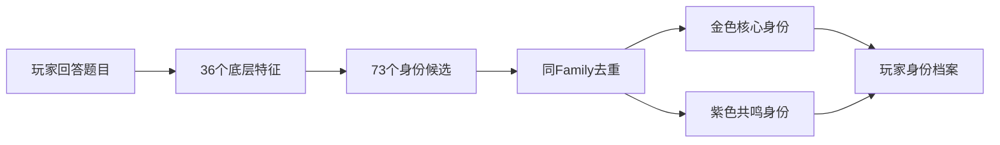
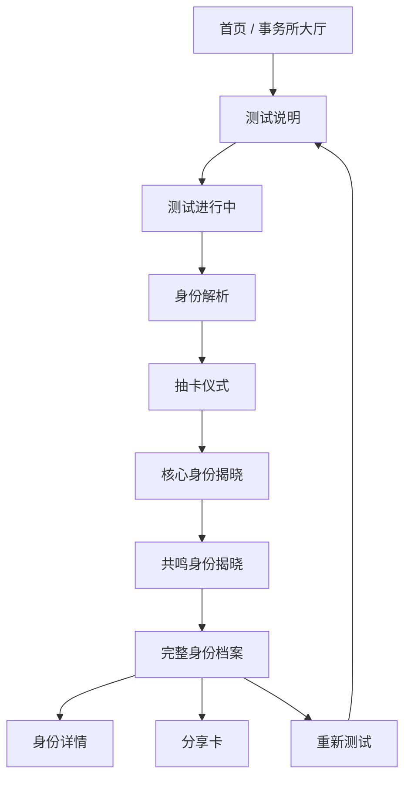
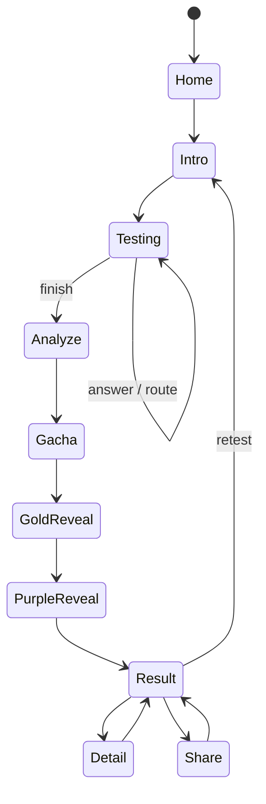

# 二游玩家身份测试｜产品需求与用户流程 PRD v1.0

> **产品代号**：咕咕嘎嘎玩家身份事务所  
> **目标平台**：Bilibili Toy、TapTap（移动端 + PC网页/PC客户端内嵌网页）  
> **产品形态**：响应式 H5 / Web App，一套代码、多平台发布  
> **业务基线**：
> - `二游玩家身份系统_身份体系冻结版_v0.6.1.md`
> - `二游玩家身份测试_36底层特征与题目覆盖矩阵_v0.1.md`
> - `二游玩家身份测试_正式题库_v0.1.md`
> - `二游玩家身份测试_判定引擎与评分算法规范_v1.0.md`
>
> 本文档负责回答：**用户看到什么、按什么顺序体验、PC/移动端怎么适配、平台差异怎么处理、开发完成的验收标准是什么。**
>
> 本文档不重新定义身份、底层特征或题目语义；如有冲突，以“身份体系冻结版 → 题目覆盖矩阵 → 正式题库 → 判定引擎规范”的业务定义为准。

---

# 0. 产品结论

## 0.1 一句话产品定义

一个面向二游玩家的、带“抽卡出金”体验的自适应身份测试：

> 玩家通过约 27～35 道动态题目，得到 2～4 张常态金色核心身份、3～7 张紫色共鸣身份，并生成一张适合 Bilibili / TapTap 分享传播的“玩家身份档案”。

它不是传统 MBTI 式“只能属于一个人格”，而是：



## 0.2 产品核心卖点

1. **二游专属**：问题围绕角色、抽卡、剧情、世界观、高难、配队、养成、版本节律、二创、社区等真实二游行为。
2. **不是单人格**：允许一个玩家同时拥有多个高匹配身份。
3. **抽卡式结果揭晓**：结果不是普通报告页，而是“出金 → 身份卡揭晓 → 紫卡共鸣 → 完整档案”。
4. **有传播感的身份名**：例如“本命真爱党 / 世界观考古学家 / 吃瓜群众 / 二创住民 / 扫地僧 / 原生阵容挑战者”等。
5. **自适应题量**：不要求每个人回答完整 65 题题池。
6. **平台原生传播**：结果卡天然适合 Bilibili Toy、动态/评论区、TapTap 社区讨论。

---

# 1. 平台策略

## 1.1 总体原则：一套 Web App，两套平台适配器

禁止为 Bilibili Toy 和 TapTap 分别维护两套业务代码。

推荐：

```text
src/
├─ app/                 # 与平台无关的产品
├─ engine/              # question / feature / identity / result
├─ components/
├─ data/
├─ platform/
│  ├─ base.ts
│  ├─ bilibili-toy.ts
│  └─ taptap.ts
└─ assets/
```

统一接口示意：

```ts
interface PlatformAdapter {
  platform: 'bilibili_toy' | 'taptap' | 'standalone';
  getSafeArea(): SafeAreaInfo;
  shareResult?(payload: SharePayload): Promise<void>;
  openExternal?(url: string): void;
  track?(event: AnalyticsEvent): void;
  getUserContext?(): Promise<PlatformUserContext | null>;
}
```

业务代码不得出现：

```ts
if (window.location.host.includes('bilibili')) { ... }
```

而应通过 adapter 处理。

## 1.2 Bilibili Toy 定位

Bilibili Toy 官方将“测试、小游戏、工具、抽卡、生成器”等明确列为适合内容；Toy 支持站内直接体验、分享结果卡，并可与视频、动态、评论区联动。

因此 B站版本的产品目标不是“像普通官网”，而是：

> **打开即测 → 测完就能晒 → 晒完能回到评论区讨论。**

Bilibili Toy 适配重点：

- 不依赖外部登录完成核心测试。
- 启动时间尽可能短。
- 支持结果卡生成。
- URL/静态资源路径使用相对路径或可配置 base URL。
- 不依赖不可控第三方 CDN 才能启动核心流程。
- 适配 B站 App 内 WebView 与桌面浏览器。
- 后退/刷新后尽可能恢复测试进度。
- 平台审核相关能力以 Toy 管理端当前提示为准，不在业务代码中硬编码假设。

## 1.3 TapTap 定位

TapTap 当前公开开发者文档支持：

1. **H5 小游戏 / 即点即玩形态**；
2. 游戏详情页的“活动与公告”可挂活动 / H5 活动链接；
3. PC 与移动端均有平台展示能力。

本项目在 TapTap 上推荐优先采用：

### Route A｜H5 即点即玩

若开发者后台和审核形态允许，将本产品作为 H5 小游戏 / 互动内容发布。

### Route B｜H5 活动页

如果产品更适合依附于已有 TapTap 项目页或活动页，则使用同一响应式 Web Build 作为 H5 活动内容。

> **注意**：若按“游戏”形态正式上架，不能只做一个简单网站壳。TapTap 的审核规范明确不鼓励低质量网页模板包装。最终发布形态以开发者后台当时可用权限和审核要求为准。

TapTap 适配重点：

- 移动端优先。
- PC 同样可完整体验。
- 不出现 Bilibili Logo、B站导流文案等跨平台物料。
- B站版 / TapTap版使用相同内容逻辑，但宣传封面和平台 CTA 分离。
- 结果分享图使用“平台中性母版 + 平台专用角标配置”，避免跨平台水印问题。

---

# 2. 用户与使用场景

## 2.1 核心用户

### U1｜重度二游玩家
- 长期玩 1～3 款二游。
- 对角色、配队、剧情、社区等至少两个领域有明显偏好。
- 期望测试“懂二游，不是套 MBTI”。

### U2｜轻度/佛系玩家
- 只在版本更新或喜欢角色出现时回来。
- 不希望被一堆“肝度题”判断为不喜欢游戏。
- 需要 NONE / NA / 佛系逻辑准确。

### U3｜社区型玩家
- 在 B站 / TapTap 看攻略、二创、吃瓜、讨论。
- 测试结果本身是可分享内容。

### U4｜玩法专项玩家
- 肉鸽、卡牌、塔防、摄影、家园、高难等某个子玩法特别鲜明。
- 题库必须先判断是否接触过，避免误判。

## 2.2 核心使用场景

1. 在 B站视频/动态/评论区点开 Toy。
2. 在 Bilibili Toy 内容流中直接进入。
3. 在 TapTap H5/小游戏入口进入。
4. 在 TapTap 活动/社区页进入。
5. PC 用户从网页完整完成测试。
6. 移动端用户在 App WebView 中单手完成。
7. 测完截图/分享身份卡。
8. 用户重测，比较不同阶段的自己。

---

# 3. 产品目标与非目标

## 3.1 产品目标

### P0
- 完整跑通测试 → 判定 → 抽卡 → 结果 → 分享。
- PC、移动端都不出现功能缺失。
- 65题题池支持自适应，典型实际作答 27～35 题。
- 73身份规则能稳定运行。
- 刷新/误触退出可恢复。
- 结果可解释，而不是只有分数。

### P1
- Bilibili Toy / TapTap 平台打包适配。
- 结果分享图。
- 基础埋点。
- 结果详情页与身份图鉴。

### P2
- 历史测试记录。
- 结果对比。
- 活动限定皮肤/身份卡框。
- 社区统计：“多少玩家也是这个身份”。

## 3.2 非目标

v1.0 不做：

- 用户账号体系。
- 排行榜。
- 社交好友系统。
- 充值 / 商业化。
- AI实时生成题目。
- AI实时决定人格。
- 后端大模型参与判定。
- 强依赖服务器才能完成测试。

**判定必须能在纯前端稳定、可复现地运行。**

---

# 4. 信息架构



---

# 5. 完整用户流程

## 5.1 S00｜启动

### 页面目标
3 秒内让用户知道：

> “这是一个二游玩家身份测试，而且结果会像抽卡一样揭晓。”

### 必须元素
- 咕咕嘎嘎玩家身份事务所 Logo / 标题。
- 一句核心文案。
- `开始身份鉴定` CTA。
- 预计耗时：建议写“约 5～8 分钟”，不要写固定题数。
- “已有进度”时显示：
  - `继续鉴定`
  - `重新开始`

### 不建议
- 首屏塞大量说明。
- 首屏自动播放长动画。
- 进入就要求登录。

## 5.2 S01｜测试说明

只解释用户真正需要知道的事情：

1. 这是多身份结果，不是“只能属于一种人格”。
2. 问题会根据回答动态变化。
3. “没玩过/游戏没有”不是“不喜欢”。
4. 没有标准答案。
5. 不涉及充值/氪金程度。

CTA：

`进入事务所`

## 5.3 S02｜入口筛查阶段

对应正式题库：

`G01～G06`

目标：

- R/C/I/S 的 Gate。
- NONE / NA。
- 内容兴趣暴露。
- 社区接触。
- 版本节律。
- 多游事实。

### UI
不要显示：

> 第 2 / 65 题

因为实际题量动态变化。

推荐：

```text
身份采样
●●○○
角色关系 → 内容玩法 → 投入方式 → 玩家关系
```

或者：

```text
身份解析度 18%
```

进度必须是**估算完成度**而不是固定题号。

## 5.4 S03｜共享核心阶段

从 `K01～K18` 中按 Gate 自动跳过不适用题。

例如：

- `R_GATE=NONE`：跳过角色抽卡相关题。
- `S_GATE=NONE`：跳过多数社区细分题。
- 未接触剧情：不强问剧情余韵。

### 体验要求
用户不能感觉自己在填“心理量表”。

题目呈现应是：

> 一个熟悉的二游场景 + 一个真实取舍。

## 5.5 S04｜Family 路由

根据当前信息增益，从 RT01～RT30 中动态抽题。

### 路由核心原则

优先级：

1. 最可能成为金卡、但缺第二条独立证据的身份。
2. 同一 Family 中存在竞争、需要“一刀切开”的身份。
3. 可能触发强分支的上位身份。
4. 可能触发稀有复合身份。

禁止：

- 为了把所有36特征都问满而出题。
- 用户已明确 NA 后继续问同类专项玩法。
- 同一件事连续换三种说法。

## 5.6 S05｜确认阶段

从 CF01～CF11 中最多优先调度 3～5 题。

目的不是增加题数，而是：

> **决定是否值得把一个普通身份升级成更鲜明的结果。**

例如：

```text
剧情沉浸党
   ↓ C02很高
CF05：剧情结束后会不会缓几天？
   ↓ E3
入戏太深
```

或者：

```text
高难攻坚党
   ↓ C06 + I05高
CF07
   ├─ 追社区纪录 → 极限竞速手
   └─ 长期深磨但低外显 → 扫地僧
```

---

# 6. 测试页交互规范

## 6.1 单选题

移动端：
- 纵向大卡片。
- 点击整块选项。
- 选中后 180～260ms 反馈，再进入下一题。
- v1 默认自动进入下一题。

PC：
- 2列或1列，根据选项文案长度。
- hover 只作为辅助，不依赖 hover 才可理解。

## 6.2 多选题

必须明确：

- `最多选2项`
- `最多选4项`
- 或 `可多选`

底部固定 CTA：

`确认这些`

多选达到上限时：
- 未选项不可选，但不要变成“错误红色”。
- 显示 `已选择 2 / 2`。

## 6.3 NONE / NA

不能和普通选项视觉上完全混在一起。

推荐：

```text
[普通选项区域]

────────────

○ 这类内容我基本不参与
○ 我没接触过 / 游戏没有这种玩法
```

语义：

- NONE = 明确不参与。
- NA = 无法测量。
- 两者都不是“最差答案”。

## 6.4 返回上一题

允许返回。

但必须：

1. 撤销旧答案的 observation。
2. 重新计算 feature。
3. 重新跑路由。
4. 清理因旧路径产生、而新路径已失效的后续答案。

不要只改 UI 选项而不回滚引擎。

---

# 7. 测试进度设计

因为自适应题数变化，不推荐固定 `x / 65`。

推荐计算：

```text
progress =
0.20 × gate_completion
+ 0.45 × core_information_completion
+ 0.25 × route_resolution
+ 0.10 × confirmation_completion
```

UI 对用户只展示平滑后的百分比。

约束：

- 百分比不可倒退。
- 即使用户修改前题导致重新路由，视觉进度只停留，不后退。
- 90%之后最多再出现约 3～5 题。
- 最后一题后平滑到100%。

---

# 8. 结果计算过渡

## S06｜身份解析

用户最后一题完成后：

1. 锁定答案快照。
2. Feature Engine 计算。
3. Identity Engine 计算。
4. Family Dedup。
5. Result Ranking。
6. 准备需要揭晓的图像资源。

### 视觉时长
即使本地计算只需要几十毫秒，也不要立即跳结果。

建议最短视觉过渡：

`1.6～2.8 秒`

目的：
- 让结果显得“被计算出来”。
- 预加载身份卡。
- 给抽卡动画建立节奏。

但不要伪造 8～15 秒“AI分析中”。

---

# 9. 抽卡揭晓流程

## 9.1 总体原则

结果页是项目的传播核心。

不是：

```text
恭喜你是：
XXXX
```

而是：


## 9.2 金色核心身份

常态预计：
- 2～4张。
- 特殊玩家允许 1、5、6 张。
- 不为了凑数量降阈值。

### 动画
建议：
- 第一金完整演出。
- 第二金开始适度缩短。
- 用户可 `点击继续`。
- 第一次体验不要提供“一键全跳过”作为主按钮。
- 第二次测试可显示 `跳过演出`。

## 9.3 紫色共鸣身份

不需要每张完整出金演出。

推荐：
- 多卡叠层。
- 依次翻开。
- 可 3～7 张。
- 进入总览时保持可点击。

---

# 10. 结果页结构

## 10.1 第一屏

### PC
左右双栏：

```text
┌─────────────────────────────────────┐
│ 玩家身份事务所 · 鉴定完成           │
├────────────────┬────────────────────┤
│ 主视觉/角色图   │ 核心身份总览       │
│                │ 金卡 × N           │
│                │ 紫卡 × N           │
│                │ [生成分享卡]        │
└────────────────┴────────────────────┘
```

### Mobile
纵向：

```text
主身份英雄卡
↓
一句话总结
↓
金卡横向滑动
↓
紫卡
↓
四域画像 / 详细解释
↓
分享
```

## 10.2 每张身份卡

必须包含：

- display_name。
- rarity。
- Family。
- 一句话人设。
- “为什么是你”2～3条。
- 对应角色插画。
- 可选：共鸣值 / 匹配度。

### 不建议
前台直接显示：

```text
Fit 83.714
Evidence 0.836
```

建议：
- `高度契合`
- `强烈共鸣`
- 或 0～100 的视觉值，但不暴露算法小数。

## 10.3 “为什么是你”

必须来自真实回答证据。

例如：

> 你在高难连续失败后，更愿意继续调整和重试；  
> 即使通关，你仍会继续追求更快回合和社区纪录。

禁止生成泛化鸡汤：

> 你是一个认真、执着、有梦想的人。

---

# 11. 分享卡

## 11.1 目标

用户第一眼愿意截图/转发，而不是一张研究报告。

分享卡至少包含：

- 咕咕嘎嘎玩家身份事务所。
- 1 张核心身份大卡。
- 1～3 个其他核心身份小标签。
- 2～4 个共鸣身份。
- 一句身份签名。
- 可选二维码/回测入口（根据平台审核和平台能力决定）。

## 11.2 尺寸母版

至少准备：

### 竖版
`1080 × 1440` 或 3:4  
适合移动端、动态、社区图文。

### 方图
`1080 × 1080`  
适合部分卡片/头像式传播。

### 横版
`1920 × 1080`  
适合 PC、视频封面和平台宣传。

## 11.3 平台物料分离

```text
share-base/
bilibili/
taptap/
```

母版相同，平台角标 / CTA 单独配置。

不得把：

`去B站测测看`

烘焙进 TapTap 版本图片。

---

# 12. PC 与移动端响应式规范

## 12.1 Breakpoints

```text
Mobile:    320～767
Tablet:    768～1199
Desktop:   >=1200
Wide:      >=1600
```

开发时不能只用 iPhone 设计稿 + CSS scale。

## 12.2 Mobile

核心目标：
- 单手操作。
- 不需要横屏。
- 选项点击区域高度建议 ≥48px。
- 主按钮尽量处于拇指区。
- 使用 `100dvh`，不要只使用旧 `100vh`。
- 支持：
  - `env(safe-area-inset-top)`
  - `env(safe-area-inset-bottom)`

长选项：
- 允许自然换行。
- 禁止为了“一屏四选项”把字号压得过小。

## 12.3 Desktop

不要把移动版放大到屏幕中间。

Desktop 应利用宽度：

- 主内容 max-width：约 1180～1440。
- 题目本体约 760～980。
- 两侧可展示事务所装饰、档案编号、轻量动态元素。
- 结果页使用双栏/多卡网格。
- 支持鼠标与键盘。
- 不把主要按钮放在极右下角远离内容。

## 12.4 超宽屏

> 视觉可以变宽，信息密度不要无限变宽。

使用 max-width 中央舞台。

背景装饰可扩展，正文不要超过舒适阅读宽度。

---

# 13. WebView 兼容

目标环境包括：
- Chrome / Edge 桌面浏览器。
- Android WebView。
- iOS WKWebView。
- Bilibili App 内 WebView / Toy 容器。
- TapTap App 内网页 / H5 容器。

要求：

- 不依赖浏览器地址栏。
- 不依赖右键。
- 不依赖 hover。
- 音频必须在用户交互后启动。
- localStorage 不可用时有内存 fallback。
- `navigator.share` 不可用时退化为“生成分享卡 / 复制分享文案”。
- 避免未经测试的 WebGL 重特效作为核心导航条件。

---

# 14. 性能预算

## 14.1 首屏

目标：
- 首屏 JS 与 UI 核心资源优先。
- 身份角色大图不全部首屏加载。
- 首屏不预载73张角色图。

建议加载策略：


## 14.2 图片

推荐：
- WebP / AVIF（带 fallback）。
- 角色卡准备移动/桌面适配尺寸。
- 不要把所有图统一做成 4K PNG。
- 图片懒加载。
- 抽卡动画使用可复用粒子/遮罩，不为每个身份导出一段视频。

## 14.3 动画

目标：
- 中端手机保持流畅。
- transform / opacity 优先。
- 避免大量 box-shadow 实时动画。
- 大面积 blur 谨慎。
- 支持 `prefers-reduced-motion`。

---

# 15. 状态保存与恢复

## 15.1 Local Session

保存：

```ts
type TestSession = {
  schema_version: string;
  test_version: string;
  started_at: number;
  current_question_id: string | null;
  answer_history: AnswerRecord[];
  route_state: RouteState;
  completed: boolean;
  result_snapshot?: ResultSnapshot;
}
```

## 15.2 恢复规则

重新进入：

### 未完成
显示：

`检测到一份未完成的身份档案`

按钮：
- 继续
- 重新开始

### 已完成
显示：
- 查看上次结果
- 再测一次

身份体系 / 题库 schema 发生 breaking change 时：
- 不尝试强行继续旧答卷。
- 提示“事务所鉴定系统已升级，需要重新测试”。

---

# 16. 数据与隐私

v1.0 不需要采集个人敏感信息。

推荐只记录匿名事件：

- platform
- viewport_group
- test_version
- question_id
- option_key
- answer_duration
- route_reason
- result identity_id
- share_clicked
- retest

不要记录：
- 真实姓名。
- 手机号。
- B站/TapTap账号信息（除非未来明确接平台授权且有必要）。
- 自由文本隐私内容。

---

# 17. 埋点事件

```text
app_open
test_start
test_resume
question_view
question_answer
question_none
question_na
question_back
route_trigger
test_complete
result_compute
gacha_start
gold_reveal
purple_reveal
result_view
identity_detail_open
share_generate
share_click
retest
drop_off
```

关键指标：

- 启动 → 开始率。
- 开始 → 完成率。
- 平均实际题数。
- 平均完成时间。
- 每阶段掉线率。
- 分享率。
- 重测率。
- 每身份命中率。
- 金卡数量分布。
- NA / NONE 使用分布。

---

# 18. 异常与边界

## 18.1 低证据

若用户大量选择 NA，导致无法可靠判断：

不要强塞一堆身份。

显示：

> “你接触过的玩法类型还比较集中，本次事务所只确认了少量高置信身份。”

## 18.2 极低参与

只有真实满足隐藏身份规则时才给：

`二游观察者`

不能因为答题少而误判。

## 18.3 无金卡

理论上允许。

但产品体验上：
- 不为凑金降低算法阈值。
- 可展示“最高共鸣身份”作为档案首卡，但不伪装为金色核心身份。

## 18.4 过多金卡

不强制截断算法结果。

展示层：
- 首轮抽卡演出优先前 4 张。
- 其余符合金卡标准的身份在“核心身份总览”继续显示为金卡。
- 不把有效金卡降成紫卡只是为了 UI 好看。

---

# 19. 页面状态机



---

# 20. 开发模块边界

## 20.1 UI 不负责算分

错误：

```tsx
if (answer === 'A') score.world += 20;
```

正确：

```tsx
submitAnswer(questionId, optionKeys)
```

由 engine 根据配置更新 observation。

## 20.2 推荐模块

```text
core/
├─ question-engine.ts
├─ observation-engine.ts
├─ feature-engine.ts
├─ identity-engine.ts
├─ dedup-engine.ts
├─ result-engine.ts
└─ session-engine.ts
```

UI：

```text
pages/
├─ Home
├─ Intro
├─ Test
├─ Analyze
├─ Gacha
└─ Result
```

---

# 21. 验收标准

## P0 功能

- [ ] 65题题池可读入。
- [ ] 36特征可计算。
- [ ] 73身份可判定。
- [ ] NONE / NA / ANY 处理正确。
- [ ] 自适应路由可运行。
- [ ] 返回上一题会回滚并重算。
- [ ] 刷新后可恢复。
- [ ] 金/紫判定稳定。
- [ ] Family 去重稳定。
- [ ] 分支替代正确。
- [ ] 稀有复合不被单题误触发。

## P0 UI

- [ ] 360×800 可正常完整测试。
- [ ] 390×844 可正常完整测试。
- [ ] 768×1024 无布局破坏。
- [ ] 1366×768 无布局破坏。
- [ ] 1920×1080 无布局破坏。
- [ ] 2560×1440 不无限拉宽。
- [ ] WebView 安全区正确。
- [ ] 长题干 / 长选项不溢出。
- [ ] 动画关闭后仍能完成全部流程。

## P0 结果

- [ ] 金卡1～6都可布局。
- [ ] 紫卡0～8都可布局。
- [ ] 结果“为什么是你”来自真实 answer evidence。
- [ ] 分享卡在移动端和PC均可生成。
- [ ] 分享图不包含错误平台Logo。

---

# 22. 平台发布检查

## Bilibili Toy

- [ ] Toy 管理端当前发布权限确认。
- [ ] 静态包 / 访问地址符合当前 Toy 管理端要求。
- [ ] 不依赖需要登录的外部域才能加载主流程。
- [ ] B站App内测试完成。
- [ ] PC B站页面测试完成。
- [ ] 结果分享卡测试。
- [ ] 审核敏感内容 / 外链 / 版权素材检查。

## TapTap

发布方式二选一或根据后台确定：

- [ ] H5 小游戏 / 即点即玩。
- [ ] H5 活动链接 / 活动与公告。

同时检查：

- [ ] TapTap移动端。
- [ ] TapTap PC / PC网页。
- [ ] 不含B站Logo/导流。
- [ ] 宣传物料单独导出 TapTap 版本。
- [ ] 若按游戏形态上架，确认当前小游戏/H5审核和物料规范。
- [ ] 不将简单网页壳包装成低质量“游戏”。

---

# 23. 平台事实来源（2026-09-08 检索）

以下仅用于开发/发布决策，平台规则可能更新，最终以管理后台当时规则为准。

1. Bilibili Toy 平台介绍  
   `https://www.bilibili.com/toy/intro`
   - Toy 支持测试、小游戏、工具等互动内容。
   - 可站内直接体验。
   - 支持结果卡、分享和评论互动。
   - 发布权限目前逐步开放，具体以管理端为准。

2. TapTap 小游戏介绍  
   `https://developer.taptap.cn/minigameapidoc/quick-start/guide/minigames-intro/`
   - 当前支持普通小游戏和 H5 小游戏。
   - 有“即点即玩”展示形态。

3. TapTap 活动与公告  
   `https://developer.taptap.cn/docs/store/operation/advanced-guide/exposure/event-notice/`
   - 活动与公告支持活动 / H5 活动链接展示。

4. TapTap 游戏审核规范  
   `https://developer.taptap.cn/docs/store/release/publish/agree/`
   - 不建议简单网页包装、低质量模板壳作为游戏主体。

---

# 24. PRD 冻结边界

v1.0 冻结：

- 产品主流程。
- 自适应测试形态。
- 多金/多紫结果结构。
- PC + Mobile 双端。
- Bilibili Toy + TapTap 一套代码多平台。
- 结果卡/分享。
- 引擎/UI分离。
- NONE / NA UX。

v1.0 不冻结：

- 最终视觉风格细节。
- 抽卡动画具体粒子参数。
- 身份插画。
- 平台SDK调用细节。
- 最终埋点平台。
