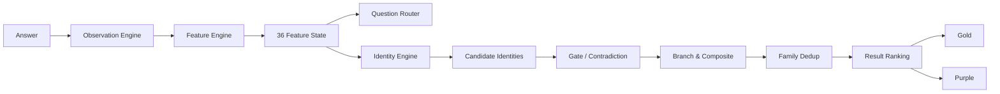
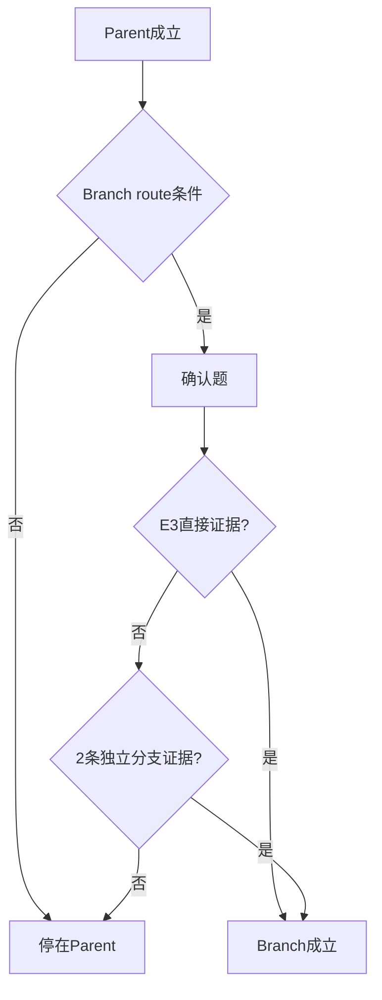

# 二游玩家身份测试｜判定引擎与评分算法规范 v1.0

> **业务基线**
> - `二游玩家身份系统_身份体系冻结版_v0.6.1.md`
> - `二游玩家身份测试_36底层特征与题目覆盖矩阵_v0.1.md`
> - `二游玩家身份测试_正式题库_v0.1.md`
>
> **目标**：将“题目 → 底层特征 → 身份 → 去重 → 金/紫结果”的判定过程定义成**确定性、可复现、可测试、可校准**的程序规范。
>
> 本引擎不得调用大模型实时判断身份。给定相同版本的题库、身份配置和答案，必须得到相同结果。

---

# 0. 总体架构



核心原则：

1. **身份数量不等于题目数量。**
2. 一题可以更新多个特征。
3. 同一题对同一身份最多算 1 条独立 evidence。
4. 普通身份原则上不能被一道题直接确认。
5. 强分支必须先有父身份。
6. 稀有复合必须拥有跨域独立证据链。
7. `ANY ≠ NONE ≠ NA`。
8. 不因为“结果好看”而改算法结论。
9. UI只消费引擎结果，不参与计算。
10. 同一答案在 Bilibili / TapTap / PC / Mobile 必须得到一致判定。

---

# 1. 数据模型

## 1.1 FeatureDefinition

```ts
type FeatureKind =
  | 'scalar'
  | 'bipolar'
  | 'vector'
  | 'categorical_vector'
  | 'derived';

interface FeatureDefinition {
  code: string;             // R01 ... S10
  domain: 'R' | 'C' | 'I' | 'S';
  kind: FeatureKind;
  components?: string[];
  min: 0;
  max: 100;
  neutral?: number;
}
```

## 1.2 Observation

每次回答不直接改“最终分数”，而是写入 observation：

```ts
interface Observation {
  question_id: string;
  option_key: string;

  feature: string;       // e.g. C06
  component?: string;    // e.g. fanwork

  anchor: number;        // 0~100
  evidence: 'E1' | 'E2' | 'E3';

  source_stage:
    | 'gate'
    | 'core'
    | 'route'
    | 'confirm';

  direct_signal?: string;
}
```

为什么必须保留 observation：

- 返回上一题时可撤销。
- 可以全量重算。
- 可做认知测试分析。
- 可以生成“为什么是你”。
- 可以检查同一身份的证据独立性。
- 可以追踪某张卡到底由哪些题触发。

## 1.3 FeatureState

```ts
interface FeatureState {
  code: string;
  score: number | null;
  confidence: number;          // 0~1
  components?: Record<string, {
    score: number | null;
    confidence: number;
  }>;
  observations: string[];      // question_ids
  na_reasons?: string[];
}
```

---

# 2. 特殊状态

## 2.1 玩家域状态

```ts
type DomainState =
  | 'ACTIVE'
  | 'LOW'
  | 'NONE'
  | 'SELF_LIMIT'
  | 'UNKNOWN';
```

### ACTIVE
有实际参与，可以正常测内部特征。

### LOW
参与度较低，但不是完全不参与。

### NONE
明确不关注/不参与。

例如：

> 我基本不抽角色。

不能把 R01 所有分量强制写成0；这些分量应处于“不测”。

### SELF_LIMIT
特殊的主动自限。

用于：

`原生阵容挑战者`

例如：

> 我主动不抽卡，只用赠送角色。

它不是“R域没有数据”。

---

## 2.2 NA / UNEXPOSED

题目级缺失：

```ts
interface NAState {
  feature: string;
  component?: string;
  reason:
    | 'game_has_no_system'
    | 'not_unlocked'
    | 'never_exposed'
    | 'too_new_to_answer';
}
```

NA：

- 不加0分。
- 不形成 contradiction。
- 不降低 feature score。
- 只降低 confidence。
- 不可拿来满足“低值CORE”。

例如：

> 玩家没玩过塔防

不能因为 `C01.tower` 无数据，就当作塔防兴趣=0。

---

## 2.3 ANY

只存在于身份规则：

```ts
domain_rule = 'ANY'
```

含义：

> 这个身份根本不读取该域。

例如摄影师的S域是ANY：
- 独狼摄影师可以成立。
- 社区活跃摄影师也可以成立。

---

# 3. Evidence 等级

正式题库 v0.1：

| Evidence | 权重 | 含义 |
|---|---:|---|
| E1 | 0.6 | 入口粗筛 / 弱支持 / 多选兴趣 |
| E2 | 1.0 | 正常行为 / 情境证据 |
| E3 | 1.5 | 强直接行为 / 分支确认 / 复合关键证据 |

```ts
const EVIDENCE_WEIGHT = {
  E1: 0.6,
  E2: 1.0,
  E3: 1.5,
} as const;
```

---

# 4. Feature Score

## 4.1 基本聚合

对于普通 scalar / bipolar / vector component：

\[
Score_f =
\frac{\sum_i a_i w_i}
     {\sum_i w_i}
\]

其中：

- \(a_i\) = option anchor，0～100。
- \(w_i\) = E1/E2/E3 权重。

代码：

```ts
function aggregateFeature(obs: Observation[]): number | null {
  if (obs.length === 0) return null;

  const weighted = obs.reduce(
    (s, x) => s + x.anchor * EVIDENCE_WEIGHT[x.evidence],
    0
  );

  const totalWeight = obs.reduce(
    (s, x) => s + EVIDENCE_WEIGHT[x.evidence],
    0
  );

  return weighted / totalWeight;
}
```

---

## 4.2 Feature Confidence

分数和证据充分度必须分开。

定义：

```text
evidence_weight_sum = Σ evidence_weight
distinct_items = distinct(question_id)
```

初始：

\[
Conf_f =
\min(1,\frac{W}{2.0})
\times ItemFactor
\]

其中：

```text
ItemFactor:
0 item  = 0
1 item  = 0.65
2 item  = 1.00
3+ item = 1.00
```

但 E3 直接证据可覆盖“需要两题”的某些专项分支：

```text
single E3 direct evidence:
Feature Confidence 可到 0.90
```

普通主身份仍不能因此自动满足“2条独立身份证据”规则。

---

## 4.3 向量

例如 R01：

```ts
R01 = {
  xp,
  strength,
  story,
  companion,
  performance,
  handfeel,
}
```

不同 component 独立聚合。

禁止：

```text
R01总分 = 所有component平均
```

因为：

> XP高 和 强度高 可以同时成立。

不是互斥轴。

---

## 4.4 双极轴

冻结方向：

```text
R02: 0=博爱，100=本命集中
R03: 0=追新，100=长情
R05: 0=即时抽取，100=计划性
C15: 0=即时转化资源，100=资源保留
I02: 0=佛系/低投入，100=高时间精力投入
```

注意：

`0` 不是“坏”，`100` 也不是“好”。

---

# 5. 派生特征 C13｜内容广度

C13 主要派生，不应只靠自我报告。

设核心内容组件：

```text
story
world
music
explore
puzzle
photo
build
battle
team
collect
roguelike
card
tower
```

有效高兴趣：

```text
component_score >= 65
component_confidence >= 0.55
```

设：

```text
n_high = 高兴趣分量数量
```

基础：

```text
n_high <=2 → C13 = 20
n_high =3  → C13 = 50
n_high =4  → C13 = 70
n_high =5  → C13 = 82
n_high >=6 → C13 = 92
```

若 RT15 有 E2/E3：

```text
C13 = 0.65 * derived_score + 0.35 * RT15_score
```

无 RT15 时：
- 可生成“全面体验派”候选。
- 不建议直接出金。

---

# 6. Question Router

## 6.1 路由不是随机抽题

每次回答后：

1. 重算 FeatureState。
2. 重算身份候选。
3. 找“缺证据但可能影响结果”的身份。
4. 给未答题打 Priority。
5. 取最高 Priority。

## 6.2 题目优先级

\[
Priority(q) =
0.40 I_q +
0.25 G_q +
0.20 B_q +
0.15 C_q
\]

其中：

### I｜Information Gap
这题能否补关键缺失证据。

### G｜Gold Impact
它是否可能决定一张金卡成立/不成立。

### B｜Boundary Value
是否区分同Family相似身份。

### C｜Composite Value
是否用于确认强分支/稀有复合。

所有值标准化为0～1。

## 6.3 路由硬规则

### Gate 阶段
G01～G06 优先完成。

### Core 阶段
从 K01～K18 中：
- `skip_if=true` → 当前跳过。
- 若用户修改前题导致 Gate 变化，可重新变为 eligible。

### Route 阶段
RT01～RT30。

### Confirm 阶段
CF01～CF11。

确认题预算：

```text
typical max: 3
complex max: 5
hard question cap: 44
```

---

# 7. IdentityDefinition

```ts
interface IdentityDefinition {
  identity_id: string;
  display_name: string;
  family_id: string;

  level:
    | 'main'
    | 'branch'
    | 'rare_composite'
    | 'hidden';

  mask: string; // RCIS

  parent_id?: string;

  core: IdentityCondition[];
  support?: IdentityCondition[];
  gates?: GateRule[];
  contradictions?: ContradictionRule[];

  direct_evidence?: DirectEvidenceRule[];

  replace_parent?: boolean;
  display_priority?: number;
}
```

---

# 8. Identity Condition

不要把：

```text
R01.xp高 + R02本命集中
```

继续保存成人类字符串。

应转成结构化配置：

```ts
{
  feature: 'R01',
  component: 'xp',
  role: 'CORE',
  operator: '>=',
  threshold: 70,
  weight: 1.0,
}
```

例如本命真爱党：

```json
{
  "identity_id": "ID_F01_FAVORITE_TRUELOVE",
  "display_name": "本命真爱党",
  "family_id": "F01",
  "level": "main",
  "mask": "1000",
  "core": [
    {
      "feature": "R01",
      "component": "emotion",
      "threshold": 65,
      "weight": 0.45
    },
    {
      "feature": "R02",
      "direction": "high",
      "threshold": 70,
      "weight": 0.55
    }
  ]
}
```

实际 component 命名以最终 `identities.json` 为准。

---

# 9. Condition Fit

## 9.1 正向阈值

条件：

```text
feature >= threshold
```

推荐：

```ts
function positiveFit(x: number, T: number) {
  if (x >= T) {
    return 70 + 30 * (x - T) / (100 - T);
  }
  return 70 * x / T;
}
```

因此：

- x=T → 70
- x=100 → 100
- x=0 → 0

## 9.2 负向 / 低值条件

例如：

`S01低外显`

```ts
function negativeFit(x: number, T: number) {
  // 条件 x <= T
  if (x <= T) {
    return 70 + 30 * (T - x) / T;
  }
  return 70 * (100 - x) / (100 - T);
}
```

---

# 10. CoreFit

只读取身份的 CORE。

\[
CoreFit(p)=
\frac{
\sum_j w_j Fit_j
}{
\sum_j w_j
}
\]

ANY：
- 不进入分母。
- 不惩罚。

NA：
- 若 CORE feature 为 NA，身份标记 `INSUFFICIENT_EVIDENCE`。
- 不能自动判失败。
- 但也不能出金。

---

# 11. Support Boost

SUP 只能加分，不能救活一个 Core 不成立的身份。

建议：

```text
SupportBoost max = +8
```

\[
SupportBoost =
min(8, mean(SupportFit) \times 0.08)
\]

最终：

```text
FitRaw = CoreFit + SupportBoost
FitRaw capped at 100
```

---

# 12. Identity Evidence Confidence

## 12.1 普通主身份

收集所有支持该身份 CORE 的 observation。

去重：

```ts
distinctQuestionIds
```

要求：

```text
至少 2 个独立 question_id
其中至少 1 个 >= E2
```

定义：

```text
W = 对CORE有效 evidence_weight总和
```

\[
EvidenceConfidence =
min(1, W / 2.2)
\]

再乘：

```text
distinct question ids:
1 → ×0.65
2+ → ×1.0
```

最终 main：

```text
eligible for Gold only if:
distinct_question_ids >= 2
EvidenceConfidence >= 0.80
```

## 12.2 单特征主身份

例如：
- 摄影师
- 家园建筑师
- 解谜破译员

虽然 CORE 可能只有 C01 某个 component，仍要求：

- 入口弱证据，例如 G02。
- Route 行为题 E2/E3。

即：

> 一个“兴趣扫描” + 一个“实际行为”。

不能只因为 G02 勾选“摄影”就出金。

---

# 13. Direct Evidence

某些身份需要直接行为：

例如：

```text
原生阵容挑战者:
DIRECT.no_pull_challenge
```

没有 direct signal：

> 即使“很少抽卡 + 高难”分数接近，也不成立。

DirectEvidence Rule：

```ts
{
  signal: 'no_pull_challenge',
  min_evidence: 'E3',
  required: true
}
```

建议需要 Direct Evidence 的典型身份：

- 原生阵容挑战者。
- 玄学抽卡师。
- 二创住民。
- 扫地僧。
- 极限竞速手。
- 闭关开荒党。
- 部分强分支。

---

# 14. Contradiction

Contradiction 分两级：

```text
SOFT
HARD
```

## HARD
定义上不可能同时成立。

例如：

- 原生阵容挑战者要求“主动自限不抽”。
- 用户明确回答“只是目前没目标，以后正常抽”。

硬矛盾：

```text
identity status = REJECTED
```

## SOFT

例如：
- 剧情沉浸党总体很高，但某题偏速通。

不直接淘汰。

\[
ContradictionPenalty =
min(18, Σ penalty)
\]

建议：

```text
E1 conflict: -3
E2 conflict: -6
E3 conflict: -10
```

最终：

```text
Fit = FitRaw - ContradictionPenalty
```

---

# 15. Identity State Machine

```ts
type IdentityStatus =
  | 'INELIGIBLE'
  | 'LOW_EVIDENCE'
  | 'CANDIDATE'
  | 'PURPLE'
  | 'GOLD'
  | 'REJECTED'
  | 'SUPPRESSED_BY_CHILD'
  | 'SUPPRESSED_BY_DEDUP';
```

---

# 16. 主身份判定

推荐初始规则：

```text
Fit < 55
→ INELIGIBLE

Fit >=55 but evidence insufficient
→ LOW_EVIDENCE

Fit 65~79
and EvidenceConfidence >= 0.60
→ PURPLE candidate

Fit >=80
and EvidenceConfidence >=0.80
and distinct question >=2
→ GOLD candidate
```

SupportBoost / Penalty 后使用最终 Fit。

---

# 17. 强分支

例如：

```text
剧情沉浸党
  ↓
入戏太深
```

流程：



规则：

```text
parent Fit >= 65
+
branch condition Fit >= 75
+
(1 E3 direct OR 2 independent branch items)
```

如果：

`replace_parent=true`

展示时：

```text
branch replaces parent
```

但后台保留 Parent 命中记录用于解释。

---

# 18. 稀有复合身份

6 个稀有复合身份遵循更严格规则。

核心原则：

> 不是几个高分平均一下，而是“缺一域就不是同一个身份”。

例如逆天改命党：

```text
R 本命集中
C 高难挑战
I 深度打磨
```

必须：

```text
R condition >=70
C condition >=70
I condition >=70
```

不能：

```text
R=100
C=100
I=20
平均73 → 成立
```

因此采用：

\[
CompositeCore =
0.6 × Min(CoreDomains)
+
0.4 × WeightedMean(CoreDomains)
\]

这会惩罚短板。

此外：

```text
每个必需域至少有1条独立 evidence
+
至少1条 E3 跨域组合证据
```

例如 CF04：

> “为了本命继续优化队伍、养成和手法，目标就是让TA打过高难”

属于跨域组合 E3。

---

# 19. 隐藏身份：二游观察者

不能作为普通竞争卡。

只有：

```text
R参与低
C参与低
I02低
S参与低
```

且：

```text
不是因为大量NA造成未知
```

才允许。

建议：

```text
active_domain_count <= 1
I02 <= 25
valid_answer_coverage >= 0.65
```

否则：

`LOW_EVIDENCE`

而不是二游观察者。

---

# 20. Family 去重

## 20.1 为什么必须去重

禁止结果：

```text
日课打卡派
全勤打卡官
体力清空官
周常清单官
```

这些过细身份已经被合并。

但剩余身份仍可能出现 evidence 高重叠。

## 20.2 Evidence Overlap

对身份 A/B：

```text
EA = 支持A的question_id集合
EB = 支持B的question_id集合
```

\[
Overlap(A,B)=
\frac{|EA∩EB|}
{|EA∪EB|}
\]

## 20.3 同Family去重规则

### Case 1｜Parent/Child
child 成立且 replace_parent：
- child展示。
- parent suppressed。

### Case 2｜不同Core
例如：
- 配队专家
- 机制党

即使同Family，只要：
- 核心特征不同；
- `Overlap < 0.70`；
- 两者都有独立 E2/E3；

允许共存。

### Case 3｜高度重合
若：

```text
same family
Overlap >=0.75
Core feature高度相同
```

优先级：

1. 强分支 > Parent。
2. 稀有复合不在普通去重中被抑制。
3. EvidenceConfidence 高者。
4. Fit 高者。
5. Direct Evidence 多者。
6. display_priority 高者。

另一张：

`SUPPRESSED_BY_DEDUP`

---

# 21. 稀有复合与普通身份共存

稀有复合不默认替换普通身份。

例如：

```text
本命真爱党
+
逆天改命党
```

可以同时显示。

因为：

- 本命真爱 = 角色关系。
- 逆天改命 = 本命 × 高难 × 深磨产生的新行为。

但如果结果过于拥挤，UI排序时可降低父系相近普通卡的 reveal priority，**不能修改其 rarity**。

---

# 22. Gold / Purple

## 22.1 Gold

初始：

```text
Fit >= 80
EvidenceConfidence >= 0.80
No HARD contradiction
Core Gate passed
Evidence independence passed
```

## 22.2 Purple

```text
Fit >=65
EvidenceConfidence >=0.60
```

或：

```text
Fit >=80
但 EvidenceConfidence 0.60~0.79
```

此时含义是：

> 方向很像，但证据还不够强。

## 22.3 不凑卡

禁止：

```text
用户只有1张Gold
→ 自动把第二名Purple升级成Gold
```

也禁止：

```text
Gold太多
→ 自动把第5张降成Purple
```

rarity 由算法决定。

展示数量由 UI 决定。

---

# 23. Result Ranking

推荐排序值只决定揭晓顺序，不决定 rarity：

\[
RankScore =
0.55 Fit +
0.25 (EvidenceConfidence×100) +
0.10 Specificity +
0.10 Independence
\]

其中：

### Specificity

```text
main = 60
branch = 80
rare composite = 100
hidden = special
```

### Independence

建议：

```text
Independence = 100 × (1 - maxOverlapWithAlreadySelected)
```

用于揭晓顺序和多样性，不直接改变 Gold/Purple。

---

# 24. 结果选择

## 24.1 Gold

所有 GOLD 保留。

RevealOrder：
按 RankScore 排序。

### UI建议
- 前4张完整金卡动画。
- 第5～6张仍是Gold，但可在后续总览中更快揭晓。

这只是表现层。

## 24.2 Purple

从 PURPLE candidate 中：

1. 去重。
2. 排序。
3. 默认结果页展示前 3～7。
4. 其余可以进入“更多共鸣”或不展示。

但原始判定结果应保留。

---

# 25. “为什么是你”生成

禁止调用模型现场编造。

每题配置：

```text
why_you_template
```

结果引擎挑选：

1. 该身份最强 E3。
2. 不同 question_id。
3. 不同语义来源。
4. 最多3条。

例如：

```ts
[
  {
    q: 'K09',
    text: '高难连续失败后，你更愿意继续调整和重试'
  },
  {
    q: 'CF07',
    text: '稳定通关以后，你还会继续追求极限纪录'
  }
]
```

输出：

> 你在高难连续失败时仍选择继续调整和重试；稳定通关之后，你还会继续追更极限的纪录。

---

# 26. 返回上一题与重算

绝对不要做增量“减20分”的脆弱逻辑。

正确流程：

```text
用户返回 Q17
↓
删除 Q17 及其后因路由产生的答案
↓
保留 Q1~Q16
↓
从 observation 重新聚合36特征
↓
重算identity
↓
重新选择下一题
```

数据量只有几十题，完全可以全量重算。

优点：
- 简单。
- 可测试。
- 不产生幽灵分数。

---

# 27. Versioning

必须版本化：

```ts
{
  identity_schema_version: "0.6.1",
  feature_schema_version: "0.1",
  question_bank_version: "0.1",
  scoring_engine_version: "1.0"
}
```

ResultSnapshot 保存以上版本。

以后调阈值不能让旧结果在后台悄悄改变。

---

# 28. 推荐配置文件

```text
data/
├─ identities.v0.6.1.json
├─ families.v0.6.1.json
├─ features.v0.1.json
├─ questions.v0.1.json
├─ scoring.v1.0.json
└─ copy/
   └─ why-you.zh-CN.json
```

---

# 29. scoring.v1.0.json 示例

```json
{
  "evidence_weight": {
    "E1": 0.6,
    "E2": 1.0,
    "E3": 1.5
  },
  "main": {
    "purple_fit": 65,
    "purple_evidence": 0.60,
    "gold_fit": 80,
    "gold_evidence": 0.80,
    "min_distinct_items": 2
  },
  "branch": {
    "parent_min_fit": 65,
    "branch_min_fit": 75,
    "direct_e3_required_or_independent_items": 2
  },
  "support": {
    "max_boost": 8
  },
  "contradiction": {
    "E1": 3,
    "E2": 6,
    "E3": 10,
    "max_soft_penalty": 18
  },
  "router": {
    "typical_confirm_max": 3,
    "complex_confirm_max": 5,
    "hard_question_cap": 44
  }
}
```

---

# 30. Identity Engine 伪代码

```ts
function evaluateIdentity(
  identity: IdentityDefinition,
  featureState: FeatureState,
  observations: Observation[]
): IdentityEvaluation {

  // 1. hard gates
  if (!passDomainGates(identity, featureState)) {
    return rejected('GATE');
  }

  // 2. required direct evidence
  if (!passRequiredDirectEvidence(identity, observations)) {
    return lowEvidence('DIRECT_EVIDENCE');
  }

  // 3. core condition
  const coreParts = evaluateCore(identity.core, featureState);

  if (coreParts.some(x => x.state === 'NA')) {
    return lowEvidence('CORE_NA');
  }

  let coreFit =
    identity.level === 'rare_composite'
      ? compositeFit(coreParts)
      : weightedMean(coreParts);

  // 4. support
  const supportBoost = computeSupportBoost(identity, featureState);

  // 5. contradiction
  const contradiction = evaluateContradictions(identity, observations);

  if (contradiction.hard) {
    return rejected('HARD_CONTRADICTION');
  }

  const fit = clamp(
    coreFit + supportBoost - contradiction.softPenalty,
    0,
    100
  );

  // 6. evidence
  const evidence = computeIdentityEvidence(
    identity,
    observations
  );

  // 7. rarity
  const rarity = classify(
    identity,
    fit,
    evidence
  );

  return {
    identity_id: identity.identity_id,
    coreFit,
    supportBoost,
    contradictionPenalty: contradiction.softPenalty,
    fit,
    evidenceConfidence: evidence.confidence,
    distinctEvidenceItems: evidence.distinctQuestionIds,
    rarity,
    evidenceItems: evidence.items
  };
}
```

---

# 31. Question Router 伪代码

```ts
function chooseNextQuestion(state: TestState): Question | null {
  const unanswered = getEligibleUnanswered(state);

  if (unanswered.length === 0) return null;

  const candidates = evaluateAllIdentities(state);

  return unanswered
    .map(q => ({
      q,
      score: routerPriority(q, state, candidates)
    }))
    .sort((a,b) => b.score - a.score)[0].q;
}
```

停止条件：

```ts
if (
  gateComplete &&
  coreCoverageSufficient &&
  highImpactIdentityGaps.length === 0 &&
  confirmBudgetSatisfied
) {
  finishTest();
}
```

---

# 32. Debug Report

开发环境必须能对任意身份输出：

```text
Identity: 扫地僧
Status: GOLD
Fit: 86.4
Evidence: 0.91
Family: F06

Core:
C06 91 (conf 0.95)
I05 88 (conf 0.90)
S01 14 (conf 0.88)

Direct:
silent_mastery = true [CF07-B / E3]

Evidence:
K09-A
RT28-A
CF07-B

Penalty:
0

Decision:
GOLD
```

正式用户界面不显示这些内部细节。

---

# 33. 自动测试用例

必须给 Engine 写单元测试和回归测试。

## Case A｜XP本命剧情型

输入特征预期：

```text
R01.xp 90
R02 90
R03 80
C02 85
I02 30
S01 30
```

预期候选：
- 本命真爱党 Gold。
- XP鉴赏家 Gold/Purple。
- 剧情沉浸党 Purple/Gold。
- 不应因为佛系降低前两者。

## Case B｜强度高难构筑型

```text
R01.strength 90
C06 90
C07 90
I05 90
S01 60
```

预期：
- 强度党。
- 高难攻坚党。
- 配队专家。

如果没有 `S03.record`：
- 不得出极限竞速手。

## Case C｜原人

```text
R_GATE=SELF_LIMIT
DIRECT.no_pull_challenge=E3
C06>=70
C07>=60
```

预期：
- 原生阵容挑战者成立。

仅仅：

```text
R_GATE=NONE
```

不得成立。

## Case D｜二创住民

```text
S02.fanwork>=85
DIRECT.fanwork_resident=E3
```

且：
- 二创巡礼者 parent 已成立。

预期：
- 二创住民替代/细分 parent 展示。

## Case E｜扫地僧

```text
C06>=85
I05>=85
S01<=25
DIRECT.silent_mastery=E3
```

预期：
- 扫地僧可成立。

如果 C06 低：
- 不成立。

如果 S01低但没有高难：
- 不成立。

---

# 34. 模拟回归建议

至少建立 30 个 Persona Fixtures：

```text
fixtures/
├─ xp_story_casual.json
├─ meta_highdiff_grinder.json
├─ world_lore_lurker.json
├─ original_roster_challenger.json
├─ fanwork_resident.json
├─ newbie_helper.json
├─ daily_checkin_casual.json
├─ version_bird.json
├─ social_builder.json
└─ ...
```

每次修改：

- questions
- scoring
- identities
- feature thresholds

都跑一次。

---

# 35. 数据校准阶段

v1.0 评分不是“心理学真理”，是工程初始参数。

## 20～30人认知测试
主要看：
- 是否理解题目。
- 结果有没有“这就是我”。
- 相似身份是否混淆。

## 100～300份
开始看：
- 选项分布。
- 题间一致性。
- 身份成立率。
- 金卡数量。

## 300～500份
再考虑：
- 调 evidence weight。
- 调 threshold。
- 调 routing priority。
- 调 family dedup overlap。
- 删除低区分度题。

---

# 36. 关键监控指标

```text
mean_question_count
p90_question_count
hard_cap_hit_rate

gold_count_distribution
purple_count_distribution

identity_hit_rate
family_multi_gold_rate

none_rate_by_question
na_rate_by_question

branch_trigger_rate
rare_composite_trigger_rate

feature_confidence_distribution
```

异常：

### 某身份 >35%
可能定义过宽。

### 某身份 <0.5%
检查：
- 身份是否太小众。
- 路由是否问不到。
- 名字是否鲜活但行为不成立。

### 同Family经常3金+
检查去重与重复题。

---

# 37. 与 UI 的接口

Engine 输出：

```ts
interface TestResult {
  version: VersionBundle;

  features: FeatureState[];

  gold: IdentityResult[];
  purple: IdentityResult[];
  suppressed: IdentityResult[];

  allEvaluations: IdentityEvaluation[];

  resultSummary: {
    primary_identity_id: string | null;
    gold_count: number;
    purple_count: number;
  };
}
```

注意：

`primary_identity_id`

只是：

> 结果页排序第一的主视觉身份。

不是重新引入“唯一主人格”。

---

# 38. 与平台无关

判定引擎不得读取：

```text
Bilibili user id
TapTap user id
设备型号
屏幕尺寸
平台来源
```

这些可以用于分析，但**不能影响身份结果**。

同一答案在 B站 / TapTap / PC / 手机必须得到同一身份结果。

---

# 39. v1.0 冻结项

冻结：

- E1/E2/E3 权重初始值。
- Feature 聚合基本模型。
- Main / Branch / Composite 判定框架。
- Gold / Purple 初始阈值。
- Evidence independence。
- Family dedup 框架。
- ANY / NONE / NA。
- 结果不凑卡。
- 平台不参与判定。

可调：

- Identity core threshold。
- 每个 condition weight。
- Router Priority 权重。
- Soft contradiction penalty。
- UI展示数量。
- 具体阈值在样本后的校准。

---

# 40. AI开发要求

当 AI 根据这套文档编码时：

1. **先把 Markdown 业务配置结构化为 JSON / TypeScript 数据。**
2. 不允许把身份判定写在 React Component。
3. 不允许按 display_name 做逻辑键。
4. 必须使用稳定 identity_id。
5. 必须保存 observation。
6. 返回上一题必须全量可重算。
7. 必须写单元测试。
8. 必须提供模拟玩家 fixtures。
9. 必须能输出 Debug Report。
10. 修改题库后必须跑回归，不允许只做肉眼测试。
11. platform adapter 不得进入 identity engine。
12. 评分参数集中在 `scoring.v1.0.json`，不要散落魔法数字。
