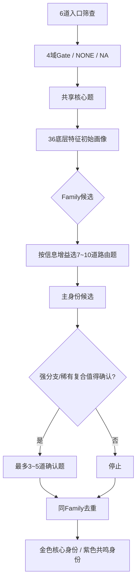

# 二游玩家身份测试｜正式题库 v0.1

> 基线文件：`二游玩家身份系统_身份体系冻结版_v0.6.1` + `二游玩家身份测试_36底层特征与题目覆盖矩阵_v0.1`。
> 本版目标：把冻结的 73 个身份、36 个底层特征正式转成可执行的自适应题池。题目文案可以在认知测试后继续优化，但 `feature code / 路由 / 证据要求` 不应随意改变。

---

## 0. 结论与题库规模

- **完整题池：65 题** = 6 入口 + 18 共享核心 + 30 Family路由 + 11 确认。
- **不是每个人都答 65 题。** 典型玩家目标 27～35 题；多域高参与玩家约 35～42 题；工程硬上限建议 44 题。
- 一题可以同时更新多个底层特征，但在“独立证据数”中，同一 `question_id` 对同一身份最多只算 1 条独立证据。
- 主身份原则上需要 ≥2 个独立 `question_id`；强分支 = 父身份成立 + 1 条 E3 强直接证据（或 2 条独立分支证据）；稀有复合要求必需域都有独立证据。
- `NONE`、`NA/UNEXPOSED`、`ANY` 继续严格区分：NONE 是玩家明确不参与，NA 是没接触/系统不存在，ANY 是身份公式不读取。

### 0.1 自适应流程



---

## 1. 工程评分约定（v0.1 初始值）

### 1.1 特征值

- 普通标量统一 `0～100`：越高代表该特征越强。
- 双极轴方向：`R02 0=博爱 / 100=本命集中`；`R03 0=追新 / 100=长情`；`R05 0=即时抽取 / 100=计划性`；`C15 0=立即转化 / 100=资源保留`；`I02 0=佛系 / 100=高投入`。
- 向量型特征使用组件，如 `R01.xp / R01.strength / R01.story / R01.companion / R01.performance`、`C01.story / explore / battle ...`。
- `I03` 用类别组件：`stable / version_burst / first_day / deadline / long_grass`。

### 1.2 证据等级与聚合

| Evidence | 权重 | 用途 |
|---|---:|---|
| `E1` | 0.6 | 入口粗筛、弱偏好、多选扫描 |
| `E2` | 1.0 | 正常行为/情境证据 |
| `E3` | 1.5 | 强直接行为、分支确认、复合身份关键证据 |

同一 feature/component 的暂定聚合：

`feature_score = Σ(anchor_score × evidence_weight) / Σ(evidence_weight)`

> v0.1 先使用这个简单权重平均；300～500 份有效样本后再校准题目权重、阈值和区分度。

### 1.3 身份初始判定建议

- **主身份候选**：Core 相关特征达到约 65，且有 ≥2 个独立题目支持；明显定义性矛盾则淘汰。
- **金卡建议**：Fit ≥80、Evidence Confidence ≥0.80，且通过同Family去重。
- **紫卡建议**：Fit 65～79 或 Fit 更高但证据尚不足金卡。
- **强分支**：父身份成立后，有 E3 直接证据即可优先替代父身份展示。
- **稀有复合**：不因“稀有”自动出金；必须满足每个必需域的独立证据链。

---

## 2. 题目字段说明

每道题统一包含：

```text
question_id
stage
type
prompt
options
none_option / na_option
route_if
skip_if
identity_support
identity_contradiction
why_you_template
```

选项中的 `updates` 是后台初始锚点，不是最终产品文案的一部分。

---

## 第一部分｜入口筛查题（6题）

### `G01`

**题目**：想到你平时玩的二游，角色和抽卡对你来说更接近哪种状态？（最多选 2 项）

- `stage`: `gate`
- `type`: `multi_select_max2`
- `route_if`: `always`
- `skip_if`: `none`

| 选项 | 前台文案 | 后台 updates | Evidence |
|---|---|---|---|
| A | 外观、人设、气质对上了，我就会明显关注这个角色。 | `R_GATE=ACTIVE; R01.xp=85` | `E1` |
| B | 角色故事、成长和塑造写得好，会让我更想要这个角色。 | `R_GATE=ACTIVE; R01.story=85` | `E1` |
| C | 强度、功能、队伍价值很重要，可能直接决定我抽不抽。 | `R_GATE=ACTIVE; R01.strength=85` | `E1` |
| D | 主页、短信、生日、好感、日常互动带来的陪伴感很重要。 | `R_GATE=ACTIVE; R01.companion=85` | `E1` |
| E | 技能演出、动画、音效或实际玩起来的感觉很重要。 | `R_GATE=ACTIVE; R01.performance=75; C14=60` | `E1` |
| F | 我会抽角色，但通常没有固定理由，遇到想要的就容易下池。 | `R_GATE=ACTIVE; R05=25` | `E1` |

- **NONE / 特殊出口**：角色/抽卡不是我玩二游的重点，我甚至基本不抽角色。 → R_GATE=NONE；保留“主动自限不抽”候选，后续用 RT06 区分。
- **主要支持身份**：XP鉴赏家、角色故事鉴赏家、强度党、角色陪伴派、演出控、抽卡行动派、原生阵容挑战者
- **主要冲突身份**：由特征低值/定义性矛盾自动处理
- **why_you_template**：你把角色吸引力主要放在「{selected_motives}」上。

### `G02`

**题目**：如果暂时不考虑奖励，下面哪些内容本身就能让你想上线？（最多选 4 项）

- `stage`: `gate`
- `type`: `multi_select_max4`
- `route_if`: `always`
- `skip_if`: `none`

| 选项 | 前台文案 | 后台 updates | Evidence |
|---|---|---|---|
| A | 剧情 / 角色故事 | `C_GATE=ACTIVE; C01.story=85` | `E1` |
| B | 世界观 / 设定 / 伏笔 | `C_GATE=ACTIVE; C01.world=85` | `E1` |
| C | 音乐 / OST / 角色主题曲 | `C_GATE=ACTIVE; C01.music=85` | `E1` |
| D | 探索地图 / 逛世界 | `C_GATE=ACTIVE; C01.explore=85` | `E1` |
| E | 解谜 / 机关 / 隐藏路线 | `C_GATE=ACTIVE; C01.puzzle=85` | `E1` |
| F | 摄影 / 构图 / 截图 | `C_GATE=ACTIVE; C01.photo=85` | `E1` |
| G | 家园 / 基地 / 装饰建造 | `C_GATE=ACTIVE; C01.build=85` | `E1` |
| H | 战斗 / 高难 / 操作 | `C_GATE=ACTIVE; C01.battle=85` | `E1` |
| I | 配队 / Build / 角色协同 | `C_GATE=ACTIVE; C01.team=85` | `E1` |
| J | 收集 / 图鉴 / 宝箱 / 成就 | `C_GATE=ACTIVE; C01.collect=85` | `E1` |
| K | 肉鸽 / 随机路线与构筑 | `C_GATE=ACTIVE; C01.roguelike=85; EXPOSE.roguelike=YES` | `E1` |
| L | 卡牌 / 牌组 / 回合资源 | `C_GATE=ACTIVE; C01.card=85; EXPOSE.card=YES` | `E1` |
| M | 塔防 / 布阵 / 波次规划 | `C_GATE=ACTIVE; C01.tower=85; EXPOSE.tower=YES` | `E1` |

- **NONE / 特殊出口**：这些内容都不是我上线的主要动力。 → C_GATE=LOW；不把未选玩法记成“不喜欢”。
- **主要支持身份**：剧情沉浸党、世界观考古学家、OST收藏家、自由探索家、摄影师、家园建筑师、解谜破译员、全收集派、高难攻坚党、配队专家、肉鸽常驻户、卡牌大师、塔防指挥官、全面体验派
- **主要冲突身份**：由特征低值/定义性矛盾自动处理
- **why_you_template**：你主动选择了「{selected_content}」作为真正会让你上线的内容。

### `G03`

**题目**：普通长草周，没有大版本刺激时，你最常见的上线状态是？

- `stage`: `gate`
- `type`: `single_choice`
- `route_if`: `always`
- `skip_if`: `none`

| 选项 | 前台文案 | 后台 updates | Evidence |
|---|---|---|---|
| A | 基本每天都会上线，日常和周期任务也比较稳定。 | `I_GATE=ACTIVE; I01=90; I02=65` | `E2` |
| B | 经常上线，但几分钟把必要资源收掉就走。 | `I_GATE=ACTIVE; I01=85; I02=30; DIRECT.short_session=90` | `E2` |
| C | 想玩就玩，不太按固定节奏，也不会因为漏东西难受。 | `I_GATE=ACTIVE; I01=35; I02=25` | `E2` |
| D | 长草期经常淡出，等新版本或活动来了再明显回归。 | `I_GATE=ACTIVE; I01=25; I02=30; I03.long_grass=80; I03.version_burst=75` | `E2` |
| E | 目前整体参与就很低，偶尔想起来才打开。 | `I_GATE=LOW; I01=10; I02=10` | `E2` |
- **主要支持身份**：日课打卡派、秒速收菜员、随心体验派、版本候鸟、二游观察者
- **主要冲突身份**：由特征低值/定义性矛盾自动处理
- **why_you_template**：你的长草期节奏更接近「{choice}」。

### `G04`

**题目**：你经历过完整版本周期时，投入通常怎么变化？

- `stage`: `gate`
- `type`: `single_choice`
- `route_if`: `always`
- `skip_if`: `none`

| 选项 | 前台文案 | 后台 updates | Evidence |
|---|---|---|---|
| A | 大版本一开就冲，主线、地图、活动想尽快推进。 | `I03.first_day=90; I03.version_burst=75` | `E2` |
| B | 版本期会明显多玩，但会按自己的节奏慢慢推进。 | `I03.version_burst=90; I03.stable=45` | `E2` |
| C | 前面可以放着，越接近截止越容易集中清内容。 | `I03.deadline=90; I03.version_burst=65` | `E2` |
| D | 长草期很少上线，新版本来了才回来狠狠干一阵。 | `I03.long_grass=95; I03.version_burst=90` | `E2` |
| E | 版本更新前后差别不大，平时就是比较稳定的节奏。 | `I03.stable=90` | `E2` |
- **NA / UNEXPOSED**：刚入坑 / 还没经历过完整版本周期。 → I03=NA
- **主要支持身份**：版本活动特种兵、版本候鸟、首日冲锋队、活动末日战神
- **主要冲突身份**：由特征低值/定义性矛盾自动处理
- **why_you_template**：你的版本投入节律呈现出明显的「{pattern}」。

### `G05`

**题目**：你平时和游戏社区的关系更像哪一种？

- `stage`: `gate`
- `type`: `single_choice`
- `route_if`: `always`
- `skip_if`: `none`

| 选项 | 前台文案 | 后台 updates | Evidence |
|---|---|---|---|
| A | 基本不看社区，自己玩也能完整闭环。 | `S_GATE=NONE; S01=5; S04=5` | `E2` |
| B | 会经常刷，但大多数时候只看不说。 | `S_GATE=ACTIVE; S01=75; S04=15` | `E2` |
| C | 偶尔会评论、聊天、和别人交换看法。 | `S_GATE=ACTIVE; S01=75; S04=60` | `E2` |
| D | 会主动找同好、讨论版本、角色或玩法。 | `S_GATE=ACTIVE; S01=90; S04=90` | `E2` |
| E | 平时不太逛，遇到问题时才搜攻略或资料。 | `S_GATE=LOW; S01=35; S04=15` | `E2` |
- **主要支持身份**：桃花源玩家、长评潜水员、同好召集人、节奏绝缘体
- **主要冲突身份**：由特征低值/定义性矛盾自动处理
- **why_you_template**：你和社区的距离更接近「{choice}」。

### `G06`

**题目**：关于你长期玩的二游数量，以及联机经历，哪项最接近？

- `stage`: `gate`
- `type`: `compound_fact`
- `route_if`: `always`
- `skip_if`: `none`

| 选项 | 前台文案 | 后台 updates | Evidence |
|---|---|---|---|
| A | 长期主要维护 1 款；基本没有联机/协助玩法经历。 | `I04.count=1; EXPOSE.coop=NO` | `E1` |
| B | 长期主要维护 1 款；有比较明确的联机/协助玩法经历。 | `I04.count=1; EXPOSE.coop=YES` | `E1` |
| C | 长期同时维护 2 款；会在活动和日课之间做取舍。 | `I04.count=2; I04=65; EXPOSE.coop=UNKNOWN` | `E1` |
| D | 长期同时维护 3 款或更多，并且会主动排时间和优先级。 | `I04.count=3plus; I04=90; DIRECT.multi_game_management=75` | `E2` |
| E | 没有长期固定维护的游戏，更多是偶尔玩。 | `I04.count=0; I04=10; I02=15` | `E1` |
- **主要支持身份**：二游管理大师、联机气氛组、萌新引路人、二游观察者
- **主要冲突身份**：由特征低值/定义性矛盾自动处理
- **why_you_template**：你的时间主要分配在「{game_count}」款长期二游上。

---

## 第二部分｜共享核心题（18题）

### `K01`

**题目**：一个新角色并不“全都好”。什么最容易真正改变你的抽取意愿？（最多选 2 项）

- `stage`: `core`
- `type`: `multi_select_max2`
- `route_if`: `R_GATE=ACTIVE`
- `skip_if`: `R_GATE=NONE`

| 选项 | 前台文案 | 后台 updates | Evidence |
|---|---|---|---|
| A | 外观、人设、气质非常戳我。 | `R01.xp=95` | `E2` |
| B | 角色很强，或者能解决我账号里的关键问题。 | `R01.strength=95; C07=55` | `E2` |
| C | 角色故事和人物塑造让我真正喜欢上了 TA。 | `R01.story=95; C02=65` | `E2` |
| D | 和 TA 的互动、陪伴感会让我长期想把 TA 留在身边。 | `R01.companion=95` | `E2` |
| E | 技能动画、必杀演出、音效太对胃口。 | `R01.performance=95` | `E2` |
| F | 实际试玩的操作循环特别顺手、特别爽。 | `C14=90; R01.handfeel=85` | `E2` |
- **主要支持身份**：XP鉴赏家、强度党、角色故事鉴赏家、角色陪伴派、演出控、手感党、缺啥补啥党
- **主要冲突身份**：由特征低值/定义性矛盾自动处理
- **why_you_template**：你真正会因为「{selected_motives}」改变抽卡决定。

### `K02`

**题目**：假设几个角色你都挺喜欢，但这次只能优先一个，你更自然的选择是？

- `stage`: `core`
- `type`: `single_choice`
- `route_if`: `R_GATE=ACTIVE`
- `skip_if`: `R_GATE=NONE`

| 选项 | 前台文案 | 后台 updates | Evidence |
|---|---|---|---|
| A | 优先那个一直最核心的本命，其他以后再说。 | `R02=92` | `E2` |
| B | 谁是最近最让我心动的新角色，就先选谁。 | `R02=45; R03=20` | `E2` |
| C | 我很难只认一个，通常会尽量让喜欢的角色都照顾到。 | `R02=10` | `E2` |
| D | 感情上都喜欢，但最后会看谁更适合当前账号。 | `R02=50; R01.strength=70; C07=60` | `E2` |
- **主要支持身份**：本命真爱党、都是我的翅膀、版本心动派、本命毕业党、缺啥补啥党
- **主要冲突身份**：由特征低值/定义性矛盾自动处理
- **why_you_template**：当喜欢发生冲突时，你会把优先级给「{choice}」。

### `K03`

**题目**：你有一个喜欢很久的角色，新版本又出了一个同样很戳你的新角色。几个月后更可能发生什么？

- `stage`: `core`
- `type`: `single_choice`
- `route_if`: `R_GATE=ACTIVE`
- `skip_if`: `R_GATE=NONE`

| 选项 | 前台文案 | 后台 updates | Evidence |
|---|---|---|---|
| A | 旧本命的位置基本不会动，新角色再喜欢也很难替代。 | `R03=95; R02=85` | `E2` |
| B | 新角色很可能迅速成为新的关注中心。 | `R03=10; R02=45` | `E2` |
| C | 两个都会长期喜欢，我不太需要谁替代谁。 | `R03=65; R02=15` | `E2` |
| D | 要看后续剧情和角色塑造，写得好谁都可能升到核心。 | `R03=45; R01.story=80` | `E2` |
- **主要支持身份**：白月光守护者、版本心动派、都是我的翅膀、角色故事鉴赏家
- **主要冲突身份**：由特征低值/定义性矛盾自动处理
- **why_you_template**：你的角色感情更偏向「{choice}」。

### `K04`

**题目**：现在有一个你挺想抽的角色，但你知道未来版本还有一个更明确的目标。资源只够稳一个，你通常会？

- `stage`: `core`
- `type`: `single_choice`
- `route_if`: `R_GATE=ACTIVE`
- `skip_if`: `R_GATE=NONE`

| 选项 | 前台文案 | 后台 updates | Evidence |
|---|---|---|---|
| A | 先忍住，未来目标优先，当前池再喜欢也尽量不动计划。 | `R05=95; R06=65` | `E2` |
| B | 先看看后续情报和资源回收，再决定能不能两边兼顾。 | `R05=75` | `E2` |
| C | 现在喜欢就先抽，未来的事情未来再想。 | `R05=15` | `E2` |
| D | 我本来就很少做跨版本规划，通常看当下心情。 | `R05=25` | `E2` |
- **主要支持身份**：卡池规划师、抽卡行动派、复刻守望者
- **主要冲突身份**：由特征低值/定义性矛盾自动处理
- **why_you_template**：面对当前心动与未来目标冲突时，你更倾向「{choice}」。

### `K05`

**题目**：角色已经到手以后，什么最容易让你继续长期关注这个角色？（最多选 2 项）

- `stage`: `core`
- `type`: `multi_select_max2`
- `route_if`: `R_GATE=ACTIVE`
- `skip_if`: `R_GATE=NONE`

| 选项 | 前台文案 | 后台 updates | Evidence |
|---|---|---|---|
| A | 后续角色剧情、成长和人物塑造。 | `R01.story=90; C02=70` | `E2` |
| B | 主页互动、短信、生日、好感故事等陪伴内容。 | `R01.companion=95` | `E2` |
| C | 新皮肤、新演出、技能动画或角色主题表现。 | `R01.performance=90` | `E2` |
| D | 继续把 TA 的强度、队伍或养成往上推。 | `R01.strength=70; C11=65; I05=55` | `E2` |
| E | 主要是角色本身已经喜欢了，不太需要后续系统维持。 | `R02=80` | `E1` |
- **主要支持身份**：角色故事鉴赏家、角色陪伴派、演出控、本命毕业党、本命真爱党
- **主要冲突身份**：由特征低值/定义性矛盾自动处理
- **why_you_template**：角色到手后，你仍会因为「{selected}」持续关注 TA。

### `K06`

**题目**：一段主线剧情很长，但奖励和新玩法都在后面。你最常见的做法是？

- `stage`: `core`
- `type`: `single_choice`
- `route_if`: `C01.story>=40 or R01.story>=50`
- `skip_if`: `C_GATE=LOW and R01.story<50`

| 选项 | 前台文案 | 后台 updates | Evidence |
|---|---|---|---|
| A | 慢慢看完，剧情本身就是我来玩的内容。 | `C02=95; C12=15` | `E2` |
| B | 关键剧情认真看，重复或铺垫太长的部分会加速。 | `C02=65; C12=60` | `E2` |
| C | 尽量快速抓住重点，先把后面的玩法和奖励解锁。 | `C02=25; C12=90` | `E2` |
| D | 如果能跳，我大概率直接跳；需要时再补剧情总结。 | `C02=10; C12=95; S02.long_review=45` | `E2` |
- **主要支持身份**：剧情沉浸党、剧情速通侠、作业速通党
- **主要冲突身份**：由特征低值/定义性矛盾自动处理
- **why_you_template**：面对长剧情时，你更愿意「{choice}」。

### `K07`

**题目**：一个剧情章节刚结束，角色经历了很大的转折。你最自然的后续反应是？

- `stage`: `core`
- `type`: `single_choice`
- `route_if`: `C01.story>=40 or R01.story>=50`
- `skip_if`: `C_GATE=LOW and R01.story<50`

| 选项 | 前台文案 | 后台 updates | Evidence |
|---|---|---|---|
| A | 还会回想角色和情节，情绪会留一阵。 | `C02=90; R01.story=80` | `E2` |
| B | 去找设定、伏笔、时间线或相关文本，把事情弄明白。 | `C02=75; C03=70` | `E2` |
| C | 去社区看看别人怎么解读、有没有长评。 | `C02=65; S02.long_review=75` | `E2` |
| D | 听一会儿相关 OST / 角色曲，让那个氛围再延续一下。 | `C02=70; C01.music=80` | `E2` |
| E | 看完就进入下一个目标，情绪不会停留太久。 | `C02=25` | `E2` |
- **主要支持身份**：剧情沉浸党、入戏太深、世界观考古学家、长评潜水员、OST收藏家、角色故事鉴赏家
- **主要冲突身份**：由特征低值/定义性矛盾自动处理
- **why_you_template**：剧情结束后，你仍会通过「{choice}」延续体验。

### `K08`

**题目**：地图上有一片奖励很少的区域：风景不错，有些小谜题，也有几个收集缺口。你更可能？

- `stage`: `core`
- `type`: `single_choice`
- `route_if`: `C01.explore>=40 or C01.collect>=40 or C01.puzzle>=40`
- `skip_if`: `none`

| 选项 | 前台文案 | 后台 updates | Evidence |
|---|---|---|---|
| A | 奖励少也想逛，看看那里到底藏了什么空间细节。 | `C04=95; C01.explore=90` | `E2` |
| B | 优先把宝箱、收集物和完成度缺口补掉。 | `C05=95; C01.collect=90` | `E2` |
| C | 谜题有意思我会去，单纯逛景就未必。 | `C01.puzzle=90; C04=45` | `E2` |
| D | 如果没什么实际收益，我大概率不会专门去。 | `C04=20; C05=25; C12=70` | `E2` |
- **主要支持身份**：自由探索家、全收集派、解谜破译员、作业速通党
- **主要冲突身份**：由特征低值/定义性矛盾自动处理
- **why_you_template**：低奖励区域里，真正吸引你的是「{choice}」。

### `K09`

**题目**：高难关卡连续失败几次后，你更可能怎么处理？

- `stage`: `core`
- `type`: `single_choice`
- `route_if`: `always`
- `skip_if`: `none`

| 选项 | 前台文案 | 后台 updates | Evidence |
|---|---|---|---|
| A | 继续调队伍、练操作、反复试，直到自己打过去。 | `C06=95; I05=95; C12=20` | `E2` |
| B | 先查成熟打法或作业，尽快把问题解决。 | `C06=65; I05=45; C12=90` | `E2` |
| C | 能打就打，重复失败太多会停，没必要一直磨。 | `C06=45; I05=25; I02=35` | `E2` |
| D | 我基本不碰这类高难，最低要求够了。 | `C06=10; I05=20` | `E2` |
- **NA / UNEXPOSED**：我玩的游戏基本没有这类高难 / 我还没解锁。 → C06=NA
- **主要支持身份**：高难攻坚党、作业速通党、手法磨练师、扫地僧、极限竞速手、随心体验派
- **主要冲突身份**：由特征低值/定义性矛盾自动处理
- **why_you_template**：面对连续失败，你更倾向「{choice}」。

### `K10`

**题目**：版本环境变了，原来的队伍不太顺。你第一反应更接近？

- `stage`: `core`
- `type`: `single_choice`
- `route_if`: `C01.battle>=40 or C01.team>=40`
- `skip_if`: `none`

| 选项 | 前台文案 | 后台 updates | Evidence |
|---|---|---|---|
| A | 重新看角色职能和队伍结构，自己换人、换循环。 | `C07=95; C08=65` | `E2` |
| B | 先研究新机制为什么会影响原队伍，再决定怎么改。 | `C08=95; C07=70` | `E2` |
| C | 直接找已经验证过的成熟队伍，照着用最省时间。 | `C07=35; C08=25; C12=90` | `E2` |
| D | 能继续用熟悉队就继续用，不太想为环境重新研究。 | `C07=25; C08=20` | `E2` |
- **主要支持身份**：配队专家、机制党、作业速通党、缺啥补啥党、攻略课代表
- **主要冲突身份**：由特征低值/定义性矛盾自动处理
- **why_you_template**：环境变化时，你习惯先从「{choice}」解决问题。

### `K11`

**题目**：一个常用角色已经能稳定完成你需要的内容，但装备/词条还有明显提升空间。你通常会？

- `stage`: `core`
- `type`: `single_choice`
- `route_if`: `C_GATE!=LOW`
- `skip_if`: `none`

| 选项 | 前台文案 | 后台 updates | Evidence |
|---|---|---|---|
| A | 继续刷，最好把主要角色都拉到自己认可的毕业线。 | `C11=90; I05=75` | `E2` |
| B | 如果是本命，我愿意继续深刷；普通角色够用就停。 | `C11=75; I05=85; R02=85` | `E2` |
| C | 有明显性价比提升就做，没有就把资源留给以后。 | `C11=55; C15=70` | `E2` |
| D | 能用就行，继续刷的收益不值得我花时间。 | `C11=20; I05=20; I02=25` | `E2` |
- **主要支持身份**：毕业党、本命毕业党、词条精修师、屯屯鼠、随心体验派
- **主要冲突身份**：由特征低值/定义性矛盾自动处理
- **why_you_template**：角色已经够用之后，你仍会「{choice}」。

### `K12`

**题目**：你手里有一份比较稀缺的养成资源，现在用掉能立刻提升一个角色，但未来也可能更需要。你更常见的做法是？

- `stage`: `core`
- `type`: `single_choice`
- `route_if`: `always`
- `skip_if`: `none`

| 选项 | 前台文案 | 后台 updates | Evidence |
|---|---|---|---|
| A | 先留着，除非目标非常明确，否则我不急着动稀有资源。 | `C15=95` | `E2` |
| B | 算一算当前提升是否值得，值得就用。 | `C15=55; C10=55` | `E2` |
| C | 只要能让现在常用角色明显变强，我倾向马上转化。 | `C15=15; C11=65` | `E2` |
| D | 如果是本命需要，我通常不会舍不得。 | `C15=25; R02=85; C11=75` | `E2` |
- **主要支持身份**：屯屯鼠、毕业党、本命毕业党、精算师
- **主要冲突身份**：由特征低值/定义性矛盾自动处理
- **why_you_template**：面对稀缺资源，你更倾向「{choice}」。

### `K13`

**题目**：今天很累，但日课/体力（行动点）再不处理就要溢出或过期。你更可能？

- `stage`: `core`
- `type`: `single_choice`
- `route_if`: `always`
- `skip_if`: `none`

| 选项 | 前台文案 | 后台 updates | Evidence |
|---|---|---|---|
| A | 还是会尽量处理掉，漏掉会让我比较不舒服。 | `I01=95; I02=75; C12=45` | `E2` |
| B | 上线几分钟，用最快方式收掉必要资源就下。 | `I01=85; I02=30; C12=90; DIRECT.short_session=95` | `E2` |
| C | 看心情，今天不想玩就算了。 | `I01=35; I02=20` | `E2` |
| D | 如果有自动/扫荡就交给系统，没有就不强求。 | `I01=55; I02=25; C12=95` | `E2` |
- **主要支持身份**：日课打卡派、秒速收菜员、自动托管党、随心体验派
- **主要冲突身份**：由特征低值/定义性矛盾自动处理
- **why_you_template**：日常奖励和个人状态冲突时，你会「{choice}」。

### `K14`

**题目**：大型版本刚上线时，你对“尽快清内容”这件事通常是什么感觉？

- `stage`: `core`
- `type`: `single_choice`
- `route_if`: `always`
- `skip_if`: `none`

| 选项 | 前台文案 | 后台 updates | Evidence |
|---|---|---|---|
| A | 很想第一时间推进，越早看到新内容越舒服。 | `I03.first_day=95; I02=80` | `E2` |
| B | 版本期会明显多玩，但不用抢第一天。 | `I03.version_burst=90; I02=65` | `E2` |
| C | 可以先放着，快结束时我反而更有动力集中清。 | `I03.deadline=95; I02=55` | `E2` |
| D | 新版本会回来玩一阵，长草后又会很快淡出。 | `I03.long_grass=95; I03.version_burst=90` | `E2` |
| E | 更新了也不会改变我的节奏，想玩什么就玩什么。 | `I03.stable=85; I02=25` | `E2` |
- **NA / UNEXPOSED**：还没经历过大型版本更新。 → I03=NA
- **主要支持身份**：版本活动特种兵、首日冲锋队、活动末日战神、版本候鸟、随心体验派
- **主要冲突身份**：由特征低值/定义性矛盾自动处理
- **why_you_template**：新版本到来时，你的投入通常会「{choice}」。

### `K15`

**题目**：你很喜欢一个角色/玩法，但社区普遍评价它“不行”。你更可能？

- `stage`: `core`
- `type`: `single_choice`
- `route_if`: `S_GATE!=NONE or S01>=30`
- `skip_if`: `none`

| 选项 | 前台文案 | 后台 updates | Evidence |
|---|---|---|---|
| A | 评价我会看，但最终还是按自己的体验继续玩。 | `S01=75; S09=95; S04=35` | `E2` |
| B | 会继续找不同观点和数据，确认自己有没有忽略什么。 | `S01=85; S09=75; S03.meta=65` | `E2` |
| C | 如果主流评价很一致，我会明显动摇，甚至调整玩法。 | `S01=80; S09=25` | `E2` |
| D | 我基本不看这些评价，社区怎么说跟我关系不大。 | `S01=10; S09=NA` | `E2` |
- **主要支持身份**：节奏绝缘体、桃花源玩家、长评潜水员
- **主要冲突身份**：由特征低值/定义性矛盾自动处理
- **why_you_template**：面对社区共识，你会「{choice}」。

### `K16`

**题目**：新版本或新角色刚公布时，你最自然会做什么？（最多选 2 项）

- `stage`: `core`
- `type`: `multi_select_max2`
- `route_if`: `S_GATE!=NONE or I03.version_burst>=50`
- `skip_if`: `none`

| 选项 | 前台文案 | 后台 updates | Evidence |
|---|---|---|---|
| A | 先自己进游戏体验。 | `C01.new_content=80; S04=25` | `E1` |
| B | 看官方前瞻、PV、开发者信息。 | `S03.official=90` | `E2` |
| C | 看爆料、测试服、数值或未来卡池消息。 | `S03.leak=90` | `E2` |
| D | 刷长评、解析、剧情/机制讨论。 | `S02.long_review=90` | `E2` |
| E | 刷同人、混剪、MMD、手书、Cos 等二创。 | `S02.fanwork=90` | `E2` |
| F | 找朋友/群友聊，交换第一反应。 | `S04=90` | `E2` |
| G | 如果社区有大争议，我会先把瓜吃明白。 | `S03.drama=90` | `E2` |
- **主要支持身份**：前瞻雷达、长评潜水员、二创巡礼者、同好召集人、吃瓜群众
- **主要冲突身份**：由特征低值/定义性矛盾自动处理
- **why_you_template**：新版本来时，你会优先去「{selected}」。

### `K17`

**题目**：朋友或萌新卡在一个机制/副本上来找你，你更可能？

- `stage`: `core`
- `type`: `single_choice`
- `route_if`: `always`
- `skip_if`: `none`

| 选项 | 前台文案 | 后台 updates | Evidence |
|---|---|---|---|
| A | 直接上线陪他打，边打边把问题解决。 | `S05=90; S06.help=95; S06.knowledge=55` | `E2` |
| B | 先把机制和坑点讲清楚，让他之后能自己解决。 | `S06.knowledge=95; S05=45` | `E2` |
| C | 发一个靠谱攻略或成熟方案，省大家时间。 | `S06.knowledge=65; C12=85` | `E2` |
| D | 我一般不太参与这种互助，最多简单说两句。 | `S05=20; S06.help=20; S06.knowledge=25` | `E2` |
- **NA / UNEXPOSED**：我基本没遇到过这种情况。 → S06=NA
- **主要支持身份**：萌新引路人、攻略课代表、联机气氛组、作业速通党
- **主要冲突身份**：由特征低值/定义性矛盾自动处理
- **why_you_template**：遇到别人卡关时，你更自然的帮助方式是「{choice}」。

### `K18`

**题目**：你很喜欢的角色出了新PV、生日内容或高光剧情，你通常会怎么表达？

- `stage`: `core`
- `type`: `single_choice`
- `route_if`: `R_GATE=ACTIVE`
- `skip_if`: `R_GATE=NONE`

| 选项 | 前台文案 | 后台 updates | Evidence |
|---|---|---|---|
| A | 自己开心就好，不太会公开表达。 | `S08.support=20; S04=20` | `E2` |
| B | 会转发、发动态、换头像/签名，或者做一些应援式表达。 | `S08.support=90; S04=70` | `E2` |
| C | 更容易做图、剪视频、写文或产出相关内容。 | `S08.support=85; S07.fanwork=80` | `E2` |
| D | 如果同时有抽卡结果，我更爱晒欧非、记录抽取过程。 | `S08.gacha=90` | `E2` |
- **主要支持身份**：本命应援官、同人创作者、晒卡党
- **主要冲突身份**：由特征低值/定义性矛盾自动处理
- **why_you_template**：你会通过「{choice}」把对角色的喜欢表达出来。

---

## 第三部分｜Family 路由题（30题）

### `RT01`

**题目**：如果游戏提供主页互动、短信、生日、好感故事、角色语音等系统，你会怎么用？

- `stage`: `route`
- `type`: `single_choice`
- `route_if`: `R_GATE=ACTIVE and R01.companion>=45`
- `skip_if`: `none`

| 选项 | 前台文案 | 后台 updates | Evidence |
|---|---|---|---|
| A | 经常看，角色像是在长期陪我玩这个游戏。 | `R01.companion=95` | `E2` |
| B | 喜欢的本命会认真看，其他角色随缘。 | `R01.companion=75; R02=80` | `E2` |
| C | 偶尔看看，主要还是把它当附加内容。 | `R01.companion=45` | `E2` |
| D | 基本不在意，角色有没有这些互动不影响我。 | `R01.companion=10` | `E2` |
- **NA / UNEXPOSED**：我玩的游戏基本没有这类系统。 → R01.companion=NA
- **主要支持身份**：角色陪伴派、本命真爱党
- **主要冲突身份**：由特征低值/定义性矛盾自动处理
- **why_you_template**：你会把角色互动系统当成「{choice}」。

### `RT02`

**题目**：看剧情或PV时，你会不会特别留意角色之间的关系变化？

- `stage`: `route`
- `type`: `single_choice`
- `route_if`: `C01.story>=45 or R01.story>=45 or S02.fanwork>=50`
- `skip_if`: `none`

| 选项 | 前台文案 | 后台 updates | Evidence |
|---|---|---|---|
| A | 会，谁和谁关系变了、阵营立场、CP/友情细节我都容易注意。 | `R04=95` | `E2` |
| B | 只会关注我特别喜欢的几组关系。 | `R04=70; R02=70` | `E2` |
| C | 主要看每个角色自己的故事，不太追关系线。 | `R04=30; R01.story=65` | `E2` |
| D | 几乎不关注这些。 | `R04=10` | `E2` |
- **主要支持身份**：关系雷达、嗑学家、羁绊组队党
- **主要冲突身份**：由特征低值/定义性矛盾自动处理
- **why_you_template**：你对角色关系线索的敏感度很高。

### `RT03`

**题目**：同强度、同定位的两个角色里，一个技能演出特别惊艳，另一个演出很普通。你会？

- `stage`: `route`
- `type`: `single_choice`
- `route_if`: `R_GATE=ACTIVE and R01.performance>=45`
- `skip_if`: `none`

| 选项 | 前台文案 | 后台 updates | Evidence |
|---|---|---|---|
| A | 演出好看的明显更想抽/更想用。 | `R01.performance=95` | `E2` |
| B | 会加分，但不会压过人设、剧情或强度。 | `R01.performance=65` | `E2` |
| C | 主要看实际玩法和数值，演出影响很小。 | `R01.performance=20; R01.strength=65` | `E2` |
| D | 我对角色演出基本没感觉。 | `R01.performance=5` | `E2` |
- **主要支持身份**：演出控
- **主要冲突身份**：由特征低值/定义性矛盾自动处理
- **why_you_template**：角色演出对你的选择有明确影响。

### `RT04`

**题目**：你试用了一个新角色：数值不算突出，但操作循环很顺；另一个角色更强，却玩起来不太合手。你更容易选谁？

- `stage`: `route`
- `type`: `single_choice`
- `route_if`: `R_GATE=ACTIVE and (C01.battle>=40 or R01.strength>=40 or C14>=40)`
- `skip_if`: `none`

| 选项 | 前台文案 | 后台 updates | Evidence |
|---|---|---|---|
| A | 顺手的那个，玩得舒服比纸面强度更重要。 | `C14=95; R01.handfeel=95` | `E2` |
| B | 还是更强的那个，强度收益更实际。 | `C14=30; R01.strength=90` | `E2` |
| C | 看我账号缺什么职能，谁能补位就选谁。 | `C14=45; C07=85; R01.strength=75` | `E2` |
| D | 角色人设/剧情更重要，这两个条件都不是第一位。 | `C14=40; R01.xp=70; R01.story=70` | `E2` |
- **主要支持身份**：手感党、强度党、缺啥补啥党、XP鉴赏家、角色故事鉴赏家
- **主要冲突身份**：由特征低值/定义性矛盾自动处理
- **why_you_template**：你在角色选择里会优先考虑「{choice}」。

### `RT05`

**题目**：未来两三个版本的信息还不完整时，你会怎么安排抽卡资源？

- `stage`: `route`
- `type`: `single_choice`
- `route_if`: `R_GATE=ACTIVE`
- `skip_if`: `none`

| 选项 | 前台文案 | 后台 updates | Evidence |
|---|---|---|---|
| A | 先列明确目标和最低预留线，没到目标池就尽量不动。 | `R05=95` | `E2` |
| B | 会留一部分，但当前角色真的喜欢也会调整计划。 | `R05=70` | `E2` |
| C | 很少做这么远的规划，有想抽的就当场判断。 | `R05=30` | `E2` |
| D | 资源放着反而难受，池子一开很容易就想试几发。 | `R05=10` | `E2` |
- **主要支持身份**：卡池规划师、抽卡行动派
- **主要冲突身份**：由特征低值/定义性矛盾自动处理
- **why_you_template**：你的抽卡资源管理更接近「{choice}」。

### `RT06`

**题目**：如果你很少或完全不抽角色，最接近你的原因是？

- `stage`: `route`
- `type`: `single_choice`
- `route_if`: `R_GATE=NONE or R05>=85`
- `skip_if`: `none`

| 选项 | 前台文案 | 后台 updates | Evidence |
|---|---|---|---|
| A | 这是我主动给自己定的玩法：尽量只用初始、赠送、免费角色推进。 | `DIRECT.no_pull_challenge=100; C06=75; C07=65; R_GATE=SELF_LIMIT` | `E3` |
| B | 我主要看剧情/探索等内容，抽不抽角色对我没那么重要。 | `R_GATE=NONE; C_GATE=ACTIVE` | `E2` |
| C | 只是暂时没遇到想抽的角色，以后还是会正常抽。 | `R_GATE=ACTIVE; R05=65` | `E1` |
| D | 我整体就玩得很少，所以抽卡也很少。 | `R_GATE=NONE; I02=10` | `E2` |
- **主要支持身份**：原生阵容挑战者、二游观察者、卡池规划师
- **主要冲突身份**：由特征低值/定义性矛盾自动处理
- **why_you_template**：你少抽角色是因为「{choice}」。

### `RT07`

**题目**：如果你有明确本命，你对 TA 的养成更像哪一种？

- `stage`: `route`
- `type`: `single_choice`
- `route_if`: `R02>=55`
- `skip_if`: `none`

| 选项 | 前台文案 | 后台 updates | Evidence |
|---|---|---|---|
| A | 愿意长期把最好的资源往 TA 身上堆，哪怕提升已经很小。 | `R02=95; C11=90; I05=95` | `E2` |
| B | 会拉到稳定好用、看着舒服的毕业线，然后停。 | `R02=85; C11=75; I05=60` | `E2` |
| C | 本命也和其他主力一样按性价比养，不会特殊深挖。 | `R02=70; C11=50; I05=40` | `E2` |
| D | 我没有明确本命。 | `R02=25` | `E2` |
- **主要支持身份**：本命毕业党、本命真爱党、逆天改命党、本命研究所长
- **主要冲突身份**：由特征低值/定义性矛盾自动处理
- **why_you_template**：你会把本命养到「{choice}」。

### `RT08`

**题目**：如果有本命，你最容易围绕 TA 做哪些事？（最多选 2 项）

- `stage`: `route`
- `type`: `multi_select_max2`
- `route_if`: `R02>=65`
- `skip_if`: `none`

| 选项 | 前台文案 | 后台 updates | Evidence |
|---|---|---|---|
| A | 反复优化养成，让 TA 的面板和实战都尽量漂亮。 | `C11=80; I05=80` | `E2` |
| B | 坚持带 TA 打高难，即使版本环境并不照顾 TA。 | `C06=90; I05=85; DIRECT.favorite_highdiff=80` | `E2` |
| C | 用和 TA 有剧情关系/阵营关系的角色组队。 | `R04=85; C07=75; DIRECT.relation_team=75` | `E2` |
| D | 公开应援、展示、分享关于 TA 的内容。 | `S08.support=90` | `E2` |
| E | 研究 TA 的机制、配队、轴和数值，还会整理给别人看。 | `C07=80; C08=80; I05=75; S07.guide=70` | `E2` |
- **主要支持身份**：本命毕业党、逆天改命党、羁绊组队党、本命应援官、本命研究所长
- **主要冲突身份**：由特征低值/定义性矛盾自动处理
- **why_you_template**：你对本命的投入会自然延伸到「{selected}」。

### `RT09`

**题目**：当剧情里出现一个没解释清楚的设定、时间线冲突或伏笔时，你通常？

- `stage`: `route`
- `type`: `single_choice`
- `route_if`: `C01.world>=50 or S02.long_review>=60 or C02>=70`
- `skip_if`: `none`

| 选项 | 前台文案 | 后台 updates | Evidence |
|---|---|---|---|
| A | 会去翻文本、设定集、wiki或长评，把线索拼起来。 | `C03=95` | `E3` |
| B | 会看别人整理好的考据，自己不一定继续深挖。 | `C03=65; S02.long_review=70` | `E2` |
| C | 记住就行，等官方后面解释。 | `C03=35` | `E2` |
| D | 这种设定问题不太影响我看剧情。 | `C03=10` | `E2` |
- **主要支持身份**：世界观考古学家、长评潜水员
- **主要冲突身份**：由特征低值/定义性矛盾自动处理
- **why_you_template**：遇到设定缺口时，你会主动把线索拼起来。

### `RT10`

**题目**：游戏音乐对你来说更接近哪一种体验？

- `stage`: `route`
- `type`: `single_choice`
- `route_if`: `C01.music>=40 or C02>=70`
- `skip_if`: `none`

| 选项 | 前台文案 | 后台 updates | Evidence |
|---|---|---|---|
| A | 会主动收藏OST，脱离游戏也经常循环角色曲、战斗曲、地图音乐。 | `C01.music=95; C02=70` | `E3` |
| B | 在游戏里很喜欢听，但很少单独收藏。 | `C01.music=75; C02=60` | `E2` |
| C | 有几首喜欢的，但整体不是我很在意的部分。 | `C01.music=45` | `E2` |
| D | 基本不会注意游戏音乐。 | `C01.music=10` | `E2` |
- **主要支持身份**：OST收藏家、剧情沉浸党
- **主要冲突身份**：由特征低值/定义性矛盾自动处理
- **why_you_template**：你会把游戏音乐当作独立于游戏之外的长期体验。

### `RT11`

**题目**：如果地图里明确没有宝箱、成就或任务奖励，你还会不会专门去陌生角落逛？

- `stage`: `route`
- `type`: `single_choice`
- `route_if`: `C01.explore>=45`
- `skip_if`: `none`

| 选项 | 前台文案 | 后台 updates | Evidence |
|---|---|---|---|
| A | 会，发现路线、风景和环境细节本身就够有趣。 | `C04=100; C01.explore=95` | `E3` |
| B | 偶尔会，但一般不会专门花很多时间。 | `C04=60` | `E2` |
| C | 如果没有奖励或谜题，我通常就不去了。 | `C04=20; C05=55` | `E2` |
- **NA / UNEXPOSED**：我玩的游戏没有可自由探索的地图。 → C04=NA
- **主要支持身份**：自由探索家
- **主要冲突身份**：由特征低值/定义性矛盾自动处理
- **why_you_template**：即使没有奖励，你也会为了“发现”本身去探索。

### `RT12`

**题目**：下面这些系统里，你是否经常主动补“缺口”？

- `stage`: `route`
- `type`: `multi_select`
- `route_if`: `C01.collect>=40 or C05>=40`
- `skip_if`: `none`

| 选项 | 前台文案 | 后台 updates | Evidence |
|---|---|---|---|
| A | 宝箱 / 地图收集物 | `C05=80; C01.collect=80` | `E2` |
| B | 图鉴 / 角色或物品收集 | `C05=80; C01.collect=80` | `E2` |
| C | 成就 / 隐藏成就 | `C05=85; C01.collect=80` | `E2` |
| D | 活动限定纪念物 / 外观 / 收藏品 | `C05=80; C01.collect=75` | `E2` |
| E | 支线 / 隐藏任务 | `C05=65; C02=55` | `E2` |

- **NONE / 特殊出口**：这些缺口我通常不太在意。 → C05=15
- **主要支持身份**：全收集派
- **主要冲突身份**：由特征低值/定义性矛盾自动处理
- **why_you_template**：你会主动补齐「{selected_systems}」中的缺口。

### `RT13`

**题目**：遇到摄影和家园/基地系统时，你更像哪种玩家？

- `stage`: `route`
- `type`: `single_choice`
- `route_if`: `C01.photo>=40 or C01.build>=40`
- `skip_if`: `none`

| 选项 | 前台文案 | 后台 updates | Evidence |
|---|---|---|---|
| A | 会花很多时间找角度、光影、构图，截图本身就是玩法。 | `C01.photo=95` | `E3` |
| B | 会认真布置家园/宿舍/基地，反复调整空间和装饰。 | `C01.build=95` | `E3` |
| C | 两个都很容易玩进去。 | `C01.photo=85; C01.build=85` | `E3` |
| D | 有就随便玩一下，不太会长期投入。 | `C01.photo=35; C01.build=35` | `E2` |
- **NA / UNEXPOSED**：我玩的游戏基本没有摄影/家园系统。 → 对应分量NA
- **主要支持身份**：摄影师、家园建筑师
- **主要冲突身份**：由特征低值/定义性矛盾自动处理
- **why_you_template**：你会把「{choice}」当成真正的玩法。

### `RT14`

**题目**：碰到比较难的机关或谜题时，你更常见的反应是？

- `stage`: `route`
- `type`: `single_choice`
- `route_if`: `C01.puzzle>=40`
- `skip_if`: `none`

| 选项 | 前台文案 | 后台 updates | Evidence |
|---|---|---|---|
| A | 先自己试，解开的那一下就是乐趣。 | `C01.puzzle=95; C08=60` | `E3` |
| B | 自己想一会儿，卡太久再查提示。 | `C01.puzzle=75; C12=45` | `E2` |
| C | 直接看解法，谜题主要是推进过程中的阻碍。 | `C01.puzzle=30; C12=90` | `E2` |
| D | 我基本不玩这类内容。 | `C01.puzzle=10` | `E2` |
- **NA / UNEXPOSED**：游戏里没有这类谜题。 → C01.puzzle=NA
- **主要支持身份**：解谜破译员、作业速通党
- **主要冲突身份**：由特征低值/定义性矛盾自动处理
- **why_you_template**：你会把解谜本身当成值得投入的乐趣。

### `RT15`

**题目**：如果同一个版本同时有剧情、探索、战斗、小游戏、收集等很多内容，你通常？

- `stage`: `route`
- `type`: `single_choice`
- `route_if`: `C01 has >=4 components >=55`
- `skip_if`: `none`

| 选项 | 前台文案 | 后台 updates | Evidence |
|---|---|---|---|
| A | 大多数都想认真体验一下，很难只守着一两个玩法。 | `C13=95` | `E3` |
| B | 会体验很多，但真正深入的只有两三个核心内容。 | `C13=70` | `E2` |
| C | 我通常只玩自己最在意的一两类，其他能跳就跳。 | `C13=25` | `E2` |
- **主要支持身份**：全面体验派
- **主要冲突身份**：由特征低值/定义性矛盾自动处理
- **why_you_template**：你对内容的兴趣不是单点，而是明显偏广。

### `RT16`

**题目**：你自己配队时，最常做的事是什么？

- `stage`: `route`
- `type`: `single_choice`
- `route_if`: `C01.team>=40 or C01.battle>=50`
- `skip_if`: `none`

| 选项 | 前台文案 | 后台 updates | Evidence |
|---|---|---|---|
| A | 先看每个角色的职能，再围绕输出、辅助、生存和循环搭结构。 | `C07=95` | `E3` |
| B | 喜欢试非常规组合，看看冷门角色能不能跑起来。 | `C07=90; C08=65` | `E3` |
| C | 主要围绕当前最强队伍做小调整，不太从零构筑。 | `C07=60; R01.strength=65` | `E2` |
| D | 很少自己配，通常直接用成熟队。 | `C07=20; C12=90` | `E2` |
- **NA / UNEXPOSED**：我玩的游戏没有明显的配队/Build系统。 → C07=NA
- **主要支持身份**：配队专家、缺啥补啥党、攻略课代表、作业速通党
- **主要冲突身份**：由特征低值/定义性矛盾自动处理
- **why_you_template**：你会主动从角色职能和队伍结构出发搭队。

### `RT17`

**题目**：碰到一个新角色/新机制，你更习惯怎么弄懂它？

- `stage`: `route`
- `type`: `single_choice`
- `route_if`: `C01.battle>=45 or C01.team>=45 or C07>=55`
- `skip_if`: `none`

| 选项 | 前台文案 | 后台 updates | Evidence |
|---|---|---|---|
| A | 自己看技能描述、测试交互，先弄清规则再决定怎么用。 | `C08=95` | `E3` |
| B | 先看别人总结，再自己验证几个关键点。 | `C08=70; C12=55` | `E2` |
| C | 直接照成熟用法，能稳定工作就行。 | `C08=25; C12=90` | `E2` |
| D | 机制研究本身不是我的兴趣。 | `C08=10` | `E2` |
- **主要支持身份**：机制党、攻略课代表、本命研究所长、作业速通党
- **主要冲突身份**：由特征低值/定义性矛盾自动处理
- **why_you_template**：你遇到新机制时，会先把规则自己弄明白。

### `RT18`

**题目**：如果网上已经有稳定好用的高难/活动攻略，你会怎么用？

- `stage`: `route`
- `type`: `single_choice`
- `route_if`: `C01.battle>=40 or C06>=40 or C07>=40`
- `skip_if`: `none`

| 选项 | 前台文案 | 后台 updates | Evidence |
|---|---|---|---|
| A | 直接抄成熟方案，省下时间去玩别的内容。 | `C12=95` | `E3` |
| B | 先看思路，再按自己的角色池改成适合自己的版本。 | `C12=65; C07=75` | `E2` |
| C | 除非卡很久，否则更想自己研究。 | `C12=25; C08=75` | `E2` |
- **主要支持身份**：作业速通党、配队专家、机制党
- **主要冲突身份**：由特征低值/定义性矛盾自动处理
- **why_you_template**：有成熟答案时，你更倾向「{choice}」。

### `RT19`

**题目**：重复日常如果支持自动战斗、扫荡或托管，你一般会？

- `stage`: `route`
- `type`: `single_choice`
- `route_if`: `C_GATE!=LOW`
- `skip_if`: `none`

| 选项 | 前台文案 | 后台 updates | Evidence |
|---|---|---|---|
| A | 能自动就自动，重复劳动没必要亲手再打一遍。 | `C12=100; I02=25; DIRECT.auto=95` | `E3` |
| B | 简单重复内容会自动，重要战斗还是自己玩。 | `C12=80; I02=40` | `E2` |
| C | 即使能自动，我也更喜欢自己操作。 | `C12=25; I02=55` | `E2` |
- **NA / UNEXPOSED**：我玩的游戏没有自动/扫荡/托管。 → 自动子项NA
- **主要支持身份**：自动托管党
- **主要冲突身份**：由特征低值/定义性矛盾自动处理
- **why_you_template**：面对重复日常，你愿意把它交给自动系统。

### `RT20`

**题目**：你心里通常有没有“这个角色算毕业了”的明确标准？

- `stage`: `route`
- `type`: `single_choice`
- `route_if`: `C_GATE!=LOW`
- `skip_if`: `none`

| 选项 | 前台文案 | 后台 updates | Evidence |
|---|---|---|---|
| A | 有，而且主要角色没到那条线时我会继续养。 | `C11=95` | `E3` |
| B | 大概有个标准，但达到八九成就可以停。 | `C11=70` | `E2` |
| C | 没有很明确，能稳定完成内容就算够了。 | `C11=30; I02=30` | `E2` |
- **主要支持身份**：毕业党、本命毕业党、词条精修师
- **主要冲突身份**：由特征低值/定义性矛盾自动处理
- **why_you_template**：你对角色养成有一条清晰的“毕业线”。

### `RT21`

**题目**：面对很稀缺、用途又很多的养成材料，你更像？

- `stage`: `route`
- `type`: `single_choice`
- `route_if`: `C_GATE!=LOW`
- `skip_if`: `none`

| 选项 | 前台文案 | 后台 updates | Evidence |
|---|---|---|---|
| A | 先囤着，仓库里有余量我才安心。 | `C15=100` | `E3` |
| B | 有明确目标就用，没有目标就留。 | `C15=75; R05=65` | `E2` |
| C | 只要现在能带来实际提升，材料就是拿来用的。 | `C15=15; C11=60` | `E2` |
- **主要支持身份**：屯屯鼠、卡池规划师、毕业党
- **主要冲突身份**：由特征低值/定义性矛盾自动处理
- **why_you_template**：你更习惯把稀缺资源先留在手里。

### `RT22`

**题目**：如果游戏有肉鸽/随机路线类玩法，你的真实反应是？

- `stage`: `route`
- `type`: `single_choice`
- `route_if`: `EXPOSE.roguelike=YES or C01.roguelike>=40`
- `skip_if`: `none`

| 选项 | 前台文案 | 后台 updates | Evidence |
|---|---|---|---|
| A | 会反复开局，随机路线、祝福、构筑变化本身就很上头。 | `C01.roguelike=100` | `E3` |
| B | 活动来了会玩，但不会专门反复刷。 | `C01.roguelike=60` | `E2` |
| C | 主要为了奖励，拿完就走。 | `C01.roguelike=25; C12=70` | `E2` |
- **NA / UNEXPOSED**：没玩过 / 游戏没有。 → C01.roguelike=NA
- **主要支持身份**：肉鸽常驻户
- **主要冲突身份**：由特征低值/定义性矛盾自动处理
- **why_you_template**：肉鸽的随机构筑和重复开局本身就是你的乐趣。

### `RT23`

**题目**：如果游戏有卡牌/牌组构筑玩法，你更接近？

- `stage`: `route`
- `type`: `single_choice`
- `route_if`: `EXPOSE.card=YES or C01.card>=40`
- `skip_if`: `none`

| 选项 | 前台文案 | 后台 updates | Evidence |
|---|---|---|---|
| A | 会研究牌组曲线、资源交换和组合，能单独玩很久。 | `C01.card=100; C07=60` | `E3` |
| B | 偶尔玩一玩，主要看活动需求。 | `C01.card=55` | `E2` |
| C | 不太喜欢这类玩法，奖励拿完就走。 | `C01.card=20; C12=65` | `E2` |
- **NA / UNEXPOSED**：没玩过 / 游戏没有。 → C01.card=NA
- **主要支持身份**：卡牌大师
- **主要冲突身份**：由特征低值/定义性矛盾自动处理
- **why_you_template**：牌组构筑和回合资源管理本身就是你的核心乐趣。

### `RT24`

**题目**：如果游戏有塔防/布阵玩法，你最在意什么？

- `stage`: `route`
- `type`: `single_choice`
- `route_if`: `EXPOSE.tower=YES or C01.tower>=40`
- `skip_if`: `none`

| 选项 | 前台文案 | 后台 updates | Evidence |
|---|---|---|---|
| A | 站位、费用、波次和防线设计，想自己把阵型调顺。 | `C01.tower=100; C07=55` | `E3` |
| B | 能过关就行，优先找稳定阵容。 | `C01.tower=50; C12=75` | `E2` |
| C | 不太喜欢塔防，通常只完成最低要求。 | `C01.tower=15` | `E2` |
- **NA / UNEXPOSED**：没玩过 / 游戏没有。 → C01.tower=NA
- **主要支持身份**：塔防指挥官
- **主要冲突身份**：由特征低值/定义性矛盾自动处理
- **why_you_template**：布阵、费用和波次规划本身会让你玩进去。

### `RT25`

**题目**：如果你长期同时维护两款以上二游，版本活动撞车时通常怎么处理？

- `stage`: `route`
- `type`: `single_choice`
- `route_if`: `I04.count>=2`
- `skip_if`: `none`

| 选项 | 前台文案 | 后台 updates | Evidence |
|---|---|---|---|
| A | 会看截止时间、日课成本和版本优先级，排一个明确顺序。 | `I04=95; DIRECT.multi_game_management=95` | `E3` |
| B | 大概分一下主次，但经常临时看心情调整。 | `I04=70` | `E2` |
| C | 经常顾不过来，哪边想起来就玩哪边。 | `I04=45` | `E2` |
- **NA / UNEXPOSED**：我长期只维护一款二游。 → I04保持低值
- **主要支持身份**：二游管理大师
- **主要冲突身份**：由特征低值/定义性矛盾自动处理
- **why_you_template**：多款二游撞期时，你会主动做时间和优先级管理。

### `RT26`

**题目**：你刷游戏社区时，哪类内容最容易让你一刷很久？（最多选 2 项）

- `stage`: `route`
- `type`: `multi_select_max2`
- `route_if`: `S01>=40`
- `skip_if`: `none`

| 选项 | 前台文案 | 后台 updates | Evidence |
|---|---|---|---|
| A | 长篇剧情/世界观/角色分析。 | `S02.long_review=95` | `E2` |
| B | 机制、配队、数值分析。 | `S02.long_review=85; C08=45` | `E2` |
| C | 同人图文、漫画、Cos。 | `S02.fanwork=90` | `E2` |
| D | 角色混剪、手书、MMD、二创视频。 | `S02.fanwork_video=95; S02.fanwork=90` | `E2` |
| E | 我主要搜解决问题的短攻略，不太长期刷内容。 | `S02.long_review=30; S02.fanwork=25; C12=70` | `E2` |
- **主要支持身份**：长评潜水员、二创巡礼者、二创住民
- **主要冲突身份**：由特征低值/定义性矛盾自动处理
- **why_you_template**：你在社区最容易沉进去的是「{selected}」。

### `RT27`

**题目**：版本有争议、角色强度变化或官方前瞻时，你通常关注哪类信息？（最多选 2 项）

- `stage`: `route`
- `type`: `multi_select_max2`
- `route_if`: `S01>=35 or I03.version_burst>=60`
- `skip_if`: `none`

| 选项 | 前台文案 | 后台 updates | Evidence |
|---|---|---|---|
| A | 官方前瞻、PV、开发者公告。 | `S03.official=95` | `E2` |
| B | 爆料、测试服、未来卡池或机制变化。 | `S03.leak=95` | `E2` |
| C | 社区争议和事件来龙去脉。 | `S03.drama=95` | `E2` |
| D | 竞速榜、伤害纪录、极限回合/时间等社区基准。 | `S03.record=95` | `E2` |
| E | 会看很多来源，但最后还是按自己的体验判断。 | `S03.meta=70; S09=75` | `E2` |
- **主要支持身份**：前瞻雷达、吃瓜群众、极限竞速手、节奏绝缘体
- **主要冲突身份**：由特征低值/定义性矛盾自动处理
- **why_you_template**：你会持续追踪「{selected_info}」。

### `RT28`

**题目**：如果没有群聊、论坛、评论区或联机伙伴，你玩二游的快乐会怎样？

- `stage`: `route`
- `type`: `single_choice`
- `route_if`: `always`
- `skip_if`: `none`

| 选项 | 前台文案 | 后台 updates | Evidence |
|---|---|---|---|
| A | 几乎不受影响，我一个人就能把乐趣闭环。 | `S01=10; S04=10; S05=20` | `E3` |
| B | 会少一点，但主要内容还是能自己享受。 | `S01=40; S04=35; S05=40` | `E2` |
| C | 会明显少很多，我很依赖交流、分享或一起玩。 | `S01=85; S04=80; S05=80` | `E3` |
| D | 社区不一定需要，但如果能和朋友联机会明显更开心。 | `S01=45; S04=35; S05=95` | `E3` |
- **主要支持身份**：桃花源玩家、同好召集人、联机气氛组、扫地僧
- **主要冲突身份**：由特征低值/定义性矛盾自动处理
- **why_you_template**：你的游戏快乐对社区/共玩的依赖程度是「{choice}」。

### `RT29`

**题目**：你帮助萌新时，最有成就感的是什么？

- `stage`: `route`
- `type`: `single_choice`
- `route_if`: `S06.help>=40 or S06.knowledge>=40 or S05>=60`
- `skip_if`: `none`

| 选项 | 前台文案 | 后台 updates | Evidence |
|---|---|---|---|
| A | 直接陪他打过卡住的Boss/副本，把问题当场解决。 | `S06.help=100; S05=90` | `E3` |
| B | 把机制、配队和坑点讲清楚，让他以后自己会判断。 | `S06.knowledge=100` | `E3` |
| C | 整理一个可复用的攻略/清单，让更多人都能用。 | `S06.knowledge=90; S07.guide=80` | `E3` |
| D | 我一般不会主动承担这种角色。 | `S06.help=15; S06.knowledge=15` | `E2` |
- **NA / UNEXPOSED**：我基本没遇到过带萌新的场景。 → S06=NA
- **主要支持身份**：萌新引路人、攻略课代表
- **主要冲突身份**：由特征低值/定义性矛盾自动处理
- **why_you_template**：你帮助别人的方式更偏向「{choice}」。

### `RT30`

**题目**：过去半年，你有没有稳定产出过和二游相关的原创内容？（可多选）

- `stage`: `route`
- `type`: `multi_select`
- `route_if`: `S01>=40 or S08.support>=60 or S02.fanwork>=60`
- `skip_if`: `none`

| 选项 | 前台文案 | 后台 updates | Evidence |
|---|---|---|---|
| A | 攻略、配队说明、表格、机制讲解、视频教程。 | `S07.guide=95` | `E3` |
| B | 同人图、文、漫画、手书、MMD、Cos、混剪。 | `S07.fanwork=95` | `E3` |
| C | 梗图、表情包、段子图、鬼畜式改编。 | `S07.meme=95` | `E3` |
| D | 抽卡记录、欧非战报、晒卡图/视频。 | `S08.gacha=90` | `E2` |

- **NONE / 特殊出口**：主要是看/转发，没有稳定原创产出。 → S07各分量低
- **主要支持身份**：攻略课代表、同人创作者、梗图工厂、晒卡党、本命研究所长、嗑学家
- **主要冲突身份**：由特征低值/定义性矛盾自动处理
- **why_you_template**：你会稳定产出「{selected_output}」。

---

## 第四部分｜强分支 / 稀有复合确认题（11题）

### `CF01`

**题目**：你曾经错过一个明确想要的角色。之后几个版本里，你通常会？

- `stage`: `confirm`
- `type`: `single_choice`
- `route_if`: `(卡池规划师 or 白月光守护者) candidate and R06 confidence low`
- `skip_if`: `none`

| 选项 | 前台文案 | 后台 updates | Evidence |
|---|---|---|---|
| A | 一直保留目标，哪怕中间有别的卡池也尽量为复刻留资源。 | `R06=100; DIRECT.rerun_wait=100` | `E3` |
| B | 会等一阵，但遇到更喜欢的新角色也可能转目标。 | `R06=65` | `E2` |
| C | 错过就算了，我很少跨版本一直等同一个目标。 | `R06=15` | `E2` |
- **NA / UNEXPOSED**：我没有错过过明确想要的角色。 → R06=NA
- **主要支持身份**：复刻守望者
- **主要冲突身份**：由特征低值/定义性矛盾自动处理
- **why_you_template**：你会跨版本守着一个明确目标等到复刻。

### `CF02`

**题目**：抽重要角色前，你有没有固定的“玄学流程”？

- `stage`: `confirm`
- `type`: `single_choice`
- `route_if`: `R_GATE=ACTIVE and F02 candidate`
- `skip_if`: `none`

| 选项 | 前台文案 | 后台 updates | Evidence |
|---|---|---|---|
| A | 有，而且比较固定：地点、音乐、时间、动作或朋友见证之类。 | `DIRECT.gacha_ritual=100` | `E3` |
| B | 偶尔会玩点仪式感，但不是固定习惯。 | `DIRECT.gacha_ritual=55` | `E2` |
| C | 完全没有，想抽就直接抽。 | `DIRECT.gacha_ritual=5` | `E2` |
- **主要支持身份**：玄学抽卡师
- **主要冲突身份**：由特征低值/定义性矛盾自动处理
- **why_you_template**：你有一套固定的抽卡仪式感。

### `CF03`

**题目**：当你很关注一组角色关系时，这种关注最容易延伸到哪里？

- `stage`: `confirm`
- `type`: `single_choice`
- `route_if`: `R04>=70 and (C07>=55 or C02>=65 or S01>=50)`
- `skip_if`: `none`

| 选项 | 前台文案 | 后台 updates | Evidence |
|---|---|---|---|
| A | 配队时也想把有剧情关系/阵营关系的人放在一起。 | `R04=95; C07=85; DIRECT.relation_team=100` | `E3` |
| B | 会从剧情、PV、语音里找互动证据，再去社区讨论或整理。 | `R04=95; C02=85; S04=75; S07.relation=70; DIRECT.ship_analysis=95` | `E3` |
| C | 主要是喜欢看他们互动，不太影响配队或社区行为。 | `R04=80; C07=35; S04=35` | `E2` |
- **主要支持身份**：羁绊组队党、嗑学家
- **主要冲突身份**：由特征低值/定义性矛盾自动处理
- **why_you_template**：你会把角色关系延伸到「{choice}」。

### `CF04`

**题目**：如果你的本命在当前环境并不强，你更接近哪种做法？

- `stage`: `confirm`
- `type`: `single_choice`
- `route_if`: `R02>=75 and I05>=60`
- `skip_if`: `none`

| 选项 | 前台文案 | 后台 updates | Evidence |
|---|---|---|---|
| A | 继续围绕 TA 优化队伍、养成和手法，目标就是让 TA 也能打过高难。 | `R02=95; C06=95; I05=100; DIRECT.favorite_highdiff=100` | `E3` |
| B | 不只自己练，我还会研究机制、配队、数据，并整理经验给别人。 | `R02=95; C07=90; C08=90; I05=95; S07.guide=90; DIRECT.favorite_lab=100` | `E3` |
| C | 本命照样喜欢，但高难会换更适合环境的角色。 | `R02=90; C06=55; I05=55` | `E2` |
- **主要支持身份**：逆天改命党、本命研究所长、本命毕业党
- **主要冲突身份**：由特征低值/定义性矛盾自动处理
- **why_you_template**：你会为了本命把研究和实战推到更深的层级。

### `CF05`

**题目**：一段特别戳你的剧情结束后，影响通常会持续多久？

- `stage`: `confirm`
- `type`: `single_choice`
- `route_if`: `剧情沉浸党 candidate and C02>=80`
- `skip_if`: `none`

| 选项 | 前台文案 | 后台 updates | Evidence |
|---|---|---|---|
| A | 会影响我很久，过几天还会想起，甚至需要缓一缓。 | `C02=100; DIRECT.story_afterglow=100` | `E3` |
| B | 当天或一阵子会很有感觉，但很快能回到正常节奏。 | `C02=80; DIRECT.story_afterglow=65` | `E2` |
| C | 看剧情时会投入，但结束后基本就结束了。 | `C02=60; DIRECT.story_afterglow=25` | `E2` |
- **主要支持身份**：入戏太深
- **主要冲突身份**：由特征低值/定义性矛盾自动处理
- **why_you_template**：剧情的情绪余韵会在你身上停留很久。

### `CF06`

**题目**：当你想把一个角色/队伍再往上优化时，下面哪种行为你真的长期做过？（可多选）

- `stage`: `confirm`
- `type`: `multi_select`
- `route_if`: `(高难攻坚党 or 配队专家 or 毕业党) candidate and I05>=55`
- `skip_if`: `none`

| 选项 | 前台文案 | 后台 updates | Evidence |
|---|---|---|---|
| A | 专门练轴、连招、取消后摇、闪避/格挡或操作细节。 | `C09=100; I05=90; DIRECT.mechanics_practice=100` | `E3` |
| B | 自己用表格、计算器、伤害工具对比面板和方案。 | `C10=100; DIRECT.quant_tool=100` | `E3` |
| C | 装备已经能用，还会为了更好的随机词条持续刷很久。 | `C11=95; I05=95; DIRECT.substat_grind=100` | `E3` |

- **NONE / 特殊出口**：这些都不会长期做，优化到够用就停。 → 对应分支低
- **主要支持身份**：手法磨练师、精算师、词条精修师
- **主要冲突身份**：由特征低值/定义性矛盾自动处理
- **why_you_template**：你会通过「{selected_optimization}」继续追求更高完成度。

### `CF07`

**题目**：高难已经能稳定通关后，你还会追什么？

- `stage`: `confirm`
- `type`: `single_choice`
- `route_if`: `高难攻坚党 candidate and C06>=75 and I05>=70`
- `skip_if`: `none`

| 选项 | 前台文案 | 后台 updates | Evidence |
|---|---|---|---|
| A | 继续压回合、时间、分数、伤害或纪录，并会参考社区基准。 | `C06=100; I05=95; S03.record=95; S04=65; DIRECT.speedrun=100` | `E3` |
| B | 会继续自己打磨，但很少晒成绩、比纪录或参与讨论。 | `C06=90; I05=95; S01=10; S04=10; DIRECT.silent_mastery=100` | `E3` |
| C | 稳定通关就够了，不需要继续往极限推。 | `C06=70; I05=55` | `E2` |
- **主要支持身份**：极限竞速手、扫地僧
- **主要冲突身份**：由特征低值/定义性矛盾自动处理
- **why_you_template**：通关之后，你仍会选择「{choice}」。

### `CF08`

**题目**：回看你过去几个大版本，你最稳定重复出现的是哪种节律？

- `stage`: `confirm`
- `type`: `single_choice`
- `route_if`: `版本活动特种兵 candidate`
- `skip_if`: `none`

| 选项 | 前台文案 | 后台 updates | Evidence |
|---|---|---|---|
| A | 新版本第一天就会集中冲一大截。 | `I03.first_day=100; DIRECT.first_day=100` | `E3` |
| B | 活动前面常常拖着，截止前最后几天突然爆肝。 | `I03.deadline=100; DIRECT.deadline=100` | `E3` |
| C | 长草期几乎消失，新版本来了才回归一阵。 | `I03.long_grass=100; I03.version_burst=95; DIRECT.version_return=100` | `E3` |
| D | 只有“版本期比平时多玩”，没有特别固定的首日/截止/长草模式。 | `I03.version_burst=85` | `E2` |
- **NA / UNEXPOSED**：经历的完整版本太少，暂时判断不了。 → I03分支NA
- **主要支持身份**：首日冲锋队、活动末日战神、版本候鸟、版本活动特种兵
- **主要冲突身份**：由特征低值/定义性矛盾自动处理
- **why_you_template**：你的版本爆发有一个很稳定的时间点：{choice}。

### `CF09`

**题目**：剧情大版本上线后，你会不会为了防剧透主动“隔离社区”？

- `stage`: `confirm`
- `type`: `single_choice`
- `route_if`: `(I03.first_day>=65 or I03.version_burst>=75) and C01.story>=60`
- `skip_if`: `none`

| 选项 | 前台文案 | 后台 updates | Evidence |
|---|---|---|---|
| A | 会，在自己推完关键剧情前尽量不刷视频、评论、群聊和相关社区。 | `S10=100; I03.first_day=85; C01.new_content=90; DIRECT.anti_spoiler=100` | `E3` |
| B | 会稍微躲一下，但不会完全隔离。 | `S10=65` | `E2` |
| C | 不会，我不太介意先看到讨论或剧透。 | `S10=10` | `E2` |
- **NA / UNEXPOSED**：我不太看剧情 / 没经历过这种版本。 → S10=NA
- **主要支持身份**：闭关开荒党
- **主要冲突身份**：由特征低值/定义性矛盾自动处理
- **why_you_template**：新剧情上线时，你会主动断开社区连接，先完成自己的体验。

### `CF10`

**题目**：和这款游戏有关的二创内容，你花的时间大概是什么量级？

- `stage`: `confirm`
- `type`: `single_choice`
- `route_if`: `二创巡礼者 candidate and S02.fanwork>=70`
- `skip_if`: `none`

| 选项 | 前台文案 | 后台 updates | Evidence |
|---|---|---|---|
| A | 经常比我实际玩游戏的时间还多。 | `S02.fanwork=100; S02.fanwork_time_ratio=100; DIRECT.fanwork_resident=100` | `E3` |
| B | 差不多能和游戏本体五五开。 | `S02.fanwork=95; S02.fanwork_time_ratio=85` | `E3` |
| C | 长期会看，但明显少于实际玩游戏的时间。 | `S02.fanwork=80; S02.fanwork_time_ratio=55` | `E2` |
| D | 偶尔刷到会看，不算长期习惯。 | `S02.fanwork=35` | `E2` |
- **主要支持身份**：二创住民、二创巡礼者
- **主要冲突身份**：由特征低值/定义性矛盾自动处理
- **why_you_template**：二创已经占据了你非常大的一部分游戏外娱乐时间。

### `CF11`

**题目**：如果你会做二游原创内容，哪种形式最稳定、最像你的固定产出？

- `stage`: `confirm`
- `type`: `single_choice`
- `route_if`: `S07 any component >=65`
- `skip_if`: `none`

| 选项 | 前台文案 | 后台 updates | Evidence |
|---|---|---|---|
| A | 梗图、表情包、段子图、鬼畜式改编，看到素材就想加工。 | `S07.meme=100; DIRECT.meme_factory=100` | `E3` |
| B | 同人图文、手书、MMD、Cos、混剪等角色向创作。 | `S07.fanwork=100` | `E3` |
| C | 攻略、表格、配队/机制讲解。 | `S07.guide=100; S06.knowledge=85` | `E3` |
| D | 我没有稳定原创产出。 | `S07.meme=10; S07.fanwork=10; S07.guide=10` | `E2` |
- **主要支持身份**：梗图工厂、同人创作者、攻略课代表
- **主要冲突身份**：由特征低值/定义性矛盾自动处理
- **why_you_template**：你稳定输出的内容类型是「{choice}」。

---

## 7. 36特征覆盖审计

- 36 个一级特征中，题池直接出现 **36 个**：`R01`、`R02`、`R03`、`R04`、`R05`、`R06`、`C01`、`C02`、`C03`、`C04`、`C05`、`C06`、`C07`、`C08`、`C09`、`C10`、`C11`、`C12`、`C13`、`C14`、`C15`、`I01`、`I02`、`I03`、`I04`、`I05`、`S01`、`S02`、`S03`、`S04`、`S05`、`S06`、`S07`、`S08`、`S09`、`S10`
- 未直接出现：无

> 注意：`C13内容广度` 主要由 G02 的多个 `C01` 分量派生，再用 RT15 确认；部分 Gate 和 DIRECT 信号不属于36一级特征，但用于分支/复合身份。

### 7.1 题量与路由预算

| 阶段 | 题池 | 单用户建议 |
|---|---:|---:|
| 入口 | 6 | 5～6 |
| 共享核心 | 18 | 12～16 |
| Family路由 | 30 | 7～10 |
| 确认 | 11 | 3～5 |
| **典型实际作答** | **65** | **27～35** |
| **复杂用户** | **65** | **35～42** |

### 7.2 路由调度优先级

1. 先补 **缺少第二条独立证据**、但最可能影响金卡的主身份。
2. 再补 **同Family竞争身份** 的一刀切问题。
3. 再确认 **强分支**，只有分支能替代/明显丰富结果时才问。
4. 最后确认 **稀有复合**；若硬上限接近，宁可少一张稀有卡，也不要牺牲主身份可靠性。

---

## 8. 关键身份的题目覆盖索引

| 身份/身份族 | 主要题目 | 说明 |
|---|---|---|
| 本命真爱党 / 都是我的翅膀 | G01、K01、K02、K03、RT07 | R01 + R02，区分本命集中与博爱 |
| 白月光 / 版本心动 | K02、K03、CF01 | R03 长情/追新，复刻守望单独确认 |
| XP / 强度 / 故事 / 陪伴 / 演出 / 手感 | G01、K01、K05、RT01、RT03、RT04 | R01 向量分量各有至少两次机会 |
| 卡池规划 / 抽卡行动 | K04、RT05、G01 | R05 两条独立决策证据 |
| 本命深耕 | RT07、RT08、K11、K12、CF03、CF04 | 主身份 + 复合身份逐层路由 |
| 剧情 / 世界观 / OST | G02、K06、K07、RT09、RT10、CF05 | 沉浸、考据、音乐分别独立 |
| 探索 / 收集 / 解谜 / 摄影 / 家园 | G02、K08、RT11～RT14 | 专项行为不要求所有人回答 |
| 全面体验派 | G02 + RT15 | C01多分量派生 C13，再确认广度 |
| 高难 / 配队 / 机制 / 效率 | G02、K09、K10、RT16～RT19 | 战斗欲、构筑、研究、抄作业分开 |
| 毕业 / 屯资源 | K11、K12、RT20、RT21、CF06 | C11 与 C15 分离 |
| 肉鸽 / 卡牌 / 塔防 | G02 + RT22～RT24 | 未暴露者统一 NA |
| 日课 / 佛系 / 版本节律 | G03、G04、K13、K14、CF08 | I01/I02/I03 共享覆盖 |
| 二游管理大师 | G06 + RT25 | 只测投入分配，不建立生态元层 |
| 独享 / 同好 / 联机 | G05、K16、K17、RT28、RT29 | S01/S04/S05/S06 |
| 吃瓜 / 前瞻 / 抗节奏 | K15、K16、RT27 | S03 与 S09 分开 |
| 长评 / 二创 / 创作 | K16、RT26、RT30、CF10、CF11 | 消费与创作分开，二创住民只做强分支 |
| 本命应援 / 晒卡 | K18、RT08、RT30 | S08 两个子信号分开 |
| 扫地僧 / 极限竞速 | K09、RT28、RT27、CF07 | 同为高难深磨，但一个低外显，一个追社区基准 |
| 闭关开荒党 | G04、K14、CF09 | 版本首发投入 + 防剧透 |

---

## 9. 第一轮认知测试重点

### 9.1 必须观察的题目问题

- 玩家是否能理解 `NONE` 与 `NA` 的区别，尤其是肉鸽/卡牌/塔防等专项玩法。
- G02 多选是否让玩家觉得“选少了就亏”；必要时将文案改成“最多4项，选你真正离不开的”。
- K01 的多个角色动机是否有明显社会赞许差异，特别是“强度”不能写得像功利负面选项。
- K09 是否能真正区分高难攻坚与抄作业效率，不要把“查攻略”误判成不喜欢高难。
- K15/RT27 是否能稳定区分桃花源玩家与节奏绝缘体。
- RT29 是否能让用户一眼理解“萌新引路人”和“攻略课代表”的差别。
- CF07 的“扫地僧”是否真的需要“社区低外显”而不是单纯不发帖。

### 9.2 第一轮数据监控

- 每题各选项分布，任何选项 <5% 或 >80% 都要检查文案与场景偏差。
- 同一特征不同题之间的方向一致性。
- 主身份成立率、强分支触发率、稀有复合触发率。
- 同Family同时出现金卡数量；若经常同族三四张金，说明去重或证据独立性不足。
- `NA` 与 `NONE` 比例；专项玩法的 NA 高是正常现象，不能当作题目失败。
- 平均实际题量、P90题量、达到44题硬上限的比例。

---

## 10. 工程实现建议

建议前端问题配置至少保存：

```ts
type Question = {
  question_id: string;
  stage: 'gate' | 'core' | 'route' | 'confirm';
  type: 'single_choice' | 'multi_select' | 'multi_select_max2' | 'multi_select_max4' | 'compound_fact';
  prompt: string;
  options: { key: string; text: string; updates: Update[]; evidence: 'E1'|'E2'|'E3' }[];
  none_option?: SpecialOption;
  na_option?: SpecialOption;
  route_if: Rule;
  skip_if?: Rule;
  identity_support?: string[];
  why_you_template?: string;
}
```

后台答题记录不要只存最终分数，至少保留：

```text
question_id
option_keys
feature_observations
evidence_level
timestamp/order
route_reason
```

这样以后可以直接生成：

> “为什么是你：你在高难连续失败时选择继续调整和重试；同时你明确表示通关后还会继续追极限纪录。”

而不是只显示一个无法解释的分数。

---

## 11. v0.1 冻结范围与下一步

本版暂时冻结：

- 65 道题池的 **测量目标**；
- 每题主要 feature code；
- Gate / Core / Route / Confirm 的层级；
- NONE / NA 规则；
- 强分支与稀有复合的证据逻辑。

本版**不冻结**：

- 最终前台措辞；
- 选项排序；
- 0～100 锚点的精确数值；
- 身份金/紫阈值；
- 具体自适应信息增益算法。

下一步建议：先做一轮 **20～30人认知测试版**，再进入 `v0.2 题目文案修订 + 路由阈值校准`。如果要直接开发，也可以先按本文件实现一个可跑通的测试引擎，再用模拟玩家做桌面回归。