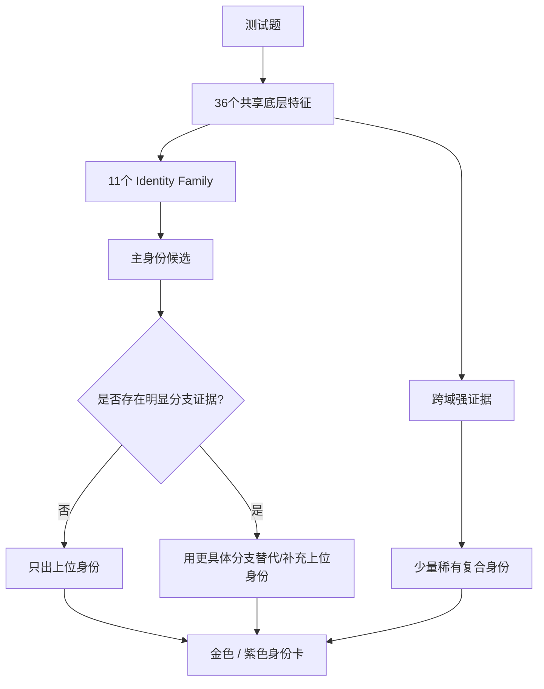
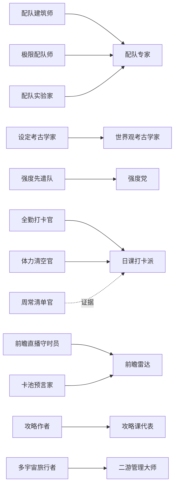
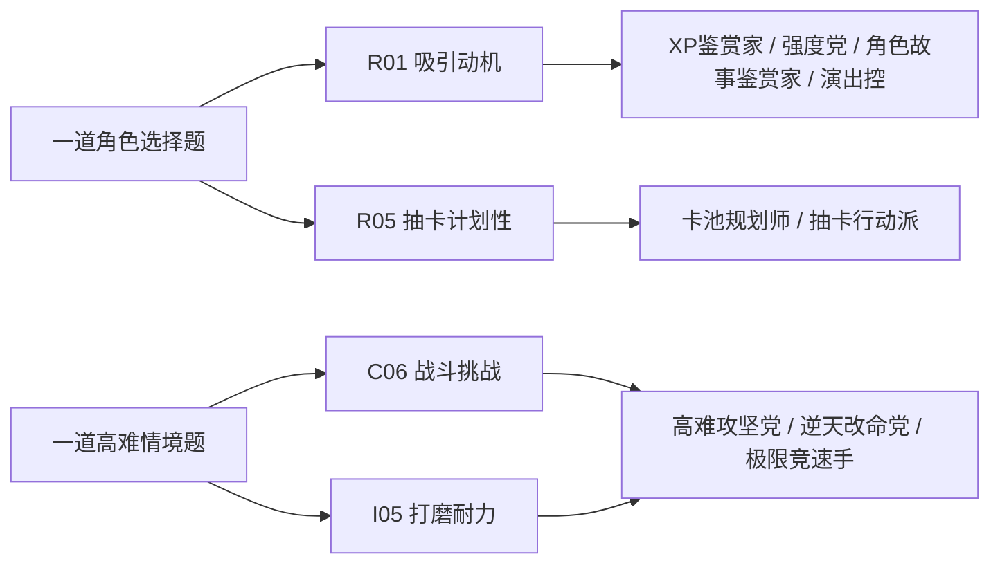
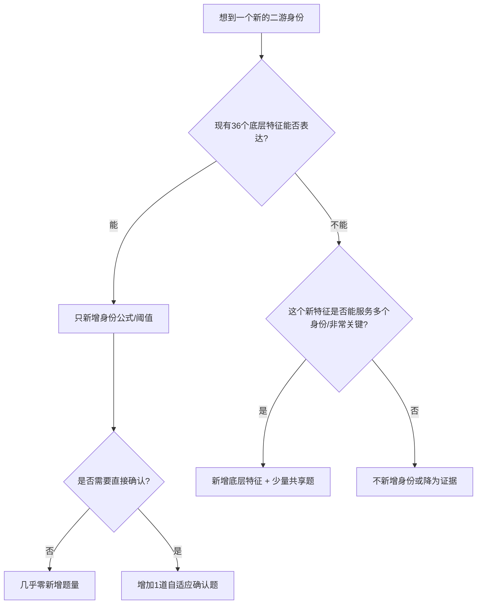

# 二游玩家身份系统｜身份体系冻结版 v0.6.1
> 本版目标：完成**身份收口并建立可控扩展机制**。依据最新产品决策，取消“游戏生态元层”；跨游戏驻留/迁移类身份大幅删除，仅保留能自然解释为“投入方式”的 `版本候鸟` 与 `二游管理大师`。不讨论氪金/充值，I域只讨论时间与精力的肝佛、版本节律和多游分配。

---
## 0. 本版结论
- v0.3 的 **103 个候选身份 → v0.4 收口为68个 → v0.5 为71个 → v0.6 为73个候选身份**。本轮核心不是扩数量，而是做前台命名重构，并只吸收2个确有独立意义的新身份。
- 结构：**54 个主身份/路由身份 + 12 个强分支 + 6 个稀有复合 + 1 个隐藏身份**。
- 后台先判定 Family 与上位身份；**只有出现明确的分支特征，才继续细分**。没有明显差别时，不为了“测得更细”硬出分支卡。
- 旧的 `META/游戏生态元层` 正式取消。`主游定居派 / 守望者 / 回坑候鸟 / 开服先遣队 / 新游侦察兵` 等退出身份系统。
- `版本候鸟` 归入 I｜投入：**长草期低投入，新版本出现时集中回升**。`二游管理大师` 也归入 I｜投入：**把有限时间/精力分配给多款游戏**。
- 本版不再追求“所有行为都要有一张卡”。大量常见行为降为**底层特征或证据**，只有有鲜活共鸣、能让玩家说“这就是我”的模式才保留为身份。
- **从 v0.6.1 起冻结身份体系作为题库设计基线**：身份数量、Family、Mask、36个底层特征与核心定义原则上不再扩改；后续优先通过题目质量、阈值和文案校准提升效果。

### 0.1 v0.6.1 最终定名与恢复
- **角色故事鉴赏家**：保留原名，强调对角色故事、成长弧与人物塑造的欣赏。
- `关系观察员` → **关系雷达**：强调角色之间的关系、阵营、CP/友情/家族与互动。
- `吃瓜观察员` → **吃瓜群众**。
- `二游排班师` → **二游管理大师**。
- `牌组构筑师` → **卡牌大师**。
- 恢复 **OST收藏家、萌新引路人、原生阵容挑战者**。
- `攻略作者` 取消独立身份，并入 **攻略课代表**。
- 新增强分支 **二创住民**：二创内容已经成为主要娱乐，甚至“看二创的时间比玩游戏还长”。

### 0.1.1 最终定名补充（v0.6.1）
- **本命应援官**：保留，不使用“为爱发电厂”。
- **全面体验派**：由“多面体验派”调整而来，不使用“六边形玩家”。
- **随心体验派**：保留原名，不使用“闲云野鹤”。
- **角色故事鉴赏家**：保留原名，不使用“角色入戏派”。

### 0.2 v0.6.1 命名层重构：后台逻辑名与前台显示名解耦

从本版开始，**身份名称不再承担判定逻辑本身**。工程实现应使用稳定 `identity_id` / Family / 特征公式；结果页只读取 `display_name`。因此以后可以继续优化名字，而无需重写题库、阈值或历史数据。

命名优先级：
1. 玩家圈已经存在、无需解释的说法；
2. 有画面、有梗但不贬义的“玩家外号”；
3. 实在没有自然叫法时，再使用功能型名称。

本轮继续吸收“逆天改命、嗑学家、精算师、桃花源玩家、扫地僧”等更有玩家感的表达；同时放弃“为爱发电厂、六边形玩家、闲云野鹤、角色入戏派”等候选显示名，最终采用“本命应援官、全面体验派、随心体验派、角色故事鉴赏家”；**不吸收“人间清醒、云指挥官、快乐咸鱼”等带价值判断、嘲讽或自贬意味较强的名称**。

### 0.3 最终前台显示名调整

| v0.5工作名 | v0.6.1最终前台名 | 说明 |
|---|---|---|
| 全员心动派 | **都是我的翅膀** | 更口语、更像玩家圈会使用的身份名 |
| 角色故事鉴赏家 | **角色故事鉴赏家** | 保留原名，语义更稳定，直接强调角色塑造与人物故事 |
| 羁绊观察家 | **关系雷达** | 更口语、更像玩家圈会使用的身份名 |
| 演出鉴赏家 | **演出控** | 更口语、更像玩家圈会使用的身份名 |
| 强度经理人 | **强度党** | 更口语、更像玩家圈会使用的身份名 |
| 手感优先派 | **手感党** | 更口语、更像玩家圈会使用的身份名 |
| 阵容补位师 | **缺啥补啥党** | 更口语、更像玩家圈会使用的身份名 |
| 抽卡仪式家 | **玄学抽卡师** | 更口语、更像玩家圈会使用的身份名 |
| 本命雕刻师 | **本命毕业党** | 更口语、更像玩家圈会使用的身份名 |
| 本命应援官 | **本命应援官** | 保留原名；“应援”能同时覆盖表达、展示、创作与支持 |
| 羁绊配队师 | **羁绊组队党** | 更口语、更像玩家圈会使用的身份名 |
| 厨力攻坚派 | **逆天改命党** | 更口语、更像玩家圈会使用的身份名 |
| 羁绊显微镜 | **嗑学家** | 更口语、更像玩家圈会使用的身份名 |
| 剧情深潜员 | **剧情沉浸党** | 更口语、更像玩家圈会使用的身份名 |
| 多面体验派 | **全面体验派** | 强调多个内容领域都愿意主动体验，比“六边形玩家”更中性准确 |
| 高难工程师 | **高难攻坚党** | 更口语、更像玩家圈会使用的身份名 |
| 机制研究员 | **机制党** | 更口语、更像玩家圈会使用的身份名 |
| 面板计算师 | **精算师** | 更口语、更像玩家圈会使用的身份名 |
| 作业速通员 | **作业速通党** | 更口语、更像玩家圈会使用的身份名 |
| 托管省心派 | **自动托管党** | 更口语、更像玩家圈会使用的身份名 |
| 养成工程师 | **毕业党** | 更口语、更像玩家圈会使用的身份名 |
| 肉鸽轮回者 | **肉鸽常驻户** | 更口语、更像玩家圈会使用的身份名 |
| 随心体验派 | **随心体验派** | 保留原名；直接表达不被奖励、最优解和完成度绑架 |
| 首日开荒员 | **首日冲锋队** | 更口语、更像玩家圈会使用的身份名 |
| 独享小宇宙 | **桃花源玩家** | 更口语、更像玩家圈会使用的身份名 |
| 节奏免疫体 | **节奏绝缘体** | 更口语、更像玩家圈会使用的身份名 |
| 前瞻情报员 | **前瞻雷达** | 更口语、更像玩家圈会使用的身份名 |
| 闭关开荒派 | **闭关开荒党** | 更口语、更像玩家圈会使用的身份名 |
| 同人巡礼者 | **二创巡礼者** | 更口语、更像玩家圈会使用的身份名 |
| 梗图生产者 | **梗图工厂** | 更口语、更像玩家圈会使用的身份名 |
| 晒卡播报员 | **晒卡党** | 更口语、更像玩家圈会使用的身份名 |

另外新增两张高辨识度身份：
- **入戏太深**：`剧情沉浸党` 的强分支，专门描述被剧情情绪长时间影响、看完刀子或高潮还需要“缓一缓”的玩家。
- **扫地僧**：稀有复合身份，强调“实力很强、长期打磨，但极少外显和参与社区比较”的独享型高手。



---
## 1. 身份层级规则：主身份、强分支、稀有复合
| 层级 | 作用 | 判定原则 | 结果页策略 |
|---|---|---|---|
| **主身份** | 表达稳定、鲜明的玩家模式 | 可以由共享底层特征直接成立 | 正常进入金/紫卡候选 |
| **强分支** | 对主身份做有意义的进一步细分 | 必须有1条非常直接或≥2条独立的分支证据 | **没有明显分支就不出**；若分支完全包含父身份，结果页优先显示更具体分支，避免父子重复刷屏 |
| **稀有复合** | 多个域交叉后产生新的二游行为 | 缺一项就不再是同一个身份 | 可以与普通主身份共存，因为它表达的是新的交叉意义 |
| **隐藏身份** | 处理低参与等系统边界 | 不是正常卡池竞争者 | 只在特殊条件下兜底 |

### 1.1 “不进一步细分”的正式规则
例如系统已经确认 `版本活动特种兵`：
- 只知道“版本期明显更肝” → **停在版本活动特种兵**。
- 明确“新版本一开就冲” → 可以细分为 `首日冲锋队`。
- 明确“前面一直拖，截止前爆肝” → 可以细分为 `活动末日战神`。
- 明确“长草几乎不玩，只等大版本回来一阵” → 可以细分为 `版本候鸟`。

同理，确认 `配队专家` 后，不会因为玩家“偶尔看面板”就再出 `精算师`；只有量化计算本身已经成为稳定、鲜明行为时才细分。

---
## 2. 取消游戏生态元层后的4域
| 域 | 正式定义 | 本版变化 |
|---|---|---|
| **R｜角色关系** | 为什么喜欢/抽角色，以及如何和角色建立关系 | 保持稀疏映射；不关注角色允许 `NONE` |
| **C｜内容玩法** | 剧情、世界观、探索、战斗、配队、解谜、摄影、建造、收集和专项玩法 | 继续允许多选向量；大量小行为降为证据 |
| **I｜投入方式** | 时间/精力的肝佛、规律度、版本节律，以及投入在一款还是多款游戏 | **新增多游分配作为I域子特征；不新增第五域** |
| **S｜玩家关系** | 独享、潜水、吃瓜、互动、联机、互助、创作、情报追踪 | 继续区分“完全不接触”与“只看不说” |

> `ANY` 仍表示“这个身份不读取该域”；`NONE` 仍表示“玩家本人不关注/不参与该域”。

---
## 3. 103 → 73：删、并、恢复、命名与证据化清单
| 原身份 | 处理 | 理由 / 去向 |
|---|---|---|
| **声优雷达** | 删除 | 过窄，声音可作为R01角色吸引动机的证据，不再单独出卡 |
| **语音全听党** | 删除 | 常见行为但身份感弱，降为剧情沉浸党证据 |
| **专武执着者** | 删除 | 本质回到外观/强度/深养成，不再单列 |
| **男角色收藏家** | 删除 | 偏好维度过窄，传播性和身份结构价值低 |
| **女角色收藏家** | 删除 | 同上 |
| **主游定居派** | 删除 | 属于跨游戏驻留生态；按用户要求移除 |
| **守望者** | 删除 | 与主游定居派高度同类，同时属于被移除的驻留生态 |
| **回坑候鸟** | 删除 | 跨游戏/回流生态行为，移除 |
| **开服先遣队** | 删除 | 新游迁移生态行为，移除 |
| **新游侦察兵** | 删除 | 新游迁移生态行为，移除 |
| **多宇宙旅行者** | 合并 | 并入二游管理大师；后者改为I域“多游投入分配” |
| **强度先遣队** | 合并 | 并入强度党，作为“强度足以否决角色”的高强度证据 |
| **保底守门员** | 合并 | 并入卡池规划师，作为计划性/目标纪律证据 |
| **素材预制员** | 合并/证据化 | 主要进入卡池规划师、本命毕业党的支持证据，不单独出卡 |
| **新角速成师** | 合并/证据化 | 进入毕业党/本命毕业党证据，不单独出卡 |
| **设定考古学家** | 合并 | 并入世界观考古学家 |
| **地图开荒官** | 合并 | 并入自由探索家 |
| **宝箱清扫队** | 合并 | 并入全收集派 |
| **图鉴收藏家** | 合并 | 并入全收集派 |
| **限定收藏官** | 合并 | 并入全收集派 |
| **成就猎人** | 合并 | 并入全收集派 |
| **支线清道夫** | 证据化 | 剧情深潜/全收集支持证据，不单独出卡 |
| **OST收藏家** | **恢复保留** | 二游配乐、角色主题曲、战斗曲、地图音乐会形成非常稳定的游戏记忆与审美偏好；比“音乐爱好者”更有二游辨识度 |
| **PV逐帧员** | 证据化 | 世界观考古/前瞻情报的强支持证据，不单独出卡 |
| **配队建筑师** | 合并并改名 | 与极限配队师、配队实验家合并为“配队专家” |
| **极限配队师** | 合并 | 并入配队专家；极限挑战部分由高难攻坚党/极限竞速手承接 |
| **配队实验家** | 合并 | 并入配队专家 |
| **全勤打卡官** | 合并 | 并入日课打卡派 |
| **体力清空官** | 合并 | 并入日课打卡派 |
| **周常清单官** | 删除/证据化 | 按用户要求不出卡；只作为日课打卡派证据 |
| **商店搬空党** | 删除/证据化 | 按用户要求不出卡；可支持版本活动特种兵/全收集派 |
| **前瞻直播守时员** | 合并 | 并入前瞻雷达 |
| **卡池预言家** | 合并 | 并入前瞻雷达；若同时有抽卡规划则给卡池规划师支持 |
| **萌新引路人** | **恢复保留** | 与攻略课代表重新拆开：强调主动带萌新打怪、过本、联机救场与解决实际困难，而不只是讲知识 |
| **攻略作者** | **合并** | 按用户要求并入攻略课代表；写长文、表格、视频攻略作为攻略课代表的高强度证据，不再单独占一张身份卡 |
| **资源行动派** | 删除 | 与“屯屯鼠”形成行为极性但身份感偏弱，不要求每个特征两端都必须有卡 |
| **原生阵容挑战者** | **恢复保留** | “原人式玩法”具有非常鲜明的二游特色：主动不抽卡/极少抽卡，只用初始、赠送或原生角色完成游戏，是独立且易传播的自限玩法 |

### 3.1 本版最重要的合并


---
## 4. Family总览
| Family | 主题 | 数量 | 设计目的 |
|---|---|---:|---|
| **F01｜角色情感结构** | 角色为什么让你喜欢、记住或持续在意 | 9 | 先判这一族的核心模式，再决定是否需要细分 |
| **F02｜角色价值与抽卡决策** | 角色作为抽取对象时，玩家怎么做选择 | 7 | 先判这一族的核心模式，再决定是否需要细分 |
| **F03｜本命深耕** | 围绕某个本命，把角色、玩法、投入和表达串起来 | 6 | 先判这一族的核心模式，再决定是否需要细分 |
| **F04｜剧情、世界观与音乐** | 看故事、理解设定，以及如何通过配乐/声音进入游戏氛围 | 5 | 先判这一族的核心模式，再决定是否需要细分 |
| **F05｜探索、创造与收集** | 地图空间、审美创造、解谜和完成度 | 6 | 先判这一族的核心模式，再决定是否需要细分 |
| **F06｜战斗、构筑与效率** | 战斗挑战、配队、自限玩法、机制研究以及省时解法 | 10 | 先判这一族的核心模式，再决定是否需要细分 |
| **F07｜养成与资源** | 角色/装备养成深度，以及资源使用风格 | 3 | 先判这一族的核心模式，再决定是否需要细分 |
| **F08｜专项玩法偏好** | 只对玩过对应模式的人路由，不增加所有人的固定题量 | 3 | 先判这一族的核心模式，再决定是否需要细分 |
| **F09｜投入节律与分配** | 只讨论时间/精力：肝、佛、版本波动和多游戏分配；不讨论充值 | 9 | 先判这一族的核心模式，再决定是否需要细分 |
| **F10｜社区参与与信息** | 独享、潜水、吃瓜、联机互助、前瞻和社区判断 | 9 | 先判这一族的核心模式，再决定是否需要细分 |
| **F11｜分享、创作与外显表达** | 把知识、同人、梗或抽卡结果向外表达 | 6 | 先判这一族的核心模式，再决定是否需要细分 |

---
## 5. Family分层 + 73身份总表
### F01｜角色情感结构
> 角色为什么让你喜欢、记住或持续在意

| 身份 | 层级 | Mask（RCIS） | 底层特征公式 | 边界/合并说明 |
|---|---|---|---|---|
| **本命真爱党** | 主身份 | `1000` | R01情感向 + R02本命集中 | 有稳定核心角色席位；不是简单“喜欢角色” |
| **都是我的翅膀** | 主身份 | `1000` | R01情感向 + R02博爱 | 长期多角色都容易产生真实喜欢 |
| **版本心动派** | 主身份 | `1000` | R01情感向 + R03追新 | 新版本角色容易快速进入关注中心 |
| **白月光守护者** | 主身份 | `1000` | R03长情 + R02稳定核心 | 旧角色长期保有高情感权重 |
| **XP鉴赏家** | 主身份 | `1000` | R01.XP/外观/人设高 | 外观、人设、气质直接影响喜欢与抽取 |
| **角色故事鉴赏家** | 主身份 | `1100` | R01.塑造高 + C02剧情沉浸 | 因角色故事、成长弧、人物塑造而明显提升喜欢与抽取意愿 |
| **角色陪伴派** | 主身份 | `1000` | R01.陪伴高 | 主页、短信、生日、好感、语音等陪伴感重要 |
| **关系雷达** | 主身份 | `1000` | R04羁绊关注高 | 持续关注角色之间的友情、阵营、CP/家族、立场变化与互动细节；比“关系观察员”更有角色关系感 |
| **演出控** | 主身份 | `1000` | R01.演出高 | 技能动画、必杀、镜头、音效等会独立影响角色吸引力 |

### F02｜角色价值与抽卡决策
> 角色作为抽取对象时，玩家怎么做选择

| 身份 | 层级 | Mask（RCIS） | 底层特征公式 | 边界/合并说明 |
|---|---|---|---|---|
| **强度党** | 主身份 | `1000` | R01.强度高 | 强度/功能足以改变甚至否决抽取决策；吸收“强度先遣队” |
| **手感党** | 主身份 | `1100` | R01角色选择 + C14手感敏感高 | 可能不强，但只要操作循环和手感对就想要 |
| **缺啥补啥党** | 主身份 | `1100` | R01功能向 + C07配队构筑 | 根据账号阵容缺口、职能拼图决定抽谁 |
| **卡池规划师** | 主身份 | `1000` | R05计划性高 + 目标明确 | 跨版本规划、保底纪律、预留资源；吸收“保底守门员/素材预制员”的主要证据 |
| **抽卡行动派** | 主身份 | `1000` | R05即时性高 | 资源难长期躺着，遇到想抽的池子更容易立即行动 |
| **复刻守望者** | 强分支 | `1000` | R06目标持久性高 | 错过明确目标后愿意长期等复刻；没有直接证据时只显示卡池规划师/白月光等上位身份 |
| **玄学抽卡师** | 强分支 | `1000` | R域参与 + 专项行为证据 | 固定地点、音乐、动作或流程；只有直接证据明显才出卡 |

### F03｜本命深耕
> 围绕某个本命，把角色、玩法、投入和表达串起来

| 身份 | 层级 | Mask（RCIS） | 底层特征公式 | 边界/合并说明 |
|---|---|---|---|---|
| **本命毕业党** | 主身份 | `1010` | R02本命集中 + I05深度打磨耐力 | 少数本命长期纵向精养；吸收“新角速成师”中本命型证据 |
| **本命应援官** | 主身份 | `1001` | R01情感向 + S08应援表达 | 会公开表达喜爱、做应援、展示本命 |
| **羁绊组队党** | 强分支 | `1100` | R04羁绊关注 + C07配队构筑 | 按剧情关系、阵营、CP/家族/主题组队；没有明显关系配队证据则只显示配队专家/关系雷达 |
| **逆天改命党** | 稀有复合 | `1110` | R02本命集中 + C06高难挑战 + I05深度打磨 | 为了让本命打得动、逆环境攻坚而持续练与优化 |
| **嗑学家** | 稀有复合 | `1101` | R04羁绊关注 + C02剧情细读 + S04/S07社区表达 | 从剧情/PV/语音找关系证据并讨论、整理或创作 |
| **本命研究所长** | 稀有复合 | `1111` | R02本命集中 + C07/C08研究 + I05长期打磨 + S07输出 | 四域都围绕同一本命形成研究、实战与分享闭环 |

### F04｜剧情、世界观与音乐
> 看故事、理解设定，也包括把游戏音乐本身当作长期体验的一部分

| 身份 | 层级 | Mask（RCIS） | 底层特征公式 | 边界/合并说明 |
|---|---|---|---|---|
| **剧情沉浸党** | 主身份 | `0100` | C01.剧情高 + C02沉浸深 | 完整投入情节、人物情绪和叙事；语音全听、支线完成、OST等降为支持证据 |
| **入戏太深** | 强分支 | `0100` | C02情绪共鸣极高 + 剧情余韵强 | 别人看完剧情领奖励，你看完剧情还要缓一阵；只有明确的强情绪共鸣、剧情余韵或“刀/糖会持续影响心情”证据时才细分 |
| **世界观考古学家** | 主身份 | `0100` | C01.世界观高 + C03研究深 | 主动查设定、时间线、伏笔、文本；合并“设定考古学家”，PV逐帧可作支持证据 |
| **剧情速通侠** | 主身份 | `0100` | C01.剧情有参与 + C12省时倾向高 + C02较低 | 剧情主要为理解关键节点或解锁内容，非关键文本会主动压缩 |
| **OST收藏家** | 主身份 | `0100` | C01.音乐/OST高 + C02氛围沉浸 | 会主动收藏、循环或脱离游戏单独听角色主题曲、战斗曲、地图音乐与原声；保留“OST收藏家”而不用泛化的“音乐爱好者” |

### F05｜探索、创造与收集
> 地图空间、审美创造、解谜和完成度

| 身份 | 层级 | Mask（RCIS） | 底层特征公式 | 边界/合并说明 |
|---|---|---|---|---|
| **自由探索家** | 主身份 | `0100` | C01.探索高 + C04自由探索驱动 | 即使奖励一般也愿意逛地图；合并“地图开荒官” |
| **摄影师** | 主身份 | `0100` | C01.摄影高 | 主动找场景、角度、构图和光影 |
| **家园建筑师** | 主身份 | `0100` | C01.建造高 | 认真布置家园、宿舍、基地或装饰系统 |
| **解谜破译员** | 主身份 | `0100` | C01.解谜高 | 机关、谜题、隐藏路线与推理解法本身就是乐趣 |
| **全收集派** | 主身份 | `0100` | C01.收集高 + C05完成驱动高 | 跨系统补齐缺口；吸收宝箱、图鉴、限定、成就等过细分支 |
| **全面体验派** | 主身份 | `0100` | C13内容广度高 | 多个玩法领域都主动体验，不愿明显偏科 |

### F06｜战斗、构筑与效率
> 战斗挑战、配队、机制研究以及省时解法

| 身份 | 层级 | Mask（RCIS） | 底层特征公式 | 边界/合并说明 |
|---|---|---|---|---|
| **高难攻坚党** | 主身份 | `0110` | C06挑战欲高 + I05打磨耐力 | 真实参与高难，并愿意反复调整直至攻克 |
| **扫地僧** | 稀有复合 | `0111` | C06高难能力/参与高 + I05长期打磨 + S01低外显/独享 | 默默练、默默过高难，社区存在感很低但实战能力很强；不是单纯“不社交”，也不是单纯“高难玩家” |
| **配队专家** | 主身份 | `0100` | C07配队构筑高 | 合并“配队建筑师/极限配队师/配队实验家”；核心是理解队伍结构并能主动构筑 |
| **原生阵容挑战者** | 主身份 | `1100` | R域抽卡主动自限/NONE + C06/C07玩法挑战 | 主动限制或放弃抽卡，只用初始、赠送、免费获取角色推进与挑战；典型如“原人”玩法。关键是**主动自限**，不是单纯没抽到角色 |
| **机制党** | 主身份 | `0100` | C08机制研究高 | 遇到新机制更愿意自己理解规律与交互 |
| **手法磨练师** | 强分支 | `0110` | C09操作精进高 + I05练习耐力 | 会专门练轴、连招、取消后摇等；没有专项训练证据时停留在高难/机制上位身份 |
| **精算师** | 强分支 | `0100` | C10数值量化高 | 主动用表格、计算器、伤害工具比较方案；只是偶尔查攻略不出此卡 |
| **极限竞速手** | 稀有复合 | `0111` | C06极限指标 + I05反复打磨 + S03/S04社区基准 | 追求极限回合、时间、分数、伤害或纪录，而不只是通关 |
| **作业速通党** | 主身份 | `0100` | C12省时策略高（攻略复用） | 成熟答案存在时优先直接采用，把时间留给更在意的内容 |
| **自动托管党** | 主身份 | `0110` | C12自动/扫荡接受高 + I02偏佛 | 重复日常愿意交给自动、扫荡或托管 |

### F07｜养成与资源
> 角色/装备养成深度，以及资源使用风格

| 身份 | 层级 | Mask（RCIS） | 底层特征公式 | 边界/合并说明 |
|---|---|---|---|---|
| **毕业党** | 主身份 | `0100` | C11养成精修高 | 希望主要角色达到清晰的可用/毕业标准 |
| **词条精修师** | 强分支 | `0110` | C11词条精修高 + I05持续刷取 | “能用”之后仍愿意为了更优随机词条持续刷 |
| **屯屯鼠** | 主身份 | `0100` | C15资源保留倾向高 | 稀有资源倾向先囤着，除非目标足够明确 |

### F08｜专项玩法偏好
> 只对玩过对应模式的人路由，不增加所有人的固定题量

| 身份 | 层级 | Mask（RCIS） | 底层特征公式 | 边界/合并说明 |
|---|---|---|---|---|
| **肉鸽常驻户** | 主身份/路由 | `0100` | C01.肉鸽高 | 喜欢随机路线、词条、构筑与重复开局变化 |
| **卡牌大师** | 主身份/路由 | `0100` | C01.卡牌高 | 卡牌、牌组、回合资源与构筑循环本身就是核心乐趣；名称从“牌组构筑师”改为更鲜明的“卡牌大师” |
| **塔防指挥官** | 主身份/路由 | `0100` | C01.塔防高 | 布阵、费用、站位、波次与防线规划本身是核心乐趣 |

### F09｜投入节律与分配
> 只讨论时间/精力：肝、佛、版本波动和多游戏分配；不讨论充值

| 身份 | 层级 | Mask（RCIS） | 底层特征公式 | 边界/合并说明 |
|---|---|---|---|---|
| **日课打卡派** | 主身份 | `0010` | I01日常规律高 | 合并全勤打卡、体力清空、周常清单等“规律维护”行为 |
| **秒速收菜员** | 主身份 | `0010` | I02偏佛 + 短会话证据 | 经常上线几分钟收资源、处理必要事项就走 |
| **随心体验派** | 主身份 | `0010` | I02佛系/够用高 | 奖励、最优和完成度冲突时优先舒服与自己想玩的内容 |
| **版本活动特种兵** | 主身份 | `0010` | I03版本爆发型 | 大版本/大型活动显著提高投入；商店搬空等行为只作为支持证据 |
| **版本候鸟** | 强分支 | `0010` | I03=长草低参与+新版本回升 | 新版本来时集中玩一阵，长草期显著淡出；不再视为“游戏生态”身份 |
| **首日冲锋队** | 强分支 | `0010` | I03=首日爆发 | 大型版本上线第一时间集中推进；没有明显首日行为则只显示版本活动特种兵 |
| **活动末日战神** | 强分支 | `0010` | I03=截止爆发 | 活动前期能放，临截止集中清完；只有强截止行为才细分 |
| **二游管理大师** | 主身份 | `0010` | I04多游分配高 | 同时维护多款二游，能安排日课、活动、版本节点与时间优先级；本质属于“投入如何分配”，不建立游戏生态元层 |
| **二游观察者** | 隐藏身份 | `0000` | 四域参与度整体低 + I02低投入 | 只处理真实低参与；不属于跨游戏生态，不进入普通身份卡池 |

### F10｜社区参与与信息
> 独享、潜水、吃瓜、联机、前瞻和社区判断

| 身份 | 层级 | Mask（RCIS） | 底层特征公式 | 边界/合并说明 |
|---|---|---|---|---|
| **桃花源玩家** | 主身份 | `0001` | S01社区需求低/独享闭环 | 无需互动也能完整享受游戏 |
| **同好召集人** | 主身份 | `0001` | S04主动互动高 | 会主动找同好、交流、分享体验 |
| **节奏绝缘体** | 主身份 | `0001` | S01有接触 + S09独立判断高 | 会看社区，但不容易被节奏和共识替代自己的判断 |
| **吃瓜群众** | 主身份 | `0001` | S03.节奏事件追踪高 | 社区有大事件、争议或瓜时会主动把来龙去脉看全；名字更直接、更有社区共鸣 |
| **长评潜水员** | 主身份 | `0001` | S02.长评消费高 | 自己未必发言，但很爱读长篇角色/剧情/机制分析 |
| **联机气氛组** | 主身份 | `0001` | S05联机共玩高 | 和别人一起玩会明显增加快乐 |
| **萌新引路人** | 主身份 | `0101` | S06互助意愿高 + S05实际带人/救场 + C域基础能力 | 遇到萌新会主动帮打怪、带本、过关、解锁机制或提醒坑点；和“攻略课代表”的区别是更强调**实际陪玩与解决问题** |
| **前瞻雷达** | 主身份 | `0001` | S03.官方/爆料情报追踪高 | 合并前瞻直播守时员、卡池预言家；PV逐帧可作为高阶支持证据 |
| **闭关开荒党** | 稀有复合 | `0111` | C01新内容高 + I03首发投入 + S10防剧透回避 | 版本上线先自己推剧情/地图，完成前主动隔离社区避免剧透 |

### F11｜分享、创作与外显表达
> 把知识、同人、梗或抽卡结果向外表达

| 身份 | 层级 | Mask（RCIS） | 底层特征公式 | 边界/合并说明 |
|---|---|---|---|---|
| **攻略课代表** | 主身份 | `0101` | C07/C08有知识 + S06知识分享；S07.攻略输出可加分 | 愿意把机制、配队、养成和坑点讲清楚；长文、表格、视频攻略都作为这一身份的高强度证据，不再细分“攻略作者” |
| **二创巡礼者** | 主身份 | `0001` | S02.同人消费高 | 同人图文、手书、MMD/Cos/混剪等是长期体验的一部分 |
| **二创住民** | 强分支 | `0001` | S02.二创消费极高 + “二创时间≥游戏时间”直接证据 | 游戏外的角色剪辑、剧情解读、手书、MMD、鬼畜、同人视频等已经成为主要娱乐内容，甚至看二创的时间比实际玩游戏还多；只有强证据时才从二创巡礼者继续细分 |
| **同人创作者** | 主身份 | `0001` | S07.同人创作高 | 主动产出同人图、文、手书、MMD/Cos、混剪等 |
| **梗图工厂** | 强分支 | `0001` | S07.梗创作高 | 主动做梗图、表情包、段子图；只有稳定创作行为才细分 |
| **晒卡党** | 主身份 | `1001` | R域抽卡参与 + S08.晒卡表达高 | 主动记录欧非、晒卡、分享抽取过程或结果 |

---
## 6. 36个底层特征：题目真正要测的东西
> **身份数量 ≠ 题目数量。** 题目首先更新这些共享底层特征；一个特征可以同时服务多个身份。`C01`、`S02`、`S03`、`S07` 是向量型特征，一道多选/情境题可同时更新多个分量。

| Code | 底层特征 | 域 | 定义 |
|---|---|---|---|
| `R01` | **角色吸引动机向量** | R | XP/外观人设、功能强度、剧情塑造、陪伴关系、演出表现等可并存，不强迫二选一 |
| `R02` | **本命集中 ↔ 博爱** | R | 是否有少数核心角色，还是长期多角同时心动 |
| `R03` | **长情 ↔ 追新** | R | 旧角色情感稳定性与新角色进入关注中心的速度 |
| `R04` | **角色关系/羁绊关注** | R | 是否主动注意角色之间的关系、阵营、CP/家族/互动变化 |
| `R05` | **抽卡计划性 ↔ 即时性** | R | 跨版本规划、保底纪律与看到想抽就下池之间的倾向 |
| `R06` | **目标持久性/复刻耐心** | R | 错过角色后是否仍长期保留明确目标 |
| `C01` | **内容兴趣向量** | C | 剧情、世界观、音乐/OST、探索、解谜、摄影、建造、战斗、配队、收集、肉鸽、卡牌、塔防等多选向量 |
| `C02` | **剧情沉浸深度** | C | 愿意完整体验角色/剧情文本、情绪与演出，而非只拿关键结论 |
| `C03` | **世界观研究深度** | C | 主动查设定、文本、时间线、伏笔并建立解释 |
| `C04` | **自由探索驱动** | C | 无奖励或低奖励时是否仍愿意漫游、开路、发现空间细节 |
| `C05` | **完成/收集驱动** | C | 对缺口、图鉴、宝箱、成就、限定物等“未完成状态”的敏感度 |
| `C06` | **战斗挑战欲** | C | 是否主动碰高难、追求更高难度与更极限的战斗目标 |
| `C07` | **配队构筑兴趣** | C | 是否主动理解角色职能、队伍结构、循环与组合 |
| `C08` | **机制研究倾向** | C | 是否喜欢自己研究技能机制、交互、规则和最优用法 |
| `C09` | **操作精进倾向** | C | 是否愿意专门练轴、连招、取消后摇、闪避/格挡等手法 |
| `C10` | **数值/面板量化** | C | 是否使用表格、计算器、伤害工具或定量比较方案 |
| `C11` | **养成精修倾向** | C | 角色/装备从“能用”继续向高完成度、毕业标准推进的倾向 |
| `C12` | **省时策略接受度** | C | 对抄成熟作业、自动、扫荡、托管等减少重复劳动方案的接受度 |
| `C13` | **内容广度** | C | 同时对多个内容类型保持真实、主动的高参与 |
| `C14` | **玩法手感敏感度** | C | 操作反馈、机制循环和角色上手体验对选择角色/玩法的重要度 |
| `C15` | **资源保留倾向** | C | 稀有养成资源是倾向先囤还是有提升就立即转化；不等同于氪金 |
| `I01` | **日常规律度** | I | 日课、周期维护、连续性等固定节律的稳定程度 |
| `I02` | **总体投入强度：肝 ↔ 佛** | I | 时间/精力投入强度；“佛”不是低兴趣，而是更少被奖励和完成度牵引 |
| `I03` | **版本投入节律** | I | stable / version_burst / first_day / deadline / long_grass 等模式 |
| `I04` | **多游投入分配** | I | 是否长期把时间精力并行分配给多款二游；只作为投入方式，不建立游戏生态层 |
| `I05` | **深度打磨耐力** | I | 为了高难、养成、攻略、竞速等目标持续重试和优化的耐力 |
| `S01` | **社区接触度** | S | 完全独享到高频逛社区/参与讨论的连续程度 |
| `S02` | **社区内容消费向量** | S | 长评、同人图文、二创视频/手书/MMD/混剪等不同类型内容的潜水消费偏好，并记录“二创消费强度/时间占比” |
| `S03` | **信息追踪向量** | S | 节奏事件、官方前瞻、爆料/测试服等不同信息源的关注方式 |
| `S04` | **主动互动/找同好** | S | 主动发言、找同好、交流观点与分享体验的程度 |
| `S05` | **联机共玩** | S | 与他人一起玩对快乐和持续参与的贡献 |
| `S06` | **互助答疑/知识分享** | S | 是否愿意给萌新、朋友或社区成员解释机制和坑点，以及是否愿意实际带人、救场、帮过本；后台区分“知识讲解”与“实际陪玩互助”子信号 |
| `S07` | **创作输出向量** | S | 攻略、同人、梗图等不同类型的稳定创作行为 |
| `S08` | **应援/晒卡表达** | S | 围绕喜欢角色或抽卡结果进行公开展示、记录和表达 |
| `S09` | **独立判断/抗节奏** | S | 接触社区后仍维持自身体验与判断的能力/倾向 |
| `S10` | **版本防剧透回避** | S | 新剧情/版本上线时主动回避社区、视频、评论以先完成个人体验 |

**当前一级特征数：36。** 其中多项本身是向量，因此后台可表达比“35个单一分数”更丰富的状态，但不要求为每个分量各出一道固定题。

---
## 7. 底层特征 → 身份：矩阵式判定
### 7.1 不再“一身份一套题”


### 7.2 Family先判定，再做分支
推荐后台顺序：
1. 用底层特征形成候选 Family。
2. 对 Family 内主身份计算 `CoreFit`。
3. 只有主身份/Familiy已经有足够证据时，才调度分支鉴别题。
4. 若分支证据不明显，**停止细分**，避免为了更多卡而制造噪声。
5. 稀有复合身份不走普通父子替代；它们要求跨域证据链完整。

---
## 8. 结果页去重：父子身份不要同时刷屏
### 8.1 Specificity Replacement（具体身份替代）
| 命中情况 | 展示建议 |
|---|---|
| 配队专家强；面板计算一般 | 只出 **配队专家** |
| 配队专家强；面板计算极强且有多条直接证据 | 优先出 **精算师**；配队专家可隐藏在“所属Family”中，不再占一张同级卡 |
| 版本活动特种兵强；无固定爆发模式 | 只出 **版本活动特种兵** |
| 版本活动特种兵强；截止爆肝非常稳定 | 出 **活动末日战神**，父身份不重复占卡 |
| 本命真爱党 + 逆天改命党都强 | **可以共存**，因为厨力攻坚是跨域涌现，不只是本命真爱的更细版本 |

### 8.2 金/紫卡仍按证据，而不是按层级
- 主身份可以是金，也可以是紫。
- 强分支只有在证据足够直接时才进入候选，因此一旦出现，通常至少应有较高置信度。
- 稀有复合身份不因为“稀有”自动出金；仍要四域/三域条件完整成立。
- 正常结果建议保持 **2～4张金 + 3～7张紫**，但不硬限数量；先做同Family去重。

---
## 9. 对题库难度的影响
本版收口后，真正需要测量的不是73个身份，而是36个共享特征。题库可以继续采用自适应结构：

| 阶段 | 目标 | 建议题量 |
|---|---|---:|
| 入口筛查 | 4域参与度、NONE、主要内容类型、投入/社区大方向 | 5～7 |
| 核心共享题 | 更新R/C/I/S主要底层特征 | 12～16 |
| Family路由题 | 只进入高概率Family继续问 | 7～10 |
| 分支/复合确认 | 只确认最可能的强分支和稀有复合 | 3～6 |
| **典型总量** |  | **27～35题** |
| **复杂玩家** | 多域高参与、多Family同时成立 | **35～42题** |

原则：`声优雷达、语音全听党、周常清单官` 这类已退出的行为**仍然可以出现在题目里作为证据选项**，但不再消耗一张独立身份卡，也不需要专门为它设计2～3道题。

---
## 10. 仍然需要警惕的几组相似身份
| Family | 相似身份 | 当前处理 | 后续认知测试重点 |
|---|---|---|---|
| 角色情感 | 本命真爱党 vs XP鉴赏家 | 暂保留 | 玩家是否能自然理解“核心席位”与“审美/人设门槛”的差别 |
| 角色情感 | 角色故事鉴赏家 vs 剧情沉浸党 | 暂保留 | 前者是“角色写得好所以喜欢/抽”；后者是“剧情本身就是核心内容” |
| 剧情 | 剧情沉浸党 vs 入戏太深 | 父/强分支 | 前者是认真沉浸，后者必须有明显情绪余韵与高共情证据 |
| 抽卡决策 | 卡池规划师 vs 复刻守望者 | 父/分支 | 复刻等待是否足够鲜活；若命中率过低可直接证据化 |
| 本命深耕 | 本命毕业党 vs 毕业党 | 暂保留 | “少数本命纵向精养”与“多数主力都要毕业”是否容易区分 |
| 战斗构筑 | 配队专家 vs 机制党 | 暂保留 | 组队结构兴趣 vs 单角色/系统机制研究是否有独立共鸣 |
| 战斗构筑 | 高难攻坚党 vs 极限竞速手 | 父系/稀有复合 | 通关高难与追纪录必须明显分开 |
| 战斗/独享 | 高难攻坚党 vs 扫地僧 | 主/稀有复合 | 扫地僧必须同时满足高难实力、长期打磨和低外显，不可只凭“社区少说话”成立 |
| 投入节律 | 版本活动特种兵 vs 版本候鸟 | 父/分支 | 版本候鸟需要“长草显著退出”，否则不细分 |
| 社区 | 长评潜水员 vs 二创巡礼者 | 暂保留 | 分别是深度分析消费与同人内容消费 |
| 二创 | 二创巡礼者 vs 二创住民 | 父/强分支 | 普通长期看同人与“二创已经成为主要娱乐、消费时间接近/超过游戏”必须有明显强度差 |
| 分享 | 攻略课代表 vs 萌新引路人 | 并列主身份 | 前者偏“讲清方法/知识”，后者偏“实际带人/救场/过本” |

如果20～30人认知测试中，一组身份经常被参与者说成“这两个不就是一个吗”，优先继续合并，而不是靠更复杂的题目强行区分。

---
## 11. 下一阶段建议
### P0｜先冻结身份结构
1. 将这 **73个候选身份** 冻结为 v0.6.1 题库设计基线；只有后续公测/认知访谈明确发现高频且强共鸣的空白类型时，才允许按“新增身份准入规则”补充。
2. 对11个Family逐个做“是否真的需要独立身份”的审计。
3. 对12个强分支做认知测试：用户能否一眼理解其与父身份的差别。
4. 对6个稀有复合身份做“缺一域是否仍成立”的反事实检查。

### P1｜再做题库
1. 给36个底层特征建立题目覆盖矩阵。
2. 优先设计**一题多特征**的高信息量情境题。
3. 给 `C01专项玩法向量` 做路由：没玩过/游戏没有该玩法 = `NA/UNEXPOSED`，不能判成“不喜欢”。
4. 分支题只在父Family达到候选阈值后出现。
5. 题量目标：典型27～35题，复杂玩家不超过42题左右；工程硬上限可继续保留约44题。

---
## 12. 本版结构总图

```mermaid
flowchart TD
    A[玩家答题] --> B[4域参与度 / NONE / NA]
    A --> C[36个共享底层特征]
    B --> D[11个Family路由]
    C --> D
    D --> E[54个主身份/路由身份]
    E --> F{分支证据是否鲜明?}
    F -->|否| G[停在上位身份]
    F -->|是| H[强分支替代/细分]
    C --> I[跨域证据链]
    I --> J[6个稀有复合身份]
    B --> K[低参与边界]
    K --> L[隐藏：二游观察者]
    G --> M[同Family去重]
    H --> M
    J --> M
    M --> N[金色核心身份 × N]
    M --> O[紫色共鸣身份 × N]
```


---
## 13. 新身份扩展协议：以后增加身份应该怎么做

**结论：在这套结构下，后续新增身份是方便的。** 新身份大多数时候不需要新建一套题，只需要把它写成“现有底层特征的组合规则 + 1条必要直接证据”。

### 13.1 新身份必须通过5个准入门槛
| 门槛 | 必须回答的问题 | 不通过时怎么处理 |
|---|---|---|
| **二游辨识度** | 这个身份离开二游语境后是否仍然几乎一样？ | 若只是泛游戏习惯，不加入 |
| **鲜活共鸣** | 玩家看到名称和一句话，是否容易产生“这就是我”？ | 只是常见行为则降为证据 |
| **独立意义** | 它与现有身份相比，是否表达了新的动机/玩法，而不是换名字？ | 高重合则合并或做分支 |
| **可测量性** | 能否用行为题、情境题获得直接证据？ | 只能靠主观猜测则不加入 |
| **复杂度预算** | 新身份是否需要新增大量底层特征和专属题？ | 成本高但价值低则不加入 |

### 13.2 优先复用现有36个底层特征
新增身份按以下顺序处理：



例如本版新增的 `二创住民`，可以直接复用 `S02社区内容消费向量`，再增加“二创消费时间是否接近/超过游戏时间”的强证据，不需要为它新建一整套题。

### 13.3 Family扩展规则
- 新身份优先挂到现有11个Family。
- **不要因为1个新身份建立新Family。** 通常至少出现3个彼此相关、又无法放进现有Family的稳定身份，才讨论新Family。
- 如果新身份只是上位身份的一种极端表现，优先设为**强分支**。
- 如果几个域交叉后产生了缺一不可的新玩法，才设为**稀有复合**。
- 每新增1个身份，都必须重新跑一次同Family相似度检查，防止身份库再次从73膨胀到100+。

### 13.4 命名不应成为工程依赖
- 新身份先创建稳定 `identity_id`，再决定前台名称。
- 前台名允许在认知测试后继续调整；改名不应改变 Family、Mask、Core、Direct Evidence 和阈值。
- 一个好名字应做到：**看到名字先笑/先懂，再看一句话确认“这就是我”**。
- 避免为了整齐强行使用“XX师 / XX员 / XX家 / XX工程师”；同一套身份允许混合使用玩家黑话、梗式外号与功能名。

### 13.4 新身份的标准配置格式
以后新增一个身份，只需要补这一条配置：

```text
身份名：二创住民
Family：F11 分享、创作与外显表达
层级：强分支
Mask：0001
Core：S02.二创消费极高
Direct Evidence：二创消费时间接近/超过实际游戏时间
Parent：二创巡礼者
Contradiction：基本不看二创内容
是否新增底层特征：否
是否新增固定题：否
是否新增路由确认题：可选1题
```

因此，**身份库可以继续成长，但题量不需要线性增长。** 真正需要严格控制的是底层特征数量和Family数量，而不是单纯卡片数量。

**v0.6.1冻结版的核心原则：宁可少一张卡，也不要用“常见行为”冒充“鲜活身份”；宁可停在清晰的上位身份，也不要为了精细化制造没有共鸣的分支。**